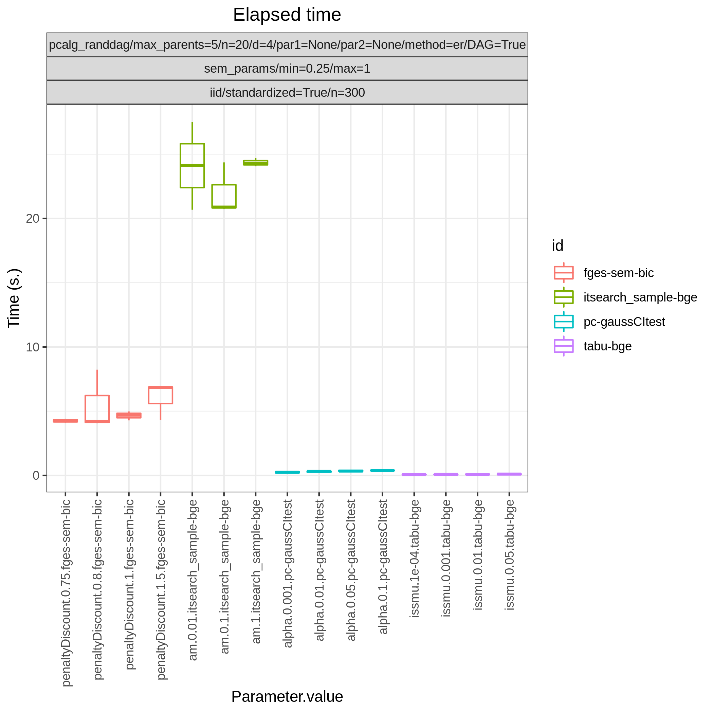
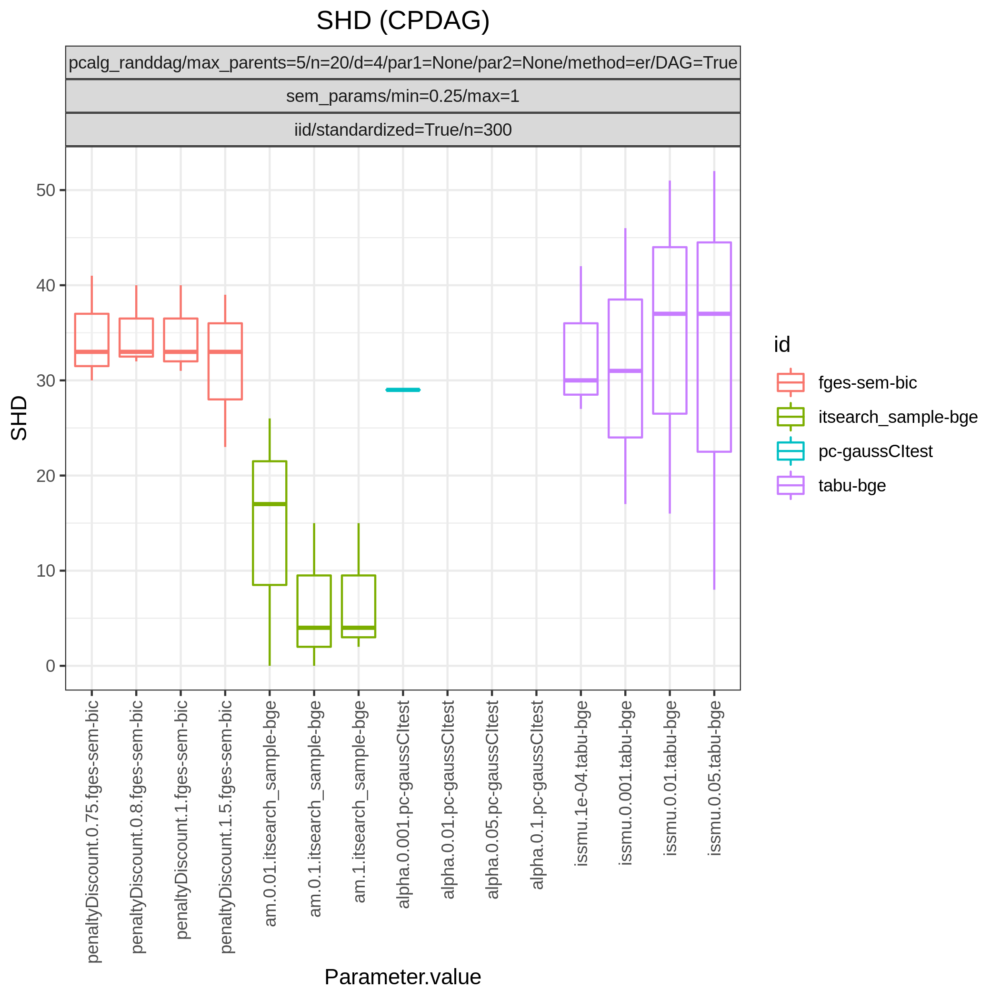
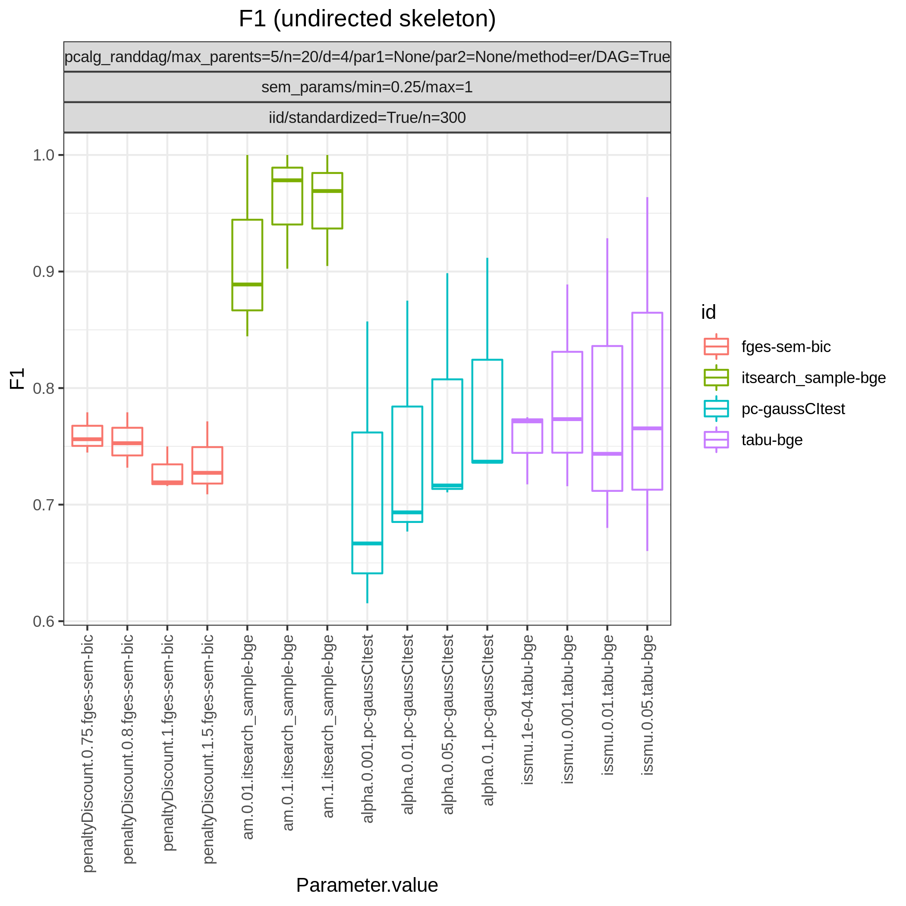

<snippet>
  <content>


<p align="left">
<a href="https://benchpressdocs.readthedocs.io/" target="_blank" rel="noopener noreferrer">

</a>
</p>


[](https://snakemake.bitbucket.io)
[](https://benchpressdocs.readthedocs.io/en/latest/?badge=latest)
[](https://www.gnu.org/licenses/old-licenses/gpl-2.0.en.html)

---

Benchpress [[1]](#1) is a [Snakemake](https://snakemake.readthedocs.io/en/stable/) workflow where structure learning algorithms, implemented in possibly different languages, can be executed and compared.
The computations scale seamlessly on multiple cores or *"... to server, cluster, grid and cloud environments, without the need to modify the workflow definition" - Snakemake*.
The documentation is found at https://benchpressdocs.readthedocs.io. 
[This](https://benchpressdocs.readthedocs.io/en/latest/json_overview.html#evaluation) section shows an overview of the supported evaluation methods.


## Requirements
- [Snakemake ≥ 5.2](https://snakemake.readthedocs.io/en/stable/) ([installation instructions](https://snakemake.readthedocs.io/en/stable/getting_started/installation.html))
- [Singularity ≥ 3.2](https://sylabs.io/singularity/) ([installation instructions](https://sylabs.io/guides/3.9/user-guide/))
- Linux (Singularity currently only has a Beta release for OSX which is not enough)
## Installation

### Clone and install
As benchpress is a snakemake workflow, once the requirements are installed it requires no further installation but cloning the repository as
```
$ git clone https://github.com/felixleopoldo/benchpress.git
$ cd benchpress
```

#### Notes
On some systems, you might also have to explicitly install squash-tools. This can be done using conda as

`$ conda install -c conda-forge squash-tools`

## Usage

Benchpress supports five different data scenarios built from combining different sources of graph parameters and data.


|     | Graph     | Parameters | Data      |
|-----|-----------|------------|-----------|
| I   | -         | -          | Fixed     |
| II  | Fixed     | -          | Fixed     |
| III | Fixed     | Fixed      | Generated |
| IV  | Fixed     | Generated  | Generated |
| V   | Generated | Generated  | Generated |

Have a look in the [resources/](resources) directory to see which fixed graphs, parameters, and datasets that are already available. 
You will e.g. find all the graphs (and corresponding parameters) from the [Bayesian networks repository](https://www.cs.huji.ac.il/w~galel/Repository/), downloaded from [bnlearns homepage](https://www.bnlearn.com/).
The methods to generate are listed further down.

#### Example study
This study is an example of data scenario V based on three continuous datasets corresponing to three realisations of a random linear Gaussian structural equation model (SEM) with random DAG. The DAGs are sampled from a restricted Erdős–Rényi distribution using the **pcalg_randdag** module and the weight parameters are sampled uniformly using the **sem_params** module. For simplicity we use only a few structure learning modules here (**bidag_itsearch**, **tetrad_fges**, **bnlearn_tabu**, **pcalg_pc**) with different parameter settings. The full setup is found here [config/ex.json](config/ex.json).

To run this study (300 jobs ~ 10 minutes on a 2-cores laptop) type

`$ snakemake --cores all --use-singularity --configfile config/ex.json`

The following plots are generated by the **roc** module





#### Getting started with your own structure learning algorithm
You can easily use your own algorithm in Benchpress regardless of the programming language.
To get the idea, perhaps the best way to start is to first use and alter the template R-script [mylib_myalg.R](workflow/scripts/structure_learning_algorithms/mylib_myalg.R) as you like. It looks like this at the moment:

```r
# These variables are generated from the keys in the config file.
myparam1 <- snakemake@wildcards[["myparam1"]] 
myparam2 <- snakemake@wildcards[["myparam2"]]

data <- read.csv(snakemake@input[["data"]], check.names = FALSE)

# This is a very fast and very bad algorithm for estimating an undirected graph.
p <- ncol(data)
Sys.sleep(3)
set.seed(as.integer(snakemake@wildcards[["replicate"]]))
# A bad estimator
start <- proc.time()[1]
adjmat <- matrix(runif(p * p), nrow = p, ncol = p) > 0.5 
# Make it symmetric (undirected)
adjmat <- 1 * (adjmat | t(adjmat)) 
# No self loops
diag(adjmat) <- 0 

totaltime <- proc.time()[1] - start
# Get the labels from the data
colnames(adjmat) <- names(data) 
write.csv(adjmat, file = snakemake@output[["adjmat"]], row.names = FALSE, quote = FALSE)
write(totaltime, file = snakemake@output[["time"]])
# Write the number of c.i. tests here if applicable
cat("None", file = snakemake@output[["ntests"]], sep = "\n") possible.

```
The parameters used in the first two lines above are automatically generated from the JSON object in the *mylib_myalg* section of [config/ex.json](config/ex.json). Feel free to add or change these keys or values. To test it you will have to add *testing_myalg* e.g. to the list of ids in the *roc* section. 

```javascript
{
    "id": "testing_myalg",
    "myparam1": "somevalue",
    "myparam2": [
        1,
        2
    ]
}

```
If you want to use another programming language or link to some of your own scripts, you can just edit [mylib_myalg.smk](workflow/rules/mylib_myalg.smk) as you like. 

```python

if "mylib_myalg" in pattern_strings:
    rule mylib_myalg:
        input:                        
            justatrigger="workflow/scripts/structure_learning_algorithms/mylib_myalg.R",
            data = alg_input_data()        
        output:
            adjmat = alg_output_adjmat_path("mylib_myalg"),
            time = alg_output_time_path("mylib_myalg"),
            ntests = alg_output_ntests_path("mylib_myalg")
        container:
            None 
        script:            
            "../scripts/structure_learning_algorithms/mylib_myalg.R"
```
If R is not installed on your system, you may change None to "docker://r-base" in order to run the script in a r-base Docker container.

### Available modules

#### Graph modules
| Method                 | Graph | Language | Library  | Version | Module id        |
|------------------------|-------|----------|----------|---------|------------------|
| randDAG                | DAG,UG| R        | pcalg    | 2.7-3   | pcalg_randdag    |
| graph.sim              | DG,UG | R        | BDgraph  | 2.64    | bdgraph_graphsim |
| CTA [[24]](#24)        | DG    | Python   | trilearn | 1.2.3   | trilearn_cta     |
| AR                     | DG    | Python   | trilearn | 1.2.3   | bandmat          |
| AR random lag          | DG    | Python   | trilearn | 1.2.3   | rand_bandmat     |
| Fixed adjacency matrix | *     | .csv     | -        | -       | -                |

#### Parameter modules

| Distribution               | Method | Graph  | Language | Library  | Version | Module id            |
|----------------------------|--------|--------|----------|----------|---------|----------------------|
| Graph Wishart              | rgwish | DG, UG | R        | BDgraph  | 2.64    | bdgraph_rgwish       |
| Hyper Dirichlet [[2]](#2)  | -      | DG     | Python   | trilearn | 1.2.3   | trilearn_hyper-dir   |
| Graph intra-class          | -      | DG     | Python   | trilearn | 1.2.3   | trilearn_intra-class |
| Random SEM parameters      | -      | DAG    | R        | -        | -       | sem_params           |
| Random probability tables  | -      | DAG    | R        | -        | -       | bin_bn               |
| Fixed bn.fit object        | -      | DAG    | .rds     | bnlearn  | -       | -                    |
| Fixed SEM parameter matrix | -      | DAG    | .csv     | -        | -       | -                    |


#### Data modules
| Method              | Language | Module id |
|---------------------|----------|-----------|
| I.I.D. data samples | -        | iid       |
| Fixed data file     | .csv     | -         |

#### Structure learning algorithms

| Algorithm                         | Graph | Language | Library             | Version  | Module id            |
|-----------------------------------|-------|----------|---------------------|----------|----------------------|
| GOBNILP [[3]](#3)                 | DAG   | C        | GOBNILP (bitbucket) | #df495ad | gobnilp              |
| ASOBS [[15]](#15)                 | DAG   | R/Java   | r.blip              | 1.1      | rblip_asobs          |
| FGES [[9]](#9)                    | CPDAG | Java     | TETRAD (causal-cmd) | 1.1.3    | tetrad_fges          |
| FCI [[5]](#5)                     | DAG   | Java     | TETRAD (causal-cmd) | 1.1.3    | tetrad_fci           |
| RFCI [[22]](#22)                  | CPDAG | Java     | TETRAD (causal-cmd) | 1.1.3    | tetrad_rfci          |
| GFCI [[21]](#21)                  | DAG   | Java     | TETRAD (causal-cmd) | 1.1.3    | tetrad_gfci          |
| PC [[4]](#4)[[5]](#5)             | CPDAG | R        | pcalg               | 2.7-3    | pcalg_pc             |
| Dual PC [[31]](#31)               | CPDAG | R        | dualPC (github)     | 4a5175d  | giudice_dualpc       |
| No tears [[17]](#17)              | DAG   | Python   | jmoss20 (github)    | #0c032a0 | notears              |
| HC [[6]](#6)                      | DAG   | R        | bnlearn             | 4.7      | bnlearn_hc           |
| MMHC [[23]](#23)                  | DAG   | R        | bnlearn             | 4.7      | bnlearn_mmhc         |
| Inter-IAMB [[27]](#27)            | CPDAG | R        | bnlearn             | 4.7      | bnlearn_interiamb    |
| GS [[26]](#26)                    | DAG   | R        | bnlearn             | 4.7      | bnlearn_gs           |
| Tabu [[25]](#25)                  | DAG   | R        | bnlearn             | 4.7      | bnlearn_tabu         |
| PC stable [[4]](#4)[[5]](#5)      | CPDAG | R        | bnlearn             | 4.7      | bnlearn_pcstable     |
| IAMB [[27]](#27)                  | DAG   | R        | bnlearn             | 4.7      | bnlearn_iamb         |
| Fast IAMB                         | DAG   | R        | bnlearn             | 4.7      | bnlearn_fastiamb     |
| IAMB FDR                          | DAG   | R        | bnlearn             | 4.7      | bnlearn_iambfdr      |
| MMPC                              | DAG   | R        | bnlearn             | 4.7      | bnlearn_mmpc         |
| SI HITON-PC                       | DAG   | R        | bnlearn             | 4.7      | bnlearn_sihitonpc    |
| Hybrid PC                         | DAG   | R        | bnlearn             | 4.7      | bnlearn_hpc          |
| H2PC                              | DAG   | R        | bnlearn             | 4.7      | bnlearn_h2pc         |
| RSMAX2                            | DAG   | R        | bnlearn             | 4.7      | bnlearn_rsmax2       |
| Iterative MCMC [[28]](#28)        | DAG   | R        | BiDAG               | 2.0.3    | bidag_itsearch       |
| Order MCMC [[28]](#28)[[29]](#29) | DAG   | R        | BiDAG               | 2.0.3    | bidag_order_mcmc     |
| Partition MCMC [[30]](#30)        | DAG   | R        | BiDAG               | 2.0.3    | bidag_partition_mcmc |
| PGibbs [[20]](#20)                | DG    | Python   | Trilearn            | 1.2.3    | trilearn_pgibbs      |
| GG99 single pair [[18]](#18)      | DG    | Java     | A. Thomas           | -        | gg99_singlepair      |
| GT13 multi pair [[19]](#19)       | DG    | Java     | A. Thomas           | -        | gt13_multipair       |
| GLasso [[31]](#31)                | UG    | Python   | scikit-learn        | 0.22.1   | sklearn_glasso       |


#### Evaluation modules

| Function                                  | Language | Library  | Module id           |
|-------------------------------------------|----------|----------|---------------------|
| Plot data with ggpairs                    | R        | GGally   | pairs_plots         |
| Plot true graphs                          | -        | graphviz | graph_true_plots    |
| Plot true graphs properties               | R        | ggplot2  | graph_true_stats    |
| Plot estimated graphs                     | -        | graphviz | graph_plots         |
| Timing and ROC curves for TPR,FPR,FNR,... | R        | ggplot2  | roc                 |
| MCMC mean graph                           | Python   | seaborn  | mcmc_heatmaps       |
| MCMC auto-correlation                     | Python   | pandas   | mcmc_autocorr_plots |
| MCMC trajectory                           | Python   | pandas   | mcmc_traj_plots     |

Acronyms are used for Directed Acyclic Graphs (DAGs), Undirected Graphs (UGs), Decomposable Graphs (DGs), and Completed Partially DAGs (CPDAGs).

## Citing

```
@misc{rios2021benchpress,
      title={Benchpress: a scalable and platform-independent workflow for benchmarking structure learning algorithms for graphical models}, 
      author={Felix L. Rios and Giusi Moffa and Jack Kuipers},
      year={2021},
      eprint={2107.03863},
      archivePrefix={arXiv},
      primaryClass={stat.ML}
}
```

## References
* <a id="1">[1]</a> [Felix L. Rios and Giusi Moffa and Jack Kuipers Benchpress: a scalable and platform-independent workflow for benchmarking structure learning algorithms for graphical models. *ArXiv eprints.*, 2107.03863, 2021.](https://arxiv.org/abs/2107.03863)
* <a id="2">[2]</a> [Dawid AP, Lauritzen SL (1993). “Hyper Markov laws in the statistical analysis of decomposable graphical models.” The Annals of Statistics, 21(3), 1272–1317.](https://projecteuclid.org/journals/annals-of-statistics/volume-21/issue-3/Hyper-Markov-Laws-in-the-Statistical-Analysis-of-Decomposable-Graphical/10.1214/aos/1176349260.full) 
* <a id="3">[3]</a> [Cussens J (2012). “Bayesian network learning with cutting planes.” arXiv preprint arXiv:1202.3713.](https://arxiv.org/abs/1202.3713)
* <a id="4">[4]</a> [Spirtes P, Glymour CN (1991). “An algorithm for fast recovery of sparse causal graphs.” Social
science computer review, 9(1), 62–72.](https://cse.sc.edu/~mgv/csce582sp14/presentations/SpirtesGlymourPC.pdf)
* <a id="5">[5]</a> [Spirtes P, Glymour CN, Scheines R, Heckerman D (2000). Causation, prediction, and search.
MIT press.](https://philarchive.org/archive/SPICPA-2)
* <a id="6">[6]</a> [Russell S, Norvig P (2002). “Artificial intelligence: a modern approach.”](https://www.sti-innsbruck.at/sites/default/files/Knowledge-Representation-Search-and-Rules/Russel-&-Norvig-Inference-and-Logic-Sections-7.pdf)
* <a id="7">[7]</a> [Scutari M, Vitolo C, Tucker A (2019b). “Learning Bayesian networks from big data with greedy search: computational complexity and efficient implementation.” Statistics and Computing, 29(5), 1095–1108.](https://link.springer.com/article/10.1007/s11222-019-09857-1)
* <a id="8">[8]</a> [Colombo D, Maathuis MH, Kalisch M, Richardson TS (2012). “Learning high-dimensional directed acyclic graphs with latent and selection variables.” The Annals of Statistics, pp. 294–321.](https://www.jstor.org/stable/pdf/41713636.pdf?casa_token=rpMn5YYYjZcAAAAA:ACAY0o3Fu4oakJ5CAEnsETe0Z-brxM7agz6NfS4MQc5BGYtkQjvBoG8pLQbOYEMhn0eYwcpKCJovhWyqnmMBDwV6Hyke91eqACHAh8UkXbERmCB9)
* <a id="9">[9]</a> [Meek C (1997). Graphical Models: Selecting causal and statistical models. Ph.D. thesis, PhD thesis, Carnegie Mellon University.]
* <a id="10">[10]</a> [Chickering DM (2002). “Optimal structure identification with greedy search.” Journal of
machine learning research, 3(Nov), 507–554.](https://www.jmlr.org/papers/volume3/chickering02b/chickering02b.pdf)
* <a id="11">[11]</a> [Ogarrio JM, Spirtes P, Ramsey J (2016). “A hybrid causal search algorithm for latent variable models.” In Conference on Probabilistic Graphical Models, pp. 368–379.]
* <a id="12">[12]</a> [Kuipers J, Suter P, Moffa G (2018a). “Efficient structure learning and sampling of Bayesian networks.” arXiv preprint arXiv:1803.07859.]
* <a id="13">[13]</a> [Margaritis D (2003). “Learning Bayesian network model structure from data.” Technical report, Carnegie-Mellon Univ Pittsburgh Pa School of Computer Science.]
* <a id="14">[14]</a> [Tsamardinos I, Aliferis CF, Statnikov AR, Statnikov E (2003). “Algorithms for large scale
Markov blanket discovery.” In FLAIRS conference, volume 2, pp. 376–380.]
* <a id="15">[15]</a> [Tsamardinos I, Brown LE, Aliferis CF (2006). “The max-min hill-climbing Bayesian network
structure learning algorithm.” Machine learning, 65(1), 31–78.]
* <a id="16">[16]</a> [Scanagatta M, de Campos CP, Corani G, Zaffalon M (2015). “Learning Bayesian networks with thousands of variables.” In Advances in neural information processing systems, pp. 1864–1872.]
* <a id="17">[17]</a> [Zheng X, Aragam B, Ravikumar PK, Xing EP (2018). “DAGs with NO TEARS: Continuous optimization for structure learning.” In Advances in Neural Information Processing Systems, pp. 9472–9483.]
* <a id="18">[18]</a> [P. Giudici and P. J. Green. Decomposable graphical Gaussian model determination. Biometrika, 86(4):785–801, 1999.]
* <a id="19">[19]</a> [P. J. Green and A. Thomas. Sampling decomposable graphs using a Markov chain on junction trees. Biometrika, 100(1):91–110, 2013.]
* <a id="20">[20]</a> [J. Olsson, T. Pavlenko, and F. L. Rios. Bayesian learning of weakly structural Markov graph laws using sequential Monte Carlo methods. Electron. J. Statist., 13(2):2865–2897, 2019.]
* <a id="21">[21]</a> [J. M. Ogarrio, P. Spirtes, and J. Ramsey. A hybrid causal search algorithm for latent variable models. In Conference on Probabilistic Graphical Models, pages 368–379, 2016.]
* <a id="22">[22]</a> [D. Colombo, M. H. Maathuis, M. Kalisch, and T. S. Richardson. Learning high-dimensional directed acyclic graphs with latent and selection variables. The Annals of Statistics, pages 294–321, 2012.]
* <a id="23">[23]</a> I. Tsamardinos, L. E. Brown, and C. F. Aliferis. The max-min hill-climbing Bayesian network structure learning algorithm. Machine learning, 65(1):31–78, 2006.
* <a id="24">[24]</a> J. Olsson, T. Pavlenko, and F. L. Rios. Sequential sampling of junction trees for decomposable graphs. ArXiv e-prints, 2018.
* <a id="25">[25]</a> S. Russell and P. Norvig. Artificial intelligence: a modern approach. 2002.
* <a id="26">[26]</a> D. Margaritis. Learning Bayesian network model structure from data. Technical report, Carnegie-Mellon Univ Pittsburgh Pa School of Computer Science, 2003.
* <a id="27">[27]</a> I. Tsamardinos, C. F. Aliferis, A. R. Statnikov, and E. Statnikov. Algorithms for large scale Markov blanket discovery. In FLAIRS conference, volume 2, pages 376–380, 2003.
* <a id="28">[28]</a> J. Kuipers, P. Suter, and G. Moffa. Efficient sampling and structure learning of bayesian networks. Journal of Computational and Graphical Statistics, 0(ja):1–32, 2021.
* <a id="29">[29]</a> Friedman and D. Koller. Being Bayesian about network structure. A Bayesian approach to structure discovery in Bayesian networks. Machine Learning, 50(1):95–125, Jan 2003.
* <a id="30">[30]</a> J. Kuipers and G. Moffa. Partition MCMC for inference on acyclic digraphs. Journal of the American Statistical Association, 112(517):282–299, 2017.
* <a id="31">[31]</a> Jerome Friedman, Trevor Hastie, Robert Tibshirani, Sparse inverse covariance estimation with the graphical lasso, Biostatistics, Volume 9, Issue 3, July 2008, Pages 432–441.
* <a id="32">[32]</a> E. Giudice, J. Kuipers, and G. Moffa. The dual pc algorithm for structure learning. arXiv preprint arXiv:2112.09036, 2021.


## Contributing
Contrubutions are very welcomed

1. Fork it!
2. Create your feature branch: `git checkout -b my-new-feature`
3. Commit your changes: `git commit -am 'Add some feature'`
4. Push to the branch: `git push origin my-new-feature`
5. Open a pull request

## License

This project is licensed under the GPL-2.0 License - see the [LICENSE](LICENSE) file for details

</content>
  <tabTrigger></tabTrigger>
</snippet>
