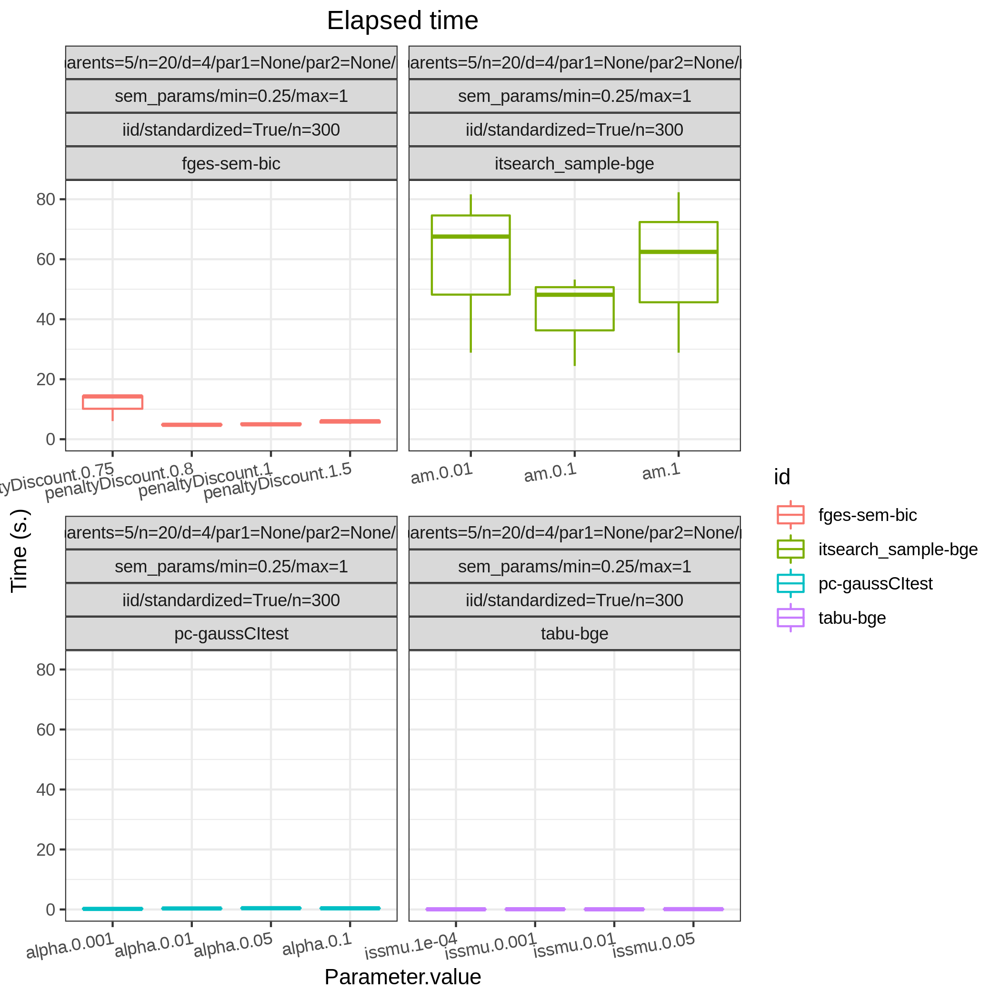

<snippet>
  <content><](https://snakemake.bitbucket.io)
[](https://benchpressdocs.readthedocs.io/en/latest/?badge=latest)
[](https://www.gnu.org/licenses/old-licenses/gpl-2.0.en.html)

---

Benchpress [[1]](#1) is a [Snakemake](https://snakemake.readthedocs.io/en/stable/) workflow where structure learning algorithms, implemented in possibly different languages, can be executed and compared.
The computations scale seamlessly on multiple cores or *"... to server, cluster, grid and cloud environments, without the need to modify the workflow definition" - Snakemake*.
The documentation is found at https://benchpressdocs.readthedocs.io. 
[This](https://benchpressdocs.readthedocs.io/en/latest/json_overview.html#evaluation) section shows an overview of the supported evaluation methods.

#### Data scenarios
Benchpress supports five different data scenarios built from combining different sources of graph parameters and data.

|     | Graph     | Parameters | Data      |
|-----|-----------|------------|-----------|
| I   | -         | -          | Fixed     |
| II  | Fixed     | -          | Fixed     |
| III | Fixed     | Fixed      | Generated |
| IV  | Fixed     | Generated  | Generated |
| V   | Generated | Generated  | Generated |


## Requirements
- [Snakemake ≥ 5.2](https://snakemake.readthedocs.io/en/stable/) ([installation instructions](https://snakemake.readthedocs.io/en/stable/getting_started/installation.html))
- [Singularity ≥ 3.2](https://sylabs.io/docs/) ([installation instructions](https://sylabs.io/guides/3.6/admin-guide/installation.html))
- Linux (Singularity currently only has a Beta release for OSX which is not enough)
## Installation

### Clone and install
As benchpress is a snakemake workflow, once the requirements are installed it requires no further installation but cloning the repository as
```
$ git clone https://github.com/felixleopoldo/benchpress.git
$ cd benchpress
```

#### Notes
On some systems, you might also have to explicitly install squash-tools. This can be done using conda as

`$ conda install -c conda-forge squash-tools`

## Usage

### Example study

This study is an example of data scenario V based on three continuous datasets corresponing to three realisations of a random linear Gaussian structural equation model (SEM) with random DAG. The DAGs are sampled from a restricted Erdős–Rényi distribution using the **pcalg_randdag** module and the weight parameters are sampled uniformly using the **sem_params** module. For simplicity we use only a few structure learning modules here (**order_mcmc**, **tetrad_fges**, **bnlearn_mmhc**, **pcalg_pc**) with different parameter settings. The full setup is found here [config/ex.json](config/ex.json).

To run this study (300 jobs ~ 10 minutes on a 2-cores laptop) type

`$ snakemake --cores all --use-singularity --configfile config/ex.json`
The following plots are from the roc module




 ### Paper study
To run the simulation setup in Section 5.1 of [[1]](#1) use [config/sec5.1.json](config/sec5.1.json) and type

`$ snakemake --cores all --use-singularity --configfile config/sec5.1.json`

A roc curve is found in the file [results/output/roc/FPRp_TRP_pattern.eps](docs/source/_static/ROC_randbinarybnreps50.png) and can be viewed with e.g. evince as

`$ evince results/output/roc/FPRp_TRP_pattern.eps`


This study took about 2h to finish on a 80-cores machine and is probably too large (~8000 jobs) for a laptop user. -->

### Available modules

#### Graph modules
| Method                 | Graph | Language | Library  | Version | Module id        |
|------------------------|-------|----------|----------|---------|------------------|
| randDAG                | DAG   | R        | pcalg    | 2.7-3   | pcalg_randdag    |
| graph.sim              | DG,UG | R        | BDgraph  | 2.64    | bdgraph_graphsim |
| CTA                    | DG    | Python   | trilearn | 1.2.3   | trilearn_cta     |
| AR                     | DG    | Python   | trilearn | 1.2.3   | bandmat          |
| AR random lag          | DG    | Python   | trilearn | 1.2.3   | rand_bandmat     |
| Fixed adjacency matrix | *     | .csv     | -        | -       | -                |

#### Parameter modules

| Distribution               | Method | Graph  | Language | Library  | Version | Module id            |
|----------------------------|--------|--------|----------|----------|---------|----------------------|
| Graph Wishart              | rgwish | DG, UG | R        | BDgraph  | 2.64    | bdgraph_rgwish       |
| Hyper Dirichlet            | -      | DG     | Python   | trilearn | 1.2.3   | trielarn_hyper-dir   |
| Graph intra-class          | -      | DG     | Python   | trilearn | 1.2.3   | trilearn_intra-class |
| Random SEM parameters      | -      | DAG    | R        | -        | -       | sem_params           |
| Random probability tables  | -      | DAG    | R        | -        | -       | bin_bn               |
| Fixed bn.fit object        | -      | DAG    | .rds     | bnlearn  | -       | -                    |
| Fixed SEM parameter matrix | -      | DAG    | .csv     | -        | -       | -                    |

#### Structure learning algorithms

| Algorithm        | Graph | Language | Library             | Version  | Module id         |
|------------------|-------|----------|---------------------|----------|-------------------|
| GOBNILP          | DAG   | C        | GOBNILP (bitbucket) | #e60ef14 | gobnilp           |
| ASOBS            | DAG   | R/Java   | r.blip              | 1.1      | rblip_asobs       |
| FGES             | CPDAG | Java     | TETRAD (causal-cmd) | 1.1.3    | tetrad_fges       |
| FCI              | DAG   | Java     | TETRAD (causal-cmd) | 1.1.3    | tetrad_fci        |
| RFCI             | CPDAG | Java     | TETRAD (causal-cmd) | 1.1.3    | tetrad_rfci       |
| GFCI             | DAG   | Java     | TETRAD (causal-cmd) | 1.1.3    | tetrad_gfci       |
| PC               | CPDAG | R        | pcalg               | 2.7-3    | pcalg_pc          |
| No tears         | DAG   | Python   | jmoss20 (github)    | #0c032a0 | notears           |
| HC               | DAG   | R        | bnlearn             | 4.7      | bnlearn_hc        |
| MMHC             | DAG   | R        | bnlearn             | 4.7      | bnlearn_mmhc      |
| Inter-IAMB       | CPDAG | R        | bnlearn             | 4.7      | bnlearn_interiamb |
| GS               | DAG   | R        | bnlearn             | 4.7      | bnlearn_gs        |
| Tabu             | DAG   | R        | bnlearn             | 4.7      | bnlearn_tabu      |
| Iterative MCMC   | DAG   | R        | BiDAG               | 2.0.3    | bidag_itsearch    |
| Order MCMC       | DAG   | R        | BiDAG               | 2.0.3    | bidag_order_mcmc  |
| PGibbs           | DG    | Python   | Trilearn            | 1.2.3    | trilearn_pgibbs   |
| GG99 single pair | DG    | Java     | A. Thomas           | -        | gg99_singlepair   |
| GT13 multi pair  | DG    | Java     | A. Thomas           | -        | gt13_multipair    |
| GLasso           | UG    | Python   | scikit-learn        | 0.22.1   | sklearn_glasso    |


#### Data modules
| Method              | Language | Module id |
|---------------------|----------|-----------|
| I.I.D. data samples | -        | iid       |
| Fixed data file     | .csv     | -         |

#### Evaluation modules

| Function                                  | Language | Library  | Module id           |
|-------------------------------------------|----------|----------|---------------------|
| Plots true graphs                         | -        | graphviz | graph_true_plots    |
| Plots estimated graphs                    | -        | graphviz | graph_plots         |
| Timing and ROC curves for TPR,FPR,FNR,... | R        | ggplot2  | roc                 |
| MCMC mean graph                           | Python   | seaborn  | mcmc_heatmaps       |
| MCMC auto-correlation                     | Python   | pandas   | mcmc_autocorr_plots |
| MCMC trajectory                           | Python   | pandas   | mcmc_traj_plots     |

Acronyms are used for Directed Acyclic Graphs (DAGs), Undirected Graphs (UGs), Decomposable Graphs (DGs), and Completed Partially DAGs (CPDAGs).

## Citing

```
@misc{rios2021benchpress,
      title={Benchpress: a scalable and platform-independent workflow for benchmarking structure learning algorithms for graphical models}, 
      author={Felix L. Rios and Giusi Moffa and Jack Kuipers},
      year={2021},
      eprint={2107.03863},
      archivePrefix={arXiv},
      primaryClass={stat.ML}
}
```

## References
* <a id="1">[1]</a> [Felix L. Rios and Giusi Moffa and Jack Kuipers Benchpress: a scalable and platform-independent workflow for benchmarking structure learning algorithms for graphical models. *ArXiv eprints.*, 2107.03863, 2021.](https://arxiv.org/abs/2107.03863)


## Contributing
Contrubutions are very welcomed

1. Fork it!
2. Create your feature branch: `git checkout -b my-new-feature`
3. Commit your changes: `git commit -am 'Add some feature'`
4. Push to the branch: `git push origin my-new-feature`
5. Open a pull request

## License

This project is licensed under the GPL-2.0 License - see the [LICENSE](LICENSE) file for details

</content>
  <tabTrigger></tabTrigger>
</snippet>
