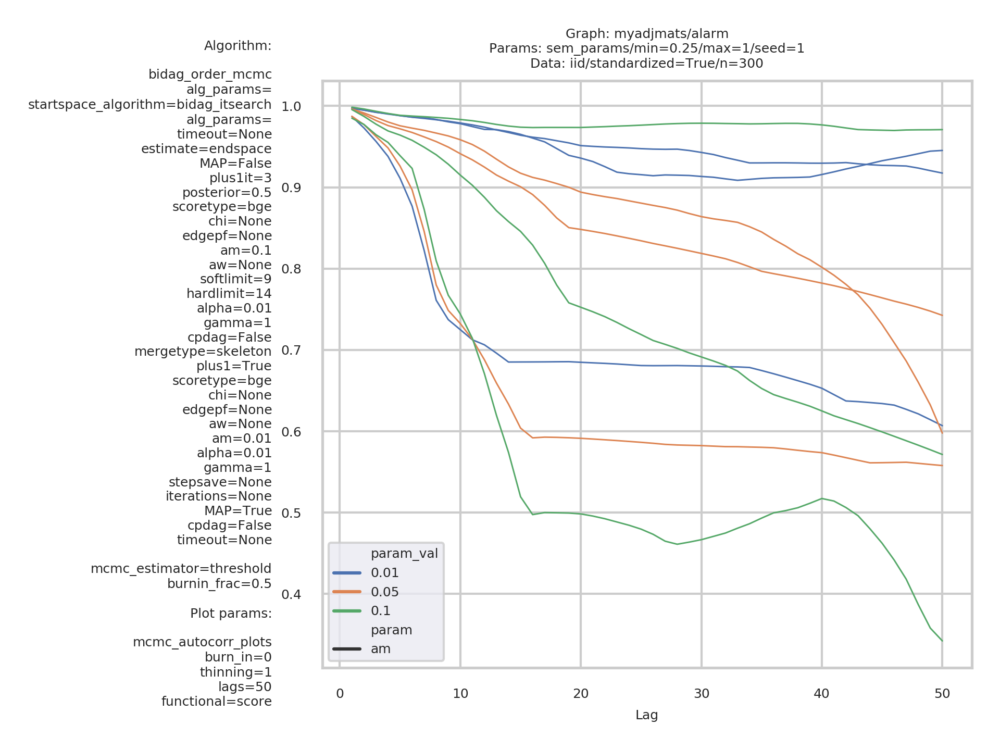
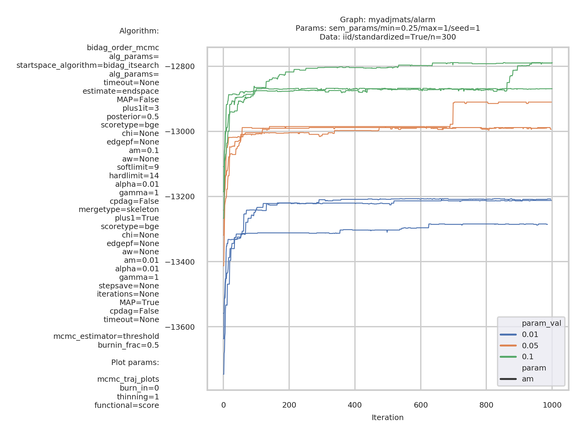

.. _evaluation: 

Evaluation
====================

There is typically no algorithm which performs well with respect to all performance metrics, and no single metric which is generally preferred. 
Therefore, to get an overall picture of the performance of an algorithm Benchpress supports different metrics through the modules in this section.
The output of the modules are copied to *results/output* for easy access.

.. list-table:: 
   :header-rows: 1 

   * - Evaluation
     - Module
   * - Benchmarks

     - benchmarks_ 
   * - Pairs plot

     - ggally_ggpairs_ 
   * - Graph plots

     - graph_plots_ 
   * - True graph plots

     - graph_true_plots_ 
   * - Graph stats

     - graph_true_stats_ 
   * - MCMC auto-correlation

     - mcmc_autocorr_plots_ 
   * - MCMC mean graphs

     - mcmc_heatmaps_ 
   * - MCMC trajectories

     - mcmc_traj_plots_ 

.. _benchmarks: 

benchmarks 
--------------

.. rubric:: Benchmarks

.. list-table:: 

   * - Module
     - `benchmarks <https://github.com/felixleopoldo/benchpress/tree/master/workflow/rules/evaluation/benchmarks>`__

.. rubric:: Description

Fields of this module

+---------------------+----------------------------------------------------------------------------------------------------------------------------------------------------------------------------------------------------------------------+-----+
| Field               | Description                                                                                                                                                                                                          |     |
+---------------------+----------------------------------------------------------------------------------------------------------------------------------------------------------------------------------------------------------------------+-----+
| ``filename_prefix`` | the prefix for the produced files.                                                                                                                                                                                   |     |
+---------------------+----------------------------------------------------------------------------------------------------------------------------------------------------------------------------------------------------------------------+-----+
| ``show_seed``       | shows the seed numbers in the ROC type plots and for the outliers in the box-plots.                                                                                                                                  |     |
+---------------------+----------------------------------------------------------------------------------------------------------------------------------------------------------------------------------------------------------------------+-----+
| ``errorbar``        | shows vertical estimated 5% and 95% quantiles in the ROC type plots.                                                                                                                                                 |     |
+---------------------+----------------------------------------------------------------------------------------------------------------------------------------------------------------------------------------------------------------------+-----+
| ``errorbarh``       | shows horisontal estimated 5% and 95% quantiles in the ROC type plots.                                                                                                                                               |     |
+---------------------+----------------------------------------------------------------------------------------------------------------------------------------------------------------------------------------------------------------------+-----+
| ``scatter``         | shows scatterplots in the ROC type plots.                                                                                                                                                                            |     |
+---------------------+----------------------------------------------------------------------------------------------------------------------------------------------------------------------------------------------------------------------+-----+
| ``path``            | joins the median values of each parameter setting for a specific with a line. So for this to become a path, you need to specify range of values for some of the fields in the corresponding algorithm module object. |     |
+---------------------+----------------------------------------------------------------------------------------------------------------------------------------------------------------------------------------------------------------------+-----+
| ``text``            | shows the parameter value in the ROC type plots. If this is set to false, a dot will be plotted instead.                                                                                                             |     |
+---------------------+----------------------------------------------------------------------------------------------------------------------------------------------------------------------------------------------------------------------+-----+

This module produces the following CSV files and directories with files

+------------------------+------------------------------------------------------------------------------------------------------------+
| *elapsed_time_join*    | Box-plots for the total times over all seeds.                                                              |
+------------------------+------------------------------------------------------------------------------------------------------------+
| *f1_skel_joint*        | F1 score box-plots.                                                                                        |
+------------------------+------------------------------------------------------------------------------------------------------------+
| *FNR_FPR_skel*         | Median false negative rate (FNR) / false positive rate (FPRp) for the skeleton graph (undirected version). |
+------------------------+------------------------------------------------------------------------------------------------------------+
| *FPR_TPR_skel*         | Median FPRp / TPR for the skeleton graph (undirected version).                                             |
+------------------------+------------------------------------------------------------------------------------------------------------+
| *FPR_TPR_pattern*      | Median FPRp / TPR for the pattern graph (same as skeleton for undirected graphs).                          |
+------------------------+------------------------------------------------------------------------------------------------------------+
| *FPRp_FNR_skel*        | Median FPRp / FNR for the skeleton graph.                                                                  |
+------------------------+------------------------------------------------------------------------------------------------------------+
| *graph_type*           | Plots the type of graph for each graph estimate.                                                           |
+------------------------+------------------------------------------------------------------------------------------------------------+
| *joint_benchmarks.csv* | Benchmarks joined in a CSV file (this ay be analyzed using any preferred software).                        |
+------------------------+------------------------------------------------------------------------------------------------------------+
| *ntests_joint*         | Box-plots for number of statistical tests (this is only applicable for some algorithms).                   |
+------------------------+------------------------------------------------------------------------------------------------------------+
| *ROC_data.csv*         | Summarized benchmarks joined in a CSV file.                                                                |
+------------------------+------------------------------------------------------------------------------------------------------------+
| *SHD_cpdag_joint*      | Structural Hamming distance (SHD) box-plots.                                                               |
+------------------------+------------------------------------------------------------------------------------------------------------+

    
..  figure:: _static/alarm/FPR_TPR_skel.png
    :alt: FPR_TPR_skel.png 
    :width: 500

    *FPR_TPR_skel.png* 

The following plots are also produced

..  figure:: _static/alarm/elapsed_time_joint.png
    :alt: Timing 
    :width: 500

    *elapsed_time_joint.png*

..  figure:: _static/alarm/f1_skel_joint.png
    :alt: F1 
    :width: 500

    *f1_skel_joint.png*

..  figure:: _static/alarm/graph_type.png
    :alt: Graph type 
    :width: 500

    *graph_type.png* 

.. rubric:: Example

.. code-block:: json

    [
      {
        "filename_prefix": "example/",
        "show_seed": true,
        "errorbar": true,
        "errorbarh": false,
        "scatter": true,
        "xlim": [
          0,
          0.3
        ],
        "ylim": [
          0,
          1
        ],
        "path": true,
        "text": false,
        "ids": [
          "fges-sem-bic",
          "pc-gaussCItest",
          "mmhc-bge-zf",
          "omcmc_itsample-bge"
        ]
      }
    ]

----------

.. _ggally_ggpairs: 

ggally_ggpairs 
------------------

.. rubric:: Pairs plot

.. list-table:: 

   * - Module
     - `ggally_ggpairs <https://github.com/felixleopoldo/benchpress/tree/master/workflow/rules/evaluation/ggally_ggpairs>`__

.. rubric:: Description

This module writes ggpairs plots using the `GGally <https://cran.r-project.org/web/packages/GGally/index.html#:~:text=GGally%3A%20Extension%20to%20'ggplot2',geometric%20objects%20with%20transformed%20data.>`_ package. 
Be careful that this can be slow and the variable names may not fit into the figure if the dimension is too large.
However, you can always alter the script as you like it.

..  figure:: _static/alarm/pairs_1.png
    :alt: GGpairs plot
    :width: 500

    GGpairs plot

.. rubric:: Example

.. code-block:: json

    [
      {
        "ggally_ggpairs": true
      }
    ]

----------

.. _graph_plots: 

graph_plots 
---------------

.. rubric:: Graph plots

.. list-table:: 

   * - Module
     - `graph_plots <https://github.com/felixleopoldo/benchpress/tree/master/workflow/rules/evaluation/graph_plots>`__

.. rubric:: Description

This module plots and saves the estimated graphs in dot-format and adjacency matrix.
It also plots graph comparison using *graphviz.compare* from `bnlearn <https://www.bnlearn.com/>`_.

..  figure:: _static/alarmpcgraph.png
    :alt: The Alarm network 

    Estimate of the Alarm network using PC algorithm

..  figure:: _static/alarmpcest.png
    :alt: The Alarm network 

    Estimate of the Alarm network using PC algorithm

.. rubric:: Example

.. code-block:: json

    [
      "fges-sem-bic",
      "mmhc-bge-zf",
      "omcmc_itsample-bge",
      "pc-gaussCItest"
    ]

----------

.. _graph_true_plots: 

graph_true_plots 
--------------------

.. rubric:: True graph plots

.. list-table:: 

   * - Module
     - `graph_true_plots <https://github.com/felixleopoldo/benchpress/tree/master/workflow/rules/evaluation/graph_true_plots>`__

.. rubric:: Description

This module plots the true underlying graphs. 

This module plots the true underlying graphs. 

..  figure:: _static/alarm.png
    :alt: The Alarm network 

    The Alarm network

..  figure:: _static/alarmadjmat.png
    :alt: The Alarm network 

    The Alarm network as adjacency matrix

.. rubric:: Example

.. code-block:: json

    [
      {
        "graph_true_plots": true
      }
    ]

----------

.. _graph_true_stats: 

graph_true_stats 
--------------------

.. rubric:: Graph stats

.. list-table:: 

   * - Module
     - `graph_true_stats <https://github.com/felixleopoldo/benchpress/tree/master/workflow/rules/evaluation/graph_true_stats>`__

.. rubric:: Description

This module plots properties of the true graphs such as graph density.

.. rubric:: Example

.. code-block:: json

    [
      {
        "graph_true_stats": true
      }
    ]

----------

.. _mcmc_autocorr_plots: 

mcmc_autocorr_plots 
-----------------------

.. rubric:: MCMC auto-correlation

.. list-table:: 

   * - Module
     - `mcmc_autocorr_plots <https://github.com/felixleopoldo/benchpress/tree/master/workflow/rules/evaluation/mcmc_autocorr_plots>`__

.. rubric:: Description

* Fields

  * ``burn_in`` percent [0, 1] to burn of the number of samples. 
  * ``functional`` the currently supported functionals are *size* and graph *score*. 
  * ``thinning`` tells the module to only considering every graph at a given interval length.
  * ``active`` should be set to *false* to deactivate.  
  * ``lags``  the maximum number of lags after ``thinning``.

This module plots the auto-correlation of a functional of the graphs in a MCMC trajectory. 

..  figure:: _static/omcmcscoreautocorr.png
    :alt: Score trajectory of order MCMC

    Auto-correlation of the scores in trajectory of order MCMC

    Auto-correlation of the scores in trajectory of order MCMC for differnt algorithm seeds and parameter settings.

.. rubric:: Example

.. code-block:: json

    [
      {
        "id": "omcmc_itsample-bge",
        "burn_in": 0.5,
        "thinning": 1,
        "lags": 50,
        "functional": [
          "score",
          "size"
        ],
        "active": true
      }
    ]

----------

.. _mcmc_heatmaps: 

mcmc_heatmaps 
-----------------

.. rubric:: MCMC mean graphs

.. list-table:: 

   * - Module
     - `mcmc_heatmaps <https://github.com/felixleopoldo/benchpress/tree/master/workflow/rules/evaluation/mcmc_heatmaps>`__

.. rubric:: Description

For Bayesian inference it is custom to use MCMC methods to simulate a Markov chain of graphs :math:`\{G^l\}_{l=0}^\infty` having the graph posterior as stationary distribution.
Suppose we have a realisation of length :math:`M + 1` of such chain, then the posterior edge probability of an edge e is estimated by :math:`\frac{1}{M+1-b} \sum_{l=b}^{M} \mathbf{1}_{e}(e^l)`, where the first :math:`b` samples are disregarded as a burn-in period.

This module has a list of objects, where each object has 

* Fields

  * ``burn_in`` percent [0, 1] to burn of the number of samples. 
  

The estimated probabilities are plotted in heatmaps using seaborn which are saved in *results/mcmc_heatmaps/* and copied to *results/output/mcmc_heatmaps/* for easy reference.

..  figure:: _static/alarmordermcmc.png
    :alt: The Alarm network 

    Mean graph estimate of the Alarm network using order MCMC with startspace from iterative MCMC 

.. rubric:: Example

.. code-block:: json

    [
      {
        "id": "omcmc_itsample-bge",
        "burn_in": 0,
        "active": true
      }
    ]

----------

.. _mcmc_traj_plots: 

mcmc_traj_plots 
-------------------

.. rubric:: MCMC trajectories

.. list-table:: 

   * - Module
     - `mcmc_traj_plots <https://github.com/felixleopoldo/benchpress/tree/master/workflow/rules/evaluation/mcmc_traj_plots>`__

.. rubric:: Description

This module plots the  values in the trajectory of a given functional. 

The ``mcmc_traj_plots`` module has a list of objects, where each object has

* Fields

  * ``burn_in`` percent [0, 1] to burn of the number of samples. 
  * ``functional`` the currently supported functionals are *size* and graph *score*. 
  * ``thinning`` tells the module to only considering every graph at a given interval length.
  * ``active`` should be set to *false* to deactivate.  

Since the trajectories tend to be very long, the user may choose to thin out the trajectory by only considering every graph at a given interval length specified by the ``thinning`` field. 

    Score trajectories of order MCMC with 3 different seeds and parameter settings for the ``am`` parameter.

.. rubric:: Example

.. code-block:: json

    [
      {
        "id": "omcmc_itsample-bge",
        "burn_in": 0.5,
        "thinning": 1,
        "functional": [
          "score",
          "size"
        ],
        "active": true
      }
    ]

----------