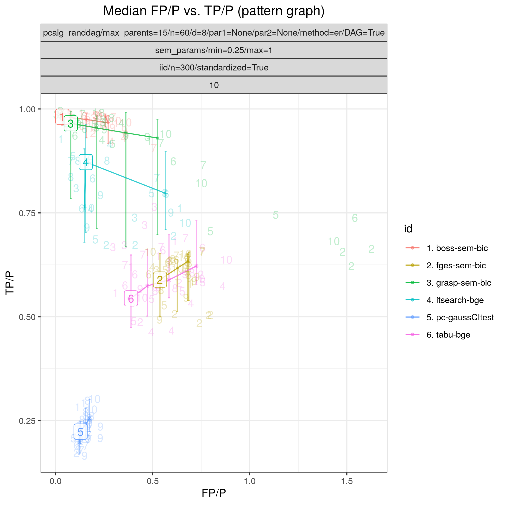

.. _structure_learning_algorithms: 

Algorithms
=======================================

Apart from the original parameters of the underlying software, each algorithm module is equipped with an additional parameter, ``timeout``, which is the maximum time in seconds allowed for the algorithm to run.
After the timeout, the algorithm will be terminated and either an empty file will be created or the current best graph will be saved (if the algorithm supports that).

Modules for MCMC algorithms can be used seamlessly with the other modules. However, apart from the original parameters and ``timeout``, these modules have four additional fields:

* ``mcmc_seed`` is the random seed for the algorithm. 
* ``mcmc_estimator`` specifies which estimator to use (*threshold* or *map*). 
* ``threshold`` specifies the threshold for the posterior edge probabilities if ``mcmc_estimator`` is set to *threshold*. 
* ``burnin_frac`` is a value in (0, 1) that specifies the fraction of the samples at the beginning of the graph trajectory to be discarded as burn-in.

The available modules are listed below. 
To add new modules, see :ref:`new_modules`.

.. list-table:: 
   :header-rows: 1 

   * - Algorithm
     - Graph
     - Package
     - Module
   * - Chordal graph samplers
     - `DG <https://en.wikipedia.org/wiki/Chordal_graph>`__
     - `Alun Thomas <https://medicine.utah.edu/faculty/alun-thomas>`__
     - athomas_jtsamplers_ 
   * - BDgraph
     - `UG <https://en.wikipedia.org/wiki/Graph_(discrete_mathematics)#Graph>`__
     - `BDgraph <https://cran.r-project.org/web/packages/BDgraph/index.html>`__
     - bdgraph_ 
   * - Iterative MCMC
     - `DAG <https://en.wikipedia.org/wiki/Directed_acyclic_graph>`__, `CPDAG <https://search.r-project.org/CRAN/refmans/pcalg/html/dag2cpdag.html>`__
     - `BiDAG <https://cran.r-project.org/web/packages/BiDAG/index.html>`__
     - bidag_itsearch_ 
   * - Order MCMC
     - `DAG <https://en.wikipedia.org/wiki/Directed_acyclic_graph>`__, `CPDAG <https://search.r-project.org/CRAN/refmans/pcalg/html/dag2cpdag.html>`__
     - `BiDAG <https://cran.r-project.org/web/packages/BiDAG/index.html>`__
     - bidag_order_mcmc_ 
   * - Partition MCMC
     - `DAG <https://en.wikipedia.org/wiki/Directed_acyclic_graph>`__, `CPDAG <https://search.r-project.org/CRAN/refmans/pcalg/html/dag2cpdag.html>`__
     - `BiDAG <https://cran.r-project.org/web/packages/BiDAG/index.html>`__
     - bidag_partition_mcmc_ 
   * - Fast IAMB
     - `DAG <https://en.wikipedia.org/wiki/Directed_acyclic_graph>`__
     - `bnlearn <https://www.bnlearn.com/>`__
     - bnlearn_fastiamb_ 
   * - Grow-shrink
     - `DAG <https://en.wikipedia.org/wiki/Directed_acyclic_graph>`__
     - `bnlearn <https://www.bnlearn.com/>`__
     - bnlearn_gs_ 
   * - H2PC
     - `DAG <https://en.wikipedia.org/wiki/Directed_acyclic_graph>`__
     - `bnlearn <https://www.bnlearn.com/>`__
     - bnlearn_h2pc_ 
   * - HC
     - `DAG <https://en.wikipedia.org/wiki/Directed_acyclic_graph>`__
     - `bnlearn <https://www.bnlearn.com/>`__
     - bnlearn_hc_ 
   * - HPC
     - `DAG <https://en.wikipedia.org/wiki/Directed_acyclic_graph>`__
     - `bnlearn <https://www.bnlearn.com/>`__
     - bnlearn_hpc_ 
   * - IAMB
     - `DAG <https://en.wikipedia.org/wiki/Directed_acyclic_graph>`__
     - `bnlearn <https://www.bnlearn.com/>`__
     - bnlearn_iamb_ 
   * - IAMB-FDR
     - `DAG <https://en.wikipedia.org/wiki/Directed_acyclic_graph>`__
     - `bnlearn <https://www.bnlearn.com/>`__
     - bnlearn_iambfdr_ 
   * - INTER-IAMB
     - `DAG <https://en.wikipedia.org/wiki/Directed_acyclic_graph>`__
     - `bnlearn <https://www.bnlearn.com/>`__
     - bnlearn_interiamb_ 
   * - MMHC
     - `DAG <https://en.wikipedia.org/wiki/Directed_acyclic_graph>`__
     - `bnlearn <https://www.bnlearn.com/>`__
     - bnlearn_mmhc_ 
   * - MMPC
     - `DAG <https://en.wikipedia.org/wiki/Directed_acyclic_graph>`__
     - `bnlearn <https://www.bnlearn.com/>`__
     - bnlearn_mmpc_ 
   * - PC
     - `DAG <https://en.wikipedia.org/wiki/Directed_acyclic_graph>`__
     - `bnlearn <https://www.bnlearn.com/>`__
     - bnlearn_pcstable_ 
   * - RSMAX2
     - `DAG <https://en.wikipedia.org/wiki/Directed_acyclic_graph>`__
     - `bnlearn <https://www.bnlearn.com/>`__
     - bnlearn_rsmax2_ 
   * - S-I HITON-PC
     - `DAG <https://en.wikipedia.org/wiki/Directed_acyclic_graph>`__
     - `bnlearn <https://www.bnlearn.com/>`__
     - bnlearn_sihitonpc_ 
   * - Tabu
     - `DAG <https://en.wikipedia.org/wiki/Directed_acyclic_graph>`__
     - `bnlearn <https://www.bnlearn.com/>`__
     - bnlearn_tabu_ 
   * - GSP
     - `DAG <https://en.wikipedia.org/wiki/Directed_acyclic_graph>`__
     - `CausalDAG <https://github.com/uhlerlab/causaldag>`__
     - causaldag_gsp_ 
   * - GRaSP
     - `CPDAG <https://search.r-project.org/CRAN/refmans/pcalg/html/dag2cpdag.html>`__
     - `causal-learn <https://causal-learn.readthedocs.io/en/latest/index.html>`__
     - causallearn_grasp_ 
   * - Corrmat thresh
     - `UG <https://en.wikipedia.org/wiki/Graph_(discrete_mathematics)#Graph>`__
     - `Benchpress <https://github.com/felixleopoldo/benchpress>`__
     - corr_thresh_ 
   * - Dual PC
     - `CG <https://en.wikipedia.org/wiki/Mixed_graph>`__, `CPDAG <https://search.r-project.org/CRAN/refmans/pcalg/html/dag2cpdag.html>`__
     - `dualPC <https://github.com/enricogiudice/dualPC>`__
     - dualpc_ 
   * - Psi-learning
     - `UG <https://en.wikipedia.org/wiki/Graph_(discrete_mathematics)#Graph>`__
     - `equSA <https://rdrr.io/cran/equSA/>`__
     - equsa_psilearner_ 
   * - ANM
     - `DAG <https://en.wikipedia.org/wiki/Directed_acyclic_graph>`__
     - `gCastle <https://github.com/huawei-noah/trustworthyAI/tree/master/gcastle>`__
     - gcastle_anm_ 
   * - CORL
     - `DAG <https://en.wikipedia.org/wiki/Directed_acyclic_graph>`__
     - `gCastle <https://github.com/huawei-noah/trustworthyAI/tree/master/gcastle>`__
     - gcastle_corl_ 
   * - Direct LINGAM
     - `DAG <https://en.wikipedia.org/wiki/Directed_acyclic_graph>`__
     - `gCastle <https://github.com/huawei-noah/trustworthyAI/tree/master/gcastle>`__
     - gcastle_direct_lingam_ 
   * - GAE
     - `DAG <https://en.wikipedia.org/wiki/Directed_acyclic_graph>`__
     - `gCastle <https://github.com/huawei-noah/trustworthyAI/tree/master/gcastle>`__
     - gcastle_gae_ 
   * - GOLEM
     - `DAG <https://en.wikipedia.org/wiki/Directed_acyclic_graph>`__
     - `gCastle <https://github.com/huawei-noah/trustworthyAI/tree/master/gcastle>`__
     - gcastle_golem_ 
   * - GraNDAG
     - `DAG <https://en.wikipedia.org/wiki/Directed_acyclic_graph>`__
     - `gCastle <https://github.com/huawei-noah/trustworthyAI/tree/master/gcastle>`__
     - gcastle_grandag_ 
   * - ICALiNGAM
     - `DAG <https://en.wikipedia.org/wiki/Directed_acyclic_graph>`__
     - `gCastle <https://github.com/huawei-noah/trustworthyAI/tree/master/gcastle>`__
     - gcastle_ica_lingam_ 
   * - MCSL
     - `DAG <https://en.wikipedia.org/wiki/Directed_acyclic_graph>`__
     - `gCastle <https://github.com/huawei-noah/trustworthyAI/tree/master/gcastle>`__
     - gcastle_mcsl_ 
   * - NO TEARS
     - `DAG <https://en.wikipedia.org/wiki/Directed_acyclic_graph>`__
     - `gCastle <https://github.com/huawei-noah/trustworthyAI/tree/master/gcastle>`__
     - gcastle_notears_ 
   * - NO TEARS low rank
     - `DAG <https://en.wikipedia.org/wiki/Directed_acyclic_graph>`__
     - `gCastle <https://github.com/huawei-noah/trustworthyAI/tree/master/gcastle>`__
     - gcastle_notears_low_rank_ 
   * - NO TEARS non-linear
     - `DAG <https://en.wikipedia.org/wiki/Directed_acyclic_graph>`__
     - `gCastle <https://github.com/huawei-noah/trustworthyAI/tree/master/gcastle>`__
     - gcastle_notears_nonlinear_ 
   * - PC
     - `DAG <https://en.wikipedia.org/wiki/Directed_acyclic_graph>`__
     - `gCastle <https://github.com/huawei-noah/trustworthyAI/tree/master/gcastle>`__
     - gcastle_pc_ 
   * - RL
     - `DAG <https://en.wikipedia.org/wiki/Directed_acyclic_graph>`__
     - `gCastle <https://github.com/huawei-noah/trustworthyAI/tree/master/gcastle>`__
     - gcastle_rl_ 
   * - GOBNILP
     - `DAG <https://en.wikipedia.org/wiki/Directed_acyclic_graph>`__
     - `GOBNILP (BitBucket) <https://bitbucket.org/jamescussens/gobnilp>`__
     - gobnilp_ 
   * - Parallel DG
     - `DG <https://en.wikipedia.org/wiki/Chordal_graph>`__
     - `parallelDG <https://github.com/melmasri/parallelDG>`__
     - paralleldg_ 
   * - GIES
     - `CPDAG <https://search.r-project.org/CRAN/refmans/pcalg/html/dag2cpdag.html>`__
     - `pcalg <https://cran.r-project.org/web/packages/pcalg/index.html>`__
     - pcalg_gies_ 
   * - PC
     - `CPDAG <https://search.r-project.org/CRAN/refmans/pcalg/html/dag2cpdag.html>`__, `CG <https://en.wikipedia.org/wiki/Mixed_graph>`__
     - `pcalg <https://cran.r-project.org/web/packages/pcalg/index.html>`__
     - pcalg_pc_ 
   * - Precmat thresh
     - `UG <https://en.wikipedia.org/wiki/Graph_(discrete_mathematics)#Graph>`__
     - `Benchpress <https://github.com/felixleopoldo/benchpress>`__
     - prec_thresh_ 
   * - ASOBS
     - `DAG <https://en.wikipedia.org/wiki/Directed_acyclic_graph>`__
     - `r.blip <https://cran.r-project.org/web/packages/r.blip/index.html>`__
     - rblip_asobs_ 
   * - Graphical Lasso
     - `UG <https://en.wikipedia.org/wiki/Graph_(discrete_mathematics)#Graph>`__
     - `scikit-learn <https://scikit-learn.org/0.22/>`__
     - sklearn_glasso_ 
   * - BOSS
     - `CPDAG <https://search.r-project.org/CRAN/refmans/pcalg/html/dag2cpdag.html>`__
     - `causal-cmd <https://github.com/bd2kccd/causal-cmd>`__
     - tetrad_boss_ 
   * - FASK
     - `DAG <https://en.wikipedia.org/wiki/Directed_acyclic_graph>`__
     - `causal-cmd <https://github.com/bd2kccd/causal-cmd>`__
     - tetrad_fask_ 
   * - FGES
     - `CPDAG <https://search.r-project.org/CRAN/refmans/pcalg/html/dag2cpdag.html>`__
     - `causal-cmd <https://github.com/bd2kccd/causal-cmd>`__
     - tetrad_fges_ 
   * - FOFC
     - `DAG <https://en.wikipedia.org/wiki/Directed_acyclic_graph>`__
     - `causal-cmd <https://github.com/bd2kccd/causal-cmd>`__
     - tetrad_fofc_ 
   * - FTFC
     - `DAG <https://en.wikipedia.org/wiki/Directed_acyclic_graph>`__
     - `causal-cmd <https://github.com/bd2kccd/causal-cmd>`__
     - tetrad_ftfc_ 
   * - GRaSP
     - `CPDAG <https://search.r-project.org/CRAN/refmans/pcalg/html/dag2cpdag.html>`__
     - `causal-cmd <https://github.com/bd2kccd/causal-cmd>`__
     - tetrad_grasp_ 
   * - ICA-LINGAM
     - `DAG <https://en.wikipedia.org/wiki/Directed_acyclic_graph>`__
     - `causal-cmd <https://github.com/bd2kccd/causal-cmd>`__
     - tetrad_ica-lingam_ 
   * - PC
     - `DAG <https://en.wikipedia.org/wiki/Directed_acyclic_graph>`__
     - `causal-cmd <https://github.com/bd2kccd/causal-cmd>`__
     - tetrad_pc_ 
   * - Particle Gibbs
     - `DG <https://en.wikipedia.org/wiki/Chordal_graph>`__
     - `trilearn <https://github.com/felixleopoldo/trilearn>`__
     - trilearn_pgibbs_ 

.. _athomas_jtsamplers: 

athomas_jtsamplers 
----------------------

.. rubric:: Chordal graph samplers

.. list-table:: 

   * - Package
     - `Alun Thomas <https://medicine.utah.edu/faculty/alun-thomas>`__
   * - Version
     - 76ad20e
   * - Language
     - `Java <https://www.java.com/en/>`__
   * - Docs
     - 
   * - Paper
     - :footcite:t:`10.1093/biomet/86.4.785`, :footcite:t:`10.2307/43304539`
   * - Graph type
     - `DG <https://en.wikipedia.org/wiki/Chordal_graph>`__
   * - Docker 
     - `bpimages/athomas_jtsamplers:76ad20e <https://hub.docker.com/r/bpimages/athomas_jtsamplers/tags>`__

   * - Module folder
     - `athomas_jtsamplers <https://github.com/felixleopoldo/benchpress/tree/master/workflow/rules/structure_learning_algorithms/athomas_jtsamplers>`__

.. rubric:: Description

Abstract :footcite:p:`10.2307/43304539`: Full Bayesian computational inference for model determination in undirected graphical models is currently restricted to decomposable graphs or other special cases, except for small-scale problems, say up to 15 variables. In this paper we develop new, more efficient methodology for such inference, by making two contributions to the computational geometry of decomposable graphs. The first of these provides sufficient conditions under which it is possible to completely connect two disconnected complete subsets of vertices, or perform the reverse procedure, yet maintain decomposability of the graph. The second is a new Markov chain Monte Carlo sampler for arbitrary positive distributions on decomposable graphs, taking a junction tree representing the graph as its state variable. 

.. rubric:: Some fields described 
* ``edge_penalty`` Set the edge penalty in the prior. 
* ``num_samples`` The number of MCMC iterations. 
* ``sampler`` Set the sampler to the one indexed by: 0 = Giudicci & Green (1999) sampler. 1 = Green & Thomas (2013) single edge junction tree sampler. 2 = Green & Thomas (2013) multiple edge junction tree sampler.  
* ``size_maxclique`` Set the maximum clique size. 

.. rubric:: Example JSON

.. code-block:: json

    [
      {
        "id": "gg99",
        "burnin_frac": 0.5,
        "mcmc_estimator": "map",
        "timeout": null,
        "threshold": 0.5,
        "mcmc_seed": 1,
        "num_samples": 10000,
        "sampler": 0,
        "edge_penalty": 1.0,
        "size_maxclique": 10000
      }
    ]

.. footbibliography::

.. _bdgraph: 

bdgraph 
-----------

.. rubric:: BDgraph

.. list-table:: 

   * - Package
     - `BDgraph <https://cran.r-project.org/web/packages/BDgraph/index.html>`__
   * - Version
     - 2.72
   * - Language
     - `R <https://www.r-project.org/>`__
   * - Docs
     - `here <https://cran.r-project.org/web/packages/BDgraph/BDgraph.pdf>`__
   * - Paper
     - :footcite:t:`JSSv089i03`, :footcite:t:`mohammadi2015bayesian`, :footcite:t:`doi:10.1080/01621459.2021.1996377`, :footcite:t:`10.1214/18-AOAS1164`
   * - Graph type
     - `UG <https://en.wikipedia.org/wiki/Graph_(discrete_mathematics)#Graph>`__
   * - Docker 
     - `bpimages/bdgraph:2.72.0 <https://hub.docker.com/r/bpimages/bdgraph/tags>`__

   * - Module folder
     - `bdgraph <https://github.com/felixleopoldo/benchpress/tree/master/workflow/rules/structure_learning_algorithms/bdgraph>`__

.. rubric:: Description

.. rubric:: Example JSON

.. code-block:: json

    [
      {
        "id": "bdgraph",
        "method": "ggm",
        "algo": "bdmcmc",
        "iter": 3000,
        "gprior": 0.5,
        "dfprior": 3,
        "gstart": "empty",
        "timeout": null,
        "mcmc_seed": 1,
        "thresh": 0.5,
        "mcmc_estimator": "threshold",
        "threshold": [
          0.1,
          0.3,
          0.5,
          0.7,
          0.9,
          1.0
        ],
        "burnin_frac": 0.3
      }
    ]

.. footbibliography::

.. _bidag_itsearch: 

bidag_itsearch 
------------------

.. rubric:: Iterative MCMC

.. list-table:: 

   * - Package
     - `BiDAG <https://cran.r-project.org/web/packages/BiDAG/index.html>`__
   * - Version
     - 2.1.4
   * - Language
     - `R <https://www.r-project.org/>`__
   * - Docs
     - `here <https://cran.r-project.org/web/packages/BiDAG/BiDAG.pdf>`__
   * - Paper
     - :footcite:t:`doi:10.1080/10618600.2021.2020127`
   * - Graph type
     - `DAG <https://en.wikipedia.org/wiki/Directed_acyclic_graph>`__, `CPDAG <https://search.r-project.org/CRAN/refmans/pcalg/html/dag2cpdag.html>`__
   * - Docker 
     - `bpimages/bidag:2.1.4 <https://hub.docker.com/r/bpimages/bidag/tags>`__

   * - Module folder
     - `bidag_itsearch <https://github.com/felixleopoldo/benchpress/tree/master/workflow/rules/structure_learning_algorithms/bidag_itsearch>`__

.. rubric:: Description

This is a hybrid score-based optimisation technique based on Markov chain Monte Carlo
schemes :footcite:t:`doi:10.1080/10618600.2021.2020127`. The algorithm starts from a skeleton obtained
through a fast method (e.g. a constraint based method, or GES). Then it performs score and
search on the DAGs belonging to the space defined by the starting skeleton. To correct for
edges which may be missed, the search space is iteratively expanded to include one additional
parent for each variable from outside the current search space. The score and search phase relies
on an MCMC scheme producing a chain of DAGs from their posterior probability given the data.

.. rubric:: Example 

Config file: `itsearch_sem.json <https://github.com/felixleopoldo/benchpress/blob/master/workflow/rules/structure_learning_algorithms/bidag_itsearch/config/itsearch_sem.json>`_

Command:

.. code:: bash

    snakemake --cores all --use-singularity --configfile workflow/rules/structure_learning_algorithms/bidag_itsearch/config/itsearch_sem.json

:numref:`itsearchroc` and :numref:`itsearchtimings2`  show FP/P vs. TP/P and timings based on 10 datsets corresponding to 10 realisations of a 80-variables random Gaussian SEM, with an average indegree of 2 and maximum indegree of 5.
Each dataset contains 300 samples.
:numref:`itsearchtype2` and :numref:`itsearchprops2` shows the type of graphs estimated and the properties of the true graphs, respectively.

.. _itsearchroc:

    FP/P vs. TP/P.

.. _itsearchtimings2:

.. figure:: ../../workflow/rules/structure_learning_algorithms/bidag_itsearch/images/bidag_time.png
    :width: 320 
    :alt: Timings itsearch example
    :align: right

    Timings.

.. _itsearchtype2:

    Type of graphs estimated.

.. _itsearchprops2:

    Graph properties.

.. rubric:: Example JSON

.. code-block:: json

    [
      {
        "id": "itsearch_map-bge",
        "estimate": "map",
        "MAP": true,
        "plus1it": null,
        "posterior": null,
        "scoretype": "bge",
        "chi": null,
        "edgepf": null,
        "am": [
          0.000248,
          0.0223,
          0.1,
          0.448,
          0.739
        ],
        "aw": null,
        "softlimit": 9,
        "hardlimit": 15,
        "alpha": 0.05,
        "gamma": 1,
        "cpdag": false,
        "mergetype": "skeleton",
        "timeout": null
      },
      {
        "id": "itsearch_map-bde",
        "estimate": "map",
        "MAP": true,
        "plus1it": null,
        "posterior": null,
        "scoretype": "bde",
        "chi": [
          0.01,
          0.1,
          1
        ],
        "edgepf": 2,
        "am": null,
        "aw": null,
        "softlimit": 9,
        "hardlimit": 12,
        "alpha": 0.05,
        "gamma": 1,
        "cpdag": false,
        "mergetype": "skeleton",
        "timeout": null
      }
    ]

.. footbibliography::

.. _bidag_order_mcmc: 

bidag_order_mcmc 
--------------------

.. rubric:: Order MCMC

.. list-table:: 

   * - Package
     - `BiDAG <https://cran.r-project.org/web/packages/BiDAG/index.html>`__
   * - Version
     - 2.1.4
   * - Language
     - `R <https://www.r-project.org/>`__
   * - Docs
     - `here <https://cran.r-project.org/web/packages/BiDAG/BiDAG.pdf>`__
   * - Paper
     - :footcite:t:`friedman2003being`, :footcite:t:`doi:10.1080/10618600.2021.2020127`
   * - Graph type
     - `DAG <https://en.wikipedia.org/wiki/Directed_acyclic_graph>`__, `CPDAG <https://search.r-project.org/CRAN/refmans/pcalg/html/dag2cpdag.html>`__
   * - Docker 
     - `bpimages/bidag:2.1.4 <https://hub.docker.com/r/bpimages/bidag/tags>`__

   * - Module folder
     - `bidag_order_mcmc <https://github.com/felixleopoldo/benchpress/tree/master/workflow/rules/structure_learning_algorithms/bidag_order_mcmc>`__

.. rubric:: Description

This technique relies on a Bayesian perspective on structure learning, where the score of a DAG
is defined as its posterior distribution. To overcome the limitation of simple structure-based
MCMC schemes, :footcite:t:`friedman2003being` turned to a score defined as the sum of the
posterior scores of all DAG which are consistent with a given topological ordering of the
nodes. One can then run a Metropolis-Hasting algorithm to sample from the distribution
induced by the order score, and later draw a DAG consistent with the order. This strategy
substantially improves convergence with respect to earlier structure MCMC scheme, though it
unfortunately produces a biased sample on the space of DAGs. The implementation considered
in Benchpress is a hybrid version with the sampling performed on a restricted search space
initialised with constraint-based testing and improved with a score-based search :footcite:t:`doi:10.1080/10618600.2021.2020127`.

.. rubric:: Some fields described 
* ``input_algorithm_id`` Algorithm to use for initial search space. This should be the ID of another algorithm object. It corresponds to the original startspace parameter in the R package. 

.. rubric:: Example JSON

.. code-block:: json

    [
      {
        "id": "omcmc_itmap-bge",
        "input_algorithm_id": "itsearch_map-bge_am01_endspace",
        "plus1": true,
        "scoretype": "bge",
        "chi": null,
        "edgepf": null,
        "aw": null,
        "am": [
          0.01,
          0.1,
          0.05
        ],
        "alpha": 0.01,
        "gamma": 1,
        "stepsave": null,
        "iterations": null,
        "MAP": true,
        "cpdag": false,
        "timeout": null,
        "mcmc_seed": 1,
        "threshold": 0.5,
        "mcmc_estimator": "threshold",
        "burnin_frac": 0.5
      },
      {
        "id": "omcmc_itmap-bde",
        "plus1": true,
        "input_algorithm": "itsearch_map-bde",
        "scoretype": "bde",
        "chi": [
          0.01,
          0.1,
          1,
          2
        ],
        "edgepf": 2,
        "aw": null,
        "am": null,
        "alpha": 0.05,
        "gamma": 1,
        "stepsave": null,
        "iterations": null,
        "MAP": true,
        "cpdag": false,
        "mcmc_seed": 1,
        "threshold": [
          0.5
        ],
        "burnin_frac": 0,
        "mcmc_estimator": "threshold",
        "timeout": null
      }
    ]

.. footbibliography::

.. _bidag_partition_mcmc: 

bidag_partition_mcmc 
------------------------

.. rubric:: Partition MCMC

.. list-table:: 

   * - Package
     - `BiDAG <https://cran.r-project.org/web/packages/BiDAG/index.html>`__
   * - Version
     - 2.1.4
   * - Language
     - `R <https://www.r-project.org/>`__
   * - Docs
     - `here <https://cran.r-project.org/web/packages/BiDAG/BiDAG.pdf>`__
   * - Paper
     - :footcite:t:`doi:10.1080/01621459.2015.1133426`
   * - Graph type
     - `DAG <https://en.wikipedia.org/wiki/Directed_acyclic_graph>`__, `CPDAG <https://search.r-project.org/CRAN/refmans/pcalg/html/dag2cpdag.html>`__
   * - Docker 
     - `bpimages/bidag:2.1.4 <https://hub.docker.com/r/bpimages/bidag/tags>`__

   * - Module folder
     - `bidag_partition_mcmc <https://github.com/felixleopoldo/benchpress/tree/master/workflow/rules/structure_learning_algorithms/bidag_partition_mcmc>`__

.. rubric:: Description

Abstract: 
Acyclic digraphs are the underlying representation of Bayesian networks, a widely used class of probabilistic graphical models. Learning the underlying graph from data is a way of gaining insights about the structural properties of a domain. Structure learning forms one of the inference challenges of statistical graphical models. Markov chain Monte Carlo (MCMC) methods, notably structure MCMC, to sample graphs from the posterior distribution given the data are probably the only viable option for Bayesian model averaging. Score modularity and restrictions on the number of parents of each node allow the graphs to be grouped into larger collections, which can be scored as a whole to improve the chain’s convergence. Current examples of algorithms taking advantage of grouping are the biased order MCMC, which acts on the alternative space of permuted triangular matrices, and nonergodic edge reversal moves. Here, we propose a novel algorithm, which employs the underlying combinatorial structure of DAGs to define a new grouping. As a result convergence is improved compared to structure MCMC, while still retaining the property of producing an unbiased sample. Finally, the method can be combined with edge reversal moves to improve the sampler further. Supplementary materials for this article are available online.

.. rubric:: Example JSON

.. code-block:: json

    [
      {
        "id": "partition_itmap-bge",
        "input_algorithm_id": "itsearch_map-bge_am01_endspace",
        "verbose": true,
        "scoretype": "bge",
        "chi": null,
        "edgepf": null,
        "aw": null,
        "am": [
          0.01,
          0.1,
          0.05
        ],
        "gamma": 1,
        "stepsave": null,
        "iterations": null,
        "timeout": null,
        "mcmc_seed": 1,
        "threshold": 0.5,
        "mcmc_estimator": "threshold",
        "burnin_frac": 0.5
      },
      {
        "id": "partition_itmap-bde",
        "input_algorithm_id": "itsearch_map-bde_endspace",
        "verbose": true,
        "scoretype": "bde",
        "chi": [
          0.01,
          0.1,
          1,
          2
        ],
        "edgepf": 2,
        "aw": null,
        "am": null,
        "gamma": 1,
        "stepsave": null,
        "iterations": null,
        "timeout": null,
        "mcmc_seed": 1,
        "threshold": 0.5,
        "mcmc_estimator": "threshold",
        "burnin_frac": 0.5
      }
    ]

.. footbibliography::

.. _bnlearn_fastiamb: 

bnlearn_fastiamb 
--------------------

.. rubric:: Fast IAMB

.. list-table:: 

   * - Package
     - `bnlearn <https://www.bnlearn.com/>`__
   * - Version
     - 4.8.3
   * - Language
     - `R <https://www.r-project.org/>`__
   * - Docs
     - `here <https://www.bnlearn.com/documentation/man/constraint.html>`__
   * - Paper
     - :footcite:t:`1565788`
   * - Graph type
     - `DAG <https://en.wikipedia.org/wiki/Directed_acyclic_graph>`__
   * - Docker 
     - `bpimages/bnlearn:4.8.3 <https://hub.docker.com/r/bpimages/bnlearn/tags>`__

   * - Module folder
     - `bnlearn_fastiamb <https://github.com/felixleopoldo/benchpress/tree/master/workflow/rules/structure_learning_algorithms/bnlearn_fastiamb>`__

.. rubric:: Description

From bnlearn: a variant of IAMB which uses speculative stepwise forward selection to reduce the number of conditional independence tests.

.. rubric:: Example JSON

.. code-block:: json

    [
      {
        "id": "fastiamb-zf",
        "alpha": [
          0.01,
          0.05
        ],
        "test": "zf",
        "B": null,
        "maxsx": null,
        "debug": false,
        "undirected": false,
        "timeout": null
      },
      {
        "id": "fastiamb-mi",
        "alpha": [
          0.01,
          0.05,
          0.1,
          0.2
        ],
        "test": "mi",
        "B": null,
        "maxsx": null,
        "debug": false,
        "undirected": false,
        "timeout": null
      }
    ]

.. footbibliography::

.. _bnlearn_gs: 

bnlearn_gs 
--------------

.. rubric:: Grow-shrink

.. list-table:: 

   * - Package
     - `bnlearn <https://www.bnlearn.com/>`__
   * - Version
     - 4.8.3
   * - Language
     - `R <https://www.r-project.org/>`__
   * - Docs
     - `here <https://www.bnlearn.com/documentation/man/constraint.html>`__
   * - Paper
     - :footcite:t:`margaritis2003learning`
   * - Graph type
     - `DAG <https://en.wikipedia.org/wiki/Directed_acyclic_graph>`__
   * - Docker 
     - `bpimages/bnlearn:4.8.3 <https://hub.docker.com/r/bpimages/bnlearn/tags>`__

   * - Module folder
     - `bnlearn_gs <https://github.com/felixleopoldo/benchpress/tree/master/workflow/rules/structure_learning_algorithms/bnlearn_gs>`__

.. rubric:: Description

The grow-shrink (GS) algorithm is based on the Markov blanket of the nodes in a DAG. For
a specific node, the Markov blanket it the set of nodes which conditioning upon renders it
conditionally independent from all other variables :footcite:t:`margaritis2003learning`. It is a constraint-based
method which estimates the Markov blanket of a node in a two-stage forward-backward proce-
dure using conditional independence tests. The Markov blankets are used to first estimate an
undirected graph and then estimate a DAG in a four-step procedure.

.. rubric:: Example JSON

.. code-block:: json

    [
      {
        "id": "gs-mi",
        "alpha": [
          0.01,
          0.05,
          0.1,
          0.2
        ],
        "test": "mi",
        "B": null,
        "maxsx": null,
        "debug": false,
        "undirected": false,
        "timeout": null
      },
      {
        "id": "gs-zf",
        "alpha": [
          0.01,
          0.05
        ],
        "test": "zf",
        "B": null,
        "maxsx": null,
        "debug": false,
        "undirected": false,
        "timeout": null
      }
    ]

.. footbibliography::

.. _bnlearn_h2pc: 

bnlearn_h2pc 
----------------

.. rubric:: H2PC

.. list-table:: 

   * - Package
     - `bnlearn <https://www.bnlearn.com/>`__
   * - Version
     - 4.8.3
   * - Language
     - `R <https://www.r-project.org/>`__
   * - Docs
     - `here <https://www.bnlearn.com/documentation/man/constraint.html>`__
   * - Paper
     - :footcite:t:`GASSE20146755`
   * - Graph type
     - `DAG <https://en.wikipedia.org/wiki/Directed_acyclic_graph>`__
   * - Docker 
     - `bpimages/bnlearn:4.8.3 <https://hub.docker.com/r/bpimages/bnlearn/tags>`__

   * - Module folder
     - `bnlearn_h2pc <https://github.com/felixleopoldo/benchpress/tree/master/workflow/rules/structure_learning_algorithms/bnlearn_h2pc>`__

.. rubric:: Description

Abstract: We present a novel hybrid algorithm for Bayesian network structure learning, called H2PC. It first reconstructs the skeleton of a Bayesian network and then performs a Bayesian-scoring greedy hill-climbing search to orient the edges. The algorithm is based on divide-and-conquer constraint-based subroutines to learn the local structure around a target variable. We conduct two series of experimental comparisons of H2PC against Max–Min Hill-Climbing (MMHC), which is currently the most powerful state-of-the-art algorithm for Bayesian network structure learning. First, we use eight well-known Bayesian network benchmarks with various data sizes to assess the quality of the learned structure returned by the algorithms. Our extensive experiments show that H2PC outperforms MMHC in terms of goodness of fit to new data and quality of the network structure with respect to the true dependence structure of the data. Second, we investigate H2PC’s ability to solve the multi-label learning problem. We provide theoretical results to characterize and identify graphically the so-called minimal label powersets that appear as irreducible factors in the joint distribution under the faithfulness condition. The multi-label learning problem is then decomposed into a series of multi-class classification problems, where each multi-class variable encodes a label powerset. H2PC is shown to compare favorably to MMHC in terms of global classification accuracy over ten multi-label data sets covering different application domains. Overall, our experiments support the conclusions that local structural learning with H2PC in the form of local neighborhood induction is a theoretically well-motivated and empirically effective learning framework that is well suited to multi-label learning. The source code (in R) of H2PC as well as all data sets used for the empirical tests are publicly available.

.. rubric:: Example JSON

.. code-block:: json

    [
      {
        "id": "h2pc-bge-zf",
        "alpha": [
          0.001,
          0.01,
          0.05,
          0.1
        ],
        "score": "bge",
        "test": "zf",
        "iss": 1,
        "issmu": 1,
        "issw": null,
        "l": 5,
        "k": 1,
        "prior": "uniform",
        "beta": null,
        "timeout": null
      },
      {
        "id": "h2pc-bde",
        "alpha": [
          0.001,
          0.01,
          0.05,
          0.1
        ],
        "score": "bge",
        "test": "zf",
        "iss": 1,
        "issmu": null,
        "issw": null,
        "l": 5,
        "k": 1,
        "prior": "uniform",
        "beta": null,
        "timeout": null
      }
    ]

.. footbibliography::

.. _bnlearn_hc: 

bnlearn_hc 
--------------

.. rubric:: HC

.. list-table:: 

   * - Package
     - `bnlearn <https://www.bnlearn.com/>`__
   * - Version
     - 4.8.3
   * - Language
     - `R <https://www.r-project.org/>`__
   * - Docs
     - `here <https://www.bnlearn.com/documentation/man/constraint.html>`__
   * - Paper
     - :footcite:t:`scutari2019learning`, :footcite:t:`norvig2002modern`
   * - Graph type
     - `DAG <https://en.wikipedia.org/wiki/Directed_acyclic_graph>`__
   * - Docker 
     - `bpimages/bnlearn:4.8.3 <https://hub.docker.com/r/bpimages/bnlearn/tags>`__

   * - Module folder
     - `bnlearn_hc <https://github.com/felixleopoldo/benchpress/tree/master/workflow/rules/structure_learning_algorithms/bnlearn_hc>`__

.. rubric:: Description

Hill climbing (HC) is a score-based algorithm which starts with a DAG with no edges and
adds, deletes or reverses edges in a greedy manner until an optimum is reached.

.. rubric:: Example JSON

.. code-block:: json

    [
      {
        "id": "hc-bde",
        "score": "bde",
        "iss": [
          0.001,
          0.01,
          0.1
        ],
        "issmu": null,
        "issw": null,
        "l": 5,
        "k": 1,
        "prior": "uniform",
        "beta": 1,
        "restart": 0,
        "perturb": 1,
        "timeout": null
      },
      {
        "id": "hc-bge",
        "score": "bge",
        "iss": 1,
        "issmu": [
          0.0001,
          0.001,
          0.01,
          0.05
        ],
        "issw": null,
        "l": 5,
        "k": 1,
        "prior": "uniform",
        "beta": 1,
        "restart": 0,
        "perturb": 1,
        "timeout": null
      }
    ]

.. footbibliography::

.. _bnlearn_hpc: 

bnlearn_hpc 
---------------

.. rubric:: HPC

.. list-table:: 

   * - Package
     - `bnlearn <https://www.bnlearn.com/>`__
   * - Version
     - 4.8.3
   * - Language
     - `R <https://www.r-project.org/>`__
   * - Docs
     - `here <https://www.bnlearn.com/documentation/man/constraint.html>`__
   * - Paper
     - :footcite:t:`GASSE20146755`
   * - Graph type
     - `DAG <https://en.wikipedia.org/wiki/Directed_acyclic_graph>`__
   * - Docker 
     - `bpimages/bnlearn:4.8.3 <https://hub.docker.com/r/bpimages/bnlearn/tags>`__

   * - Module folder
     - `bnlearn_hpc <https://github.com/felixleopoldo/benchpress/tree/master/workflow/rules/structure_learning_algorithms/bnlearn_hpc>`__

.. rubric:: Description

From bnlearn: an algorithm building on iamb.fdr to learn the parents and children of each node like mmpc and si.hiton.pc. The reference publication is the same as that for Hybrid HPC.

.. rubric:: Example JSON

.. code-block:: json

    [
      {
        "id": "hpc-zf",
        "alpha": [
          0.01,
          0.05
        ],
        "test": "zf",
        "B": null,
        "maxsx": null,
        "debug": false,
        "undirected": false,
        "timeout": null
      },
      {
        "id": "hpc-mi",
        "alpha": [
          0.01,
          0.05,
          0.1,
          0.2
        ],
        "test": "mi",
        "B": null,
        "maxsx": null,
        "debug": false,
        "undirected": false,
        "timeout": null
      }
    ]

.. footbibliography::

.. _bnlearn_iamb: 

bnlearn_iamb 
----------------

.. rubric:: IAMB

.. list-table:: 

   * - Package
     - `bnlearn <https://www.bnlearn.com/>`__
   * - Version
     - 4.8.3
   * - Language
     - `R <https://www.r-project.org/>`__
   * - Docs
     - `here <https://www.bnlearn.com/documentation/man/constraint.html>`__
   * - Paper
     - :footcite:t:`tsamardinos2003algorithms`
   * - Graph type
     - `DAG <https://en.wikipedia.org/wiki/Directed_acyclic_graph>`__
   * - Docker 
     - `bpimages/bnlearn:4.8.3 <https://hub.docker.com/r/bpimages/bnlearn/tags>`__

   * - Module folder
     - `bnlearn_iamb <https://github.com/felixleopoldo/benchpress/tree/master/workflow/rules/structure_learning_algorithms/bnlearn_iamb>`__

.. rubric:: Description

.. rubric:: Example JSON

.. code-block:: json

    [
      {
        "id": "iamb-zf",
        "alpha": [
          0.01,
          0.05
        ],
        "test": "zf",
        "B": null,
        "maxsx": null,
        "debug": false,
        "undirected": false,
        "timeout": null
      },
      {
        "id": "iamb-mi",
        "alpha": [
          0.01,
          0.05
        ],
        "test": "mi",
        "B": null,
        "maxsx": null,
        "debug": false,
        "undirected": false,
        "timeout": null
      }
    ]

.. footbibliography::

.. _bnlearn_iambfdr: 

bnlearn_iambfdr 
-------------------

.. rubric:: IAMB-FDR

.. list-table:: 

   * - Package
     - `bnlearn <https://www.bnlearn.com/>`__
   * - Version
     - 4.8.3
   * - Language
     - `R <https://www.r-project.org/>`__
   * - Docs
     - `here <https://www.bnlearn.com/documentation/man/constraint.html>`__
   * - Paper
     - :footcite:t:`10.1007/978-3-540-78757-0_15`
   * - Graph type
     - `DAG <https://en.wikipedia.org/wiki/Directed_acyclic_graph>`__
   * - Docker 
     - `bpimages/bnlearn:4.8.3 <https://hub.docker.com/r/bpimages/bnlearn/tags>`__

   * - Module folder
     - `bnlearn_iambfdr <https://github.com/felixleopoldo/benchpress/tree/master/workflow/rules/structure_learning_algorithms/bnlearn_iambfdr>`__

.. rubric:: Description

Abstract: In many cases what matters is not whether a false discovery is made or not but the expected proportion of false discoveries among all the discoveries made, i.e. the so-called false discovery rate (FDR). We present an algorithm aiming at controlling the FDR of edges when learning Gaussian graphical models (GGMs). The algorithm is particularly suitable when dealing with more nodes than samples, e.g. when learning GGMs of gene networks from gene expression data. We illustrate this on the Rosetta compendium [8].

.. rubric:: Example JSON

.. code-block:: json

    [
      {
        "id": "iambfdr-zf",
        "alpha": [
          0.01,
          0.05
        ],
        "test": "zf",
        "B": null,
        "maxsx": null,
        "debug": false,
        "undirected": false,
        "timeout": null
      },
      {
        "id": "iambfdr-mi",
        "alpha": [
          0.01,
          0.05
        ],
        "test": "mi",
        "B": null,
        "maxsx": null,
        "debug": false,
        "undirected": false,
        "timeout": null
      }
    ]

.. footbibliography::

.. _bnlearn_interiamb: 

bnlearn_interiamb 
---------------------

.. rubric:: INTER-IAMB

.. list-table:: 

   * - Package
     - `bnlearn <https://www.bnlearn.com/>`__
   * - Version
     - 4.8.3
   * - Language
     - `R <https://www.r-project.org/>`__
   * - Docs
     - `here <https://www.bnlearn.com/documentation/man/constraint.html>`__
   * - Paper
     - :footcite:t:`1565788`
   * - Graph type
     - `DAG <https://en.wikipedia.org/wiki/Directed_acyclic_graph>`__
   * - Docker 
     - `bpimages/bnlearn:4.8.3 <https://hub.docker.com/r/bpimages/bnlearn/tags>`__

   * - Module folder
     - `bnlearn_interiamb <https://github.com/felixleopoldo/benchpress/tree/master/workflow/rules/structure_learning_algorithms/bnlearn_interiamb>`__

.. rubric:: Description

As in GS, this algorithm is also based on the Markov blanket method to first determine the
undirected skeleton. However, in incremental association Markov blanket (inter-IAMB) the
variable to be included in the Markov blankets are not considered in static order as in GS
and the forward-backward stages are combined into a single procedure, which has the effect of
reducing the size of the blankets.

.. rubric:: Example JSON

.. code-block:: json

    [
      {
        "id": "interiamb-zf",
        "alpha": [
          0.01,
          0.05
        ],
        "test": "zf",
        "B": null,
        "maxsx": null,
        "debug": false,
        "undirected": false,
        "timeout": null
      },
      {
        "id": "interiamb-mi",
        "alpha": [
          0.01,
          0.05
        ],
        "test": "mi",
        "B": null,
        "maxsx": null,
        "debug": false,
        "undirected": false,
        "timeout": null
      }
    ]

.. footbibliography::

.. _bnlearn_mmhc: 

bnlearn_mmhc 
----------------

.. rubric:: MMHC

.. list-table:: 

   * - Package
     - `bnlearn <https://www.bnlearn.com/>`__
   * - Version
     - 4.8.3
   * - Language
     - `R <https://www.r-project.org/>`__
   * - Docs
     - `here <https://www.bnlearn.com/documentation/man/constraint.html>`__
   * - Paper
     - :footcite:t:`tsamardinos2006max`
   * - Graph type
     - `DAG <https://en.wikipedia.org/wiki/Directed_acyclic_graph>`__
   * - Docker 
     - `bpimages/bnlearn:4.8.3 <https://hub.docker.com/r/bpimages/bnlearn/tags>`__

   * - Module folder
     - `bnlearn_mmhc <https://github.com/felixleopoldo/benchpress/tree/master/workflow/rules/structure_learning_algorithms/bnlearn_mmhc>`__

.. rubric:: Description

Max-min hill-climbing (MMHC) is a hybrid method which first estimates the skeleton of a
DAG using an algorithm called Max-Min Parents and Children and then performs a greedy
hill-climbing search to orient the edges with respect to a Bayesian score. It is a popular approach used as standard benchmark and also well suited for high-
dimensional domains.

.. rubric:: Example JSON

.. code-block:: json

    [
      {
        "id": "mmhc-bde-mi",
        "alpha": [
          0.01,
          0.05,
          0.1
        ],
        "test": "mi",
        "score": "bde",
        "iss": 0.1,
        "issmu": 1,
        "issw": null,
        "l": 5,
        "k": 1,
        "prior": "uniform",
        "beta": 1,
        "timeout": null
      },
      {
        "id": "mmhc-bge-zf",
        "alpha": [
          0.001,
          0.01,
          0.05,
          0.1
        ],
        "score": "bge",
        "test": "zf",
        "iss": 1,
        "issmu": 1,
        "issw": null,
        "l": 5,
        "k": 1,
        "prior": "uniform",
        "beta": null,
        "timeout": null
      }
    ]

.. footbibliography::

.. _bnlearn_mmpc: 

bnlearn_mmpc 
----------------

.. rubric:: MMPC

.. list-table:: 

   * - Package
     - `bnlearn <https://www.bnlearn.com/>`__
   * - Version
     - 4.8.3
   * - Language
     - `R <https://www.r-project.org/>`__
   * - Docs
     - `here <https://www.bnlearn.com/documentation/man/constraint.html>`__
   * - Paper
     - :footcite:t:`10.1145/956750.956838`
   * - Graph type
     - `DAG <https://en.wikipedia.org/wiki/Directed_acyclic_graph>`__
   * - Docker 
     - `bpimages/bnlearn:4.8.3 <https://hub.docker.com/r/bpimages/bnlearn/tags>`__

   * - Module folder
     - `bnlearn_mmpc <https://github.com/felixleopoldo/benchpress/tree/master/workflow/rules/structure_learning_algorithms/bnlearn_mmpc>`__

.. rubric:: Description

Abstract: Data Mining with Bayesian Network learning has two important characteristics: under conditions learned edges between variables correspond to casual influences, and second, for every variable T in the network a special subset (Markov Blanket) identifiable by the network is the minimal variable set required to predict T. However, all known algorithms learning a complete BN do not scale up beyond a few hundred variables. On the other hand, all known sound algorithms learning a local region of the network require an exponential number of training instances to the size of the learned region.The contribution of this paper is two-fold. We introduce a novel local algorithm that returns all variables with direct edges to and from a target variable T as well as a local algorithm that returns the Markov Blanket of T. Both algorithms (i) are sound, (ii) can be run efficiently in datasets with thousands of variables, and (iii) significantly outperform in terms of approximating the true neighborhood previous state-of-the-art algorithms using only a fraction of the training size required by the existing methods. A fundamental difference between our approach and existing ones is that the required sample depends on the generating graph connectivity and not the size of the local region; this yields up to exponential savings in sample relative to previously known algorithms. The results presented here are promising not only for discovery of local causal structure, and variable selection for classification, but also for the induction of complete BNs.

.. rubric:: Example JSON

.. code-block:: json

    [
      {
        "id": "mmpc-zf",
        "alpha": [
          0.01,
          0.05
        ],
        "test": "zf",
        "B": null,
        "maxsx": null,
        "debug": false,
        "undirected": false,
        "timeout": null
      },
      {
        "id": "mmpc-mi",
        "alpha": [
          0.01,
          0.05
        ],
        "test": "mi",
        "B": null,
        "maxsx": null,
        "debug": false,
        "undirected": false,
        "timeout": null
      }
    ]

.. footbibliography::

.. _bnlearn_pcstable: 

bnlearn_pcstable 
--------------------

.. rubric:: PC

.. list-table:: 

   * - Package
     - `bnlearn <https://www.bnlearn.com/>`__
   * - Version
     - 4.8.3
   * - Language
     - `R <https://www.r-project.org/>`__
   * - Docs
     - `here <https://www.bnlearn.com/documentation/man/constraint.html>`__
   * - Paper
     - :footcite:t:`doi:10.1177/089443939100900106`
   * - Graph type
     - `DAG <https://en.wikipedia.org/wiki/Directed_acyclic_graph>`__
   * - Docker 
     - `bpimages/bnlearn:4.8.3 <https://hub.docker.com/r/bpimages/bnlearn/tags>`__

   * - Module folder
     - `bnlearn_pcstable <https://github.com/felixleopoldo/benchpress/tree/master/workflow/rules/structure_learning_algorithms/bnlearn_pcstable>`__

.. rubric:: Description

.. rubric:: Example JSON

.. code-block:: json

    [
      {
        "id": "pcstable-zf",
        "alpha": [
          0.01,
          0.05
        ],
        "test": "zf",
        "B": null,
        "maxsx": null,
        "debug": false,
        "undirected": false,
        "timeout": null
      },
      {
        "id": "pcstable-mi",
        "alpha": [
          0.01,
          0.05
        ],
        "test": "mi",
        "B": null,
        "maxsx": null,
        "debug": false,
        "undirected": false,
        "timeout": null
      }
    ]

.. footbibliography::

.. _bnlearn_rsmax2: 

bnlearn_rsmax2 
------------------

.. rubric:: RSMAX2

.. list-table:: 

   * - Package
     - `bnlearn <https://www.bnlearn.com/>`__
   * - Version
     - 4.8.3
   * - Language
     - `R <https://www.r-project.org/>`__
   * - Docs
     - `here <https://www.bnlearn.com/documentation/man/constraint.html>`__
   * - Paper
     - :footcite:t:`https://doi.org/10.48550/arxiv.1301.6696`
   * - Graph type
     - `DAG <https://en.wikipedia.org/wiki/Directed_acyclic_graph>`__
   * - Docker 
     - `bpimages/bnlearn:4.8.3 <https://hub.docker.com/r/bpimages/bnlearn/tags>`__

   * - Module folder
     - `bnlearn_rsmax2 <https://github.com/felixleopoldo/benchpress/tree/master/workflow/rules/structure_learning_algorithms/bnlearn_rsmax2>`__

.. rubric:: Description

Abstract: Learning Bayesian networks is often cast as an optimization problem, where the computational task is to find a structure that maximizes a statistically motivated score. By and large, existing learning tools address this optimization problem using standard heuristic search techniques. Since the search space is extremely large, such search procedures can spend most of the time examining candidates that are extremely unreasonable. This problem becomes critical when we deal with data sets that are large either in the number of instances, or the number of attributes. In this paper, we introduce an algorithm that achieves faster learning by restricting the search space. This iterative algorithm restricts the parents of each variable to belong to a small subset of candidates. We then search for a network that satisfies these constraints. The learned network is then used for selecting better candidates for the next iteration. We evaluate this algorithm both on synthetic and real-life data. Our results show that it is significantly faster than alternative search procedures without loss of quality in the learned structures.

.. rubric:: Example JSON

.. code-block:: json

    [
      {
        "id": "rsmax2-bge-zf",
        "restrict": "si.hiton.pc",
        "maximize": "hc",
        "alpha": [
          0.001,
          0.01,
          0.05,
          0.1
        ],
        "score": "bge",
        "test": "zf",
        "iss": 1,
        "issmu": 1,
        "issw": null,
        "l": 5,
        "k": 1,
        "prior": "uniform",
        "beta": null,
        "timeout": null
      },
      {
        "id": "rsmax2-bde-mi",
        "restrict": "si.hiton.pc",
        "maximize": "hc",
        "alpha": [
          0.001,
          0.01,
          0.05,
          0.1
        ],
        "score": "bde",
        "test": "mi",
        "iss": 1,
        "issmu": null,
        "issw": null,
        "l": 5,
        "k": 1,
        "prior": "uniform",
        "beta": null,
        "timeout": null
      }
    ]

.. footbibliography::

.. _bnlearn_sihitonpc: 

bnlearn_sihitonpc 
---------------------

.. rubric:: S-I HITON-PC

.. list-table:: 

   * - Package
     - `bnlearn <https://www.bnlearn.com/>`__
   * - Version
     - 4.8.3
   * - Language
     - `R <https://www.r-project.org/>`__
   * - Docs
     - `here <https://www.bnlearn.com/documentation/man/constraint.html>`__
   * - Paper
     - :footcite:t:`JMLR:v11:aliferis10a`
   * - Graph type
     - `DAG <https://en.wikipedia.org/wiki/Directed_acyclic_graph>`__
   * - Docker 
     - `bpimages/bnlearn:4.8.3 <https://hub.docker.com/r/bpimages/bnlearn/tags>`__

   * - Module folder
     - `bnlearn_sihitonpc <https://github.com/felixleopoldo/benchpress/tree/master/workflow/rules/structure_learning_algorithms/bnlearn_sihitonpc>`__

.. rubric:: Description

Abstract: We present an algorithmic framework for learning local causal structure around target variables of interest in the form of direct causes/effects and Markov blankets applicable to very large data sets with relatively small samples. The selected feature sets can be used for causal discovery and classification. The framework (Generalized Local Learning, or GLL) can be instantiated in numerous ways, giving rise to both existing state-of-the-art as well as novel algorithms. The resulting algorithms are sound under well-defined sufficient conditions. In a first set of experiments we evaluate several algorithms derived from this framework in terms of predictivity and feature set parsimony and compare to other local causal discovery methods and to state-of-the-art non-causal feature selection methods using real data. A second set of experimental evaluations compares the algorithms in terms of ability to induce local causal neighborhoods using simulated and resimulated data and examines the relation of predictivity with causal induction performance.
Our experiments demonstrate, consistently with causal feature selection theory, that local causal feature selection methods (under broad assumptions encompassing appropriate family of distributions, types of classifiers, and loss functions) exhibit strong feature set parsimony, high predictivity and local causal interpretability. Although non-causal feature selection methods are often used in practice to shed light on causal relationships, we find that they cannot be interpreted causally even when they achieve excellent predictivity. Therefore we conclude that only local causal techniques should be used when insight into causal structure is sought.
In a companion paper we examine in depth the behavior of GLL algorithms, provide extensions, and show how local techniques can be used for scalable and accurate global causal graph learning.

.. rubric:: Example JSON

.. code-block:: json

    [
      {
        "id": "sihitonpc-zf",
        "alpha": [
          0.01,
          0.05
        ],
        "test": "zf",
        "B": null,
        "maxsx": null,
        "debug": false,
        "undirected": false,
        "timeout": null
      },
      {
        "id": "sihitonpc-mi",
        "alpha": [
          0.01,
          0.05
        ],
        "test": "mi",
        "B": null,
        "maxsx": null,
        "debug": false,
        "undirected": false,
        "timeout": null
      }
    ]

.. footbibliography::

.. _bnlearn_tabu: 

bnlearn_tabu 
----------------

.. rubric:: Tabu

.. list-table:: 

   * - Package
     - `bnlearn <https://www.bnlearn.com/>`__
   * - Version
     - 4.8.3
   * - Language
     - `R <https://www.r-project.org/>`__
   * - Docs
     - `here <https://www.bnlearn.com/documentation/man/constraint.html>`__
   * - Paper
     - :footcite:t:`scutari2019learning`, :footcite:t:`norvig2002modern`
   * - Graph type
     - `DAG <https://en.wikipedia.org/wiki/Directed_acyclic_graph>`__
   * - Docker 
     - `bpimages/bnlearn:4.8.3 <https://hub.docker.com/r/bpimages/bnlearn/tags>`__

   * - Module folder
     - `bnlearn_tabu <https://github.com/felixleopoldo/benchpress/tree/master/workflow/rules/structure_learning_algorithms/bnlearn_tabu>`__

.. rubric:: Description

Tabu is a less greedy version of the HC algorithm allowing for non-optimal moves that might be
beneficial from a global perspective to avoid local maxima.

.. rubric:: Example JSON

.. code-block:: json

    [
      {
        "id": "tabu-bde",
        "score": "bde",
        "iss": [
          0.001,
          0.01,
          0.1
        ],
        "issmu": 1,
        "issw": null,
        "l": 5,
        "k": 1,
        "prior": "uniform",
        "beta": 1,
        "timeout": null
      },
      {
        "id": "tabu-bge",
        "score": "bge",
        "iss": 1,
        "issmu": [
          0.0001,
          0.001,
          0.01,
          0.05
        ],
        "issw": null,
        "l": 5,
        "k": 1,
        "prior": "uniform",
        "beta": 1,
        "timeout": null
      }
    ]

.. footbibliography::

.. _causaldag_gsp: 

causaldag_gsp 
-----------------

.. rubric:: GSP

.. list-table:: 

   * - Package
     - `CausalDAG <https://github.com/uhlerlab/causaldag>`__
   * - Version
     - 0.1a163
   * - Language
     - `Python <https://www.python.org/>`__
   * - Docs
     - `here <https://uhlerlab.github.io/causaldag/>`__
   * - Paper
     - :footcite:t:`10.1093/biomet/asaa104`, :footcite:t:`squires2018causaldag`, :footcite:t:`https://doi.org/10.1002/sta4.183`
   * - Graph type
     - `DAG <https://en.wikipedia.org/wiki/Directed_acyclic_graph>`__
   * - Docker 
     - `bpimages/causaldag:0.1a163 <https://hub.docker.com/r/bpimages/causaldag/tags>`__

   * - Module folder
     - `causaldag_gsp <https://github.com/felixleopoldo/benchpress/tree/master/workflow/rules/structure_learning_algorithms/causaldag_gsp>`__

.. rubric:: Description

.. rubric:: Example JSON

.. code-block:: json

    [
      {
        "id": "gsp",
        "nruns": 5,
        "depth": 4,
        "verbose": true,
        "initial_undirected": "threshold",
        "use_lowest": true,
        "max_iters": "inf",
        "factor": 2,
        "progress_bar": false,
        "summarize": false,
        "alpha": [
          0.05,
          0.001
        ],
        "invert": true,
        "timeout": null
      }
    ]

.. footbibliography::

.. _causallearn_grasp: 

causallearn_grasp 
---------------------

.. rubric:: GRaSP

.. list-table:: 

   * - Package
     - `causal-learn <https://causal-learn.readthedocs.io/en/latest/index.html>`__
   * - Version
     - v0.1.3.3
   * - Language
     - `Python <https://www.python.org/>`__
   * - Docs
     - `here <https://causal-learn.readthedocs.io/en/latest/search_methods_index/Permutation-based%20causal%20discovery%20methods/GRaSP.html#id10>`__
   * - Paper
     - :footcite:t:`lam2022greedy`
   * - Graph type
     - `CPDAG <https://search.r-project.org/CRAN/refmans/pcalg/html/dag2cpdag.html>`__
   * - Docker 
     - `bpimages/causal-learn:0.1.3.4 <https://hub.docker.com/r/bpimages/causal-learn/tags>`__

   * - Module folder
     - `causallearn_grasp <https://github.com/felixleopoldo/benchpress/tree/master/workflow/rules/structure_learning_algorithms/causallearn_grasp>`__

.. rubric:: Description

Greedy relaxation of the sparsest permutation (GRaSP) algorithm.

.. rubric:: Example JSON

.. code-block:: json

    [
      {
        "id": "grasp",
        "maxP": 2,
        "timeout": null
      }
    ]

.. footbibliography::

.. _corr_thresh: 

corr_thresh 
---------------

.. rubric:: Corrmat thresh

.. list-table:: 

   * - Package
     - `Benchpress <https://github.com/felixleopoldo/benchpress>`__
   * - Version
     - 
   * - Language
     - `Python <https://www.python.org/>`__
   * - Docs
     - 
   * - Paper
     - :footcite:t:`lauritzen1996graphical`
   * - Graph type
     - `UG <https://en.wikipedia.org/wiki/Graph_(discrete_mathematics)#Graph>`__
   * - Docker 
     - `bpimages/datascience-python:1.1 <https://hub.docker.com/r/bpimages/datascience-python/tags>`__

   * - Module folder
     - `corr_thresh <https://github.com/felixleopoldo/benchpress/tree/master/workflow/rules/structure_learning_algorithms/corr_thresh>`__

.. rubric:: Description

Thresholding the estimated correlation matrix.
Assuming Gaussian data, absense of an edge between a pair of nodes corresponds to marginal independence.

.. rubric:: Example JSON

.. code-block:: json

    [
      {
        "id": "ct",
        "thresh": 0.5,
        "timeout": null
      }
    ]

.. footbibliography::

.. _dualpc: 

dualpc 
----------

.. rubric:: Dual PC

.. list-table:: 

   * - Package
     - `dualPC <https://github.com/enricogiudice/dualPC>`__
   * - Version
     - 
   * - Language
     - `R <https://www.r-project.org/>`__
   * - Docs
     - 
   * - Paper
     - :footcite:t:`pmlr-v186-giudice22a`
   * - Graph type
     - `CG <https://en.wikipedia.org/wiki/Mixed_graph>`__, `CPDAG <https://search.r-project.org/CRAN/refmans/pcalg/html/dag2cpdag.html>`__
   * - Docker 
     - `bpimages/dualpc:585751b <https://hub.docker.com/r/bpimages/dualpc/tags>`__

   * - Module folder
     - `dualpc <https://github.com/felixleopoldo/benchpress/tree/master/workflow/rules/structure_learning_algorithms/dualpc>`__

.. rubric:: Description

The dual PC algorithm is a novel scheme to carry out the
conditional independence tests within the PC algorithm for Gaussian data, by leveraging the
inverse relationship between covariance and precision matrices. The algorithm exploits block
matrix inversions on the covariance and precision matrices to simultaneously perform tests on
partial correlations of complementary (or dual) conditioning sets. Simulation studies indicate
that the dual PC algorithm outperforms the classic PC algorithm both in terms of run time
and in recovering the underlying network structure.

.. rubric:: Example JSON

.. code-block:: json

    [
      {
        "id": "dualpc",
        "alpha": [
          0.001,
          0.01,
          0.05,
          0.1
        ],
        "skeleton": false,
        "max_ord": null,
        "timeout": null
      }
    ]

.. footbibliography::

.. _equsa_psilearner: 

equsa_psilearner 
--------------------

.. rubric:: Psi-learning

.. list-table:: 

   * - Package
     - `equSA <https://rdrr.io/cran/equSA/>`__
   * - Version
     - 1.2.1
   * - Language
     - `R <https://www.r-project.org/>`__
   * - Docs
     - `here <https://rdrr.io/cran/equSA/man/>`__
   * - Paper
     - :footcite:t:`liang2015equivalent`, :footcite:t:`liang2008estimating`
   * - Graph type
     - `UG <https://en.wikipedia.org/wiki/Graph_(discrete_mathematics)#Graph>`__
   * - Docker 
     - `bpimages/equsa_psilearner:1.2.1 <https://hub.docker.com/r/bpimages/equsa_psilearner/tags>`__

   * - Module folder
     - `equsa_psilearner <https://github.com/felixleopoldo/benchpress/tree/master/workflow/rules/structure_learning_algorithms/equsa_psilearner>`__

.. rubric:: Description

Abstract: Gaussian graphical models (GGMs) are frequently used to explore networks, such as gene regulatory networks, among a set of variables. Under the classical theory of GGMs, the construction of Gaussian graphical networks amounts to finding the pairs of variables with nonzero partial correlation coefficients. However, this is infeasible for high-dimensional problems for which the number of variables is larger than the sample size. In this article, we propose a new measure of partial correlation coefficient, which is evaluated with a reduced conditional set and thus feasible for high-dimensional problems. Under the Markov property and adjacency faithfulness conditions, the new measure of partial correlation coefficient is equivalent to the true partial correlation coefficient in construction of Gaussian graphical networks. Based on the new measure of partial correlation coefficient, we propose a multiple hypothesis test-based method for the construction of Gaussian graphical networks. Furthermore, we establish the consistency of the proposed method under mild conditions. The proposed method outperforms the existing methods, such as the PC, graphical Lasso, nodewise regression, and qp-average methods, especially for the problems for which a large number of indirect associations are present. The proposed method has a computational complexity of nearly O(p2), and is flexible in data integration, network comparison, and covariate adjustment.

.. rubric:: Some fields described 
* ``alpha1`` The significance level of correlation screening. In general, a high significance level of correlation screening will lead to a slightly large separator. 
* ``alpha2`` The significance level of ψ screening. 
* ``grid`` The number of components for the ψ scores. The default value is 2. 
* ``iterations`` Number of iterations for screening. The default value is 100. 
* ``neig`` Neiborhood size in correlation screening step, default to n/log(n), where n is the number of observation. 

.. rubric:: Example JSON

.. code-block:: json

    [
      {
        "id": "psilearn",
        "timeout": null,
        "alpha1": 0.05,
        "alpha2": 0.05,
        "grid": 2,
        "iterations": 100,
        "neig": 10
      }
    ]

.. footbibliography::

.. _gcastle_anm: 

gcastle_anm 
---------------

.. rubric:: ANM

.. list-table:: 

   * - Package
     - `gCastle <https://github.com/huawei-noah/trustworthyAI/tree/master/gcastle>`__
   * - Version
     - 1.0.3
   * - Language
     - `Python <https://www.python.org/>`__
   * - Docs
     - 
   * - Paper
     - :footcite:t:`hoyer2008nonlinear`
   * - Graph type
     - `DAG <https://en.wikipedia.org/wiki/Directed_acyclic_graph>`__
   * - Docker 
     - `bpimages/gcastle:1.0.3 <https://hub.docker.com/r/bpimages/gcastle/tags>`__

   * - Module folder
     - `gcastle_anm <https://github.com/felixleopoldo/benchpress/tree/master/workflow/rules/structure_learning_algorithms/gcastle_anm>`__

.. rubric:: Description

Nonlinear causal discovery with additive noise models.

.. rubric:: Example JSON

.. code-block:: json

    [
      {
        "id": "gcastle_anm",
        "alpha": 0.05,
        "timeout": null
      }
    ]

.. footbibliography::

.. _gcastle_corl: 

gcastle_corl 
----------------

.. rubric:: CORL

.. list-table:: 

   * - Package
     - `gCastle <https://github.com/huawei-noah/trustworthyAI/tree/master/gcastle>`__
   * - Version
     - 1.0.3
   * - Language
     - `Python <https://www.python.org/>`__
   * - Docs
     - 
   * - Paper
     - :footcite:t:`wang2021ordering`
   * - Graph type
     - `DAG <https://en.wikipedia.org/wiki/Directed_acyclic_graph>`__
   * - Docker 
     - `bpimages/gcastle:1.0.3 <https://hub.docker.com/r/bpimages/gcastle/tags>`__

   * - Module folder
     - `gcastle_corl <https://github.com/felixleopoldo/benchpress/tree/master/workflow/rules/structure_learning_algorithms/gcastle_corl>`__

.. rubric:: Description

A RL- and order-based algorithm that improves the efficiency and scalability of previous RL-based approach.

.. rubric:: Example JSON

.. code-block:: json

    [
      {
        "id": "gcastle_corl",
        "batch_size": 64,
        "input_dim": 100,
        "embed_dim": 256,
        "normalize": false,
        "encoder_name": "transformer",
        "encoder_heads": 8,
        "encoder_blocks": 3,
        "encoder_dropout_rate": 0.1,
        "decoder_name": "lstm",
        "reward_mode": "episodic",
        "reward_score_type": "BIC",
        "reward_regression_type": "LR",
        "reward_gpr_alpha": 1.0,
        "iteration": 10,
        "actor_lr": "1e-4",
        "critic_lr": "1e-3",
        "alpha": 0.99,
        "init_baseline": -1.0,
        "random_seed": 0,
        "device_type": "cpu",
        "device_ids": 0,
        "timeout": null
      }
    ]

.. footbibliography::

.. _gcastle_direct_lingam: 

gcastle_direct_lingam 
-------------------------

.. rubric:: Direct LINGAM

.. list-table:: 

   * - Package
     - `gCastle <https://github.com/huawei-noah/trustworthyAI/tree/master/gcastle>`__
   * - Version
     - 1.0.3
   * - Language
     - `Python <https://www.python.org/>`__
   * - Docs
     - 
   * - Paper
     - :footcite:t:`shimizu2011directlingam`
   * - Graph type
     - `DAG <https://en.wikipedia.org/wiki/Directed_acyclic_graph>`__
   * - Docker 
     - `bpimages/gcastle:1.0.3 <https://hub.docker.com/r/bpimages/gcastle/tags>`__

   * - Module folder
     - `gcastle_direct_lingam <https://github.com/felixleopoldo/benchpress/tree/master/workflow/rules/structure_learning_algorithms/gcastle_direct_lingam>`__

.. rubric:: Description

A direct learning algorithm for linear non-Gaussian acyclic model (LiNGAM).

.. rubric:: Example JSON

.. code-block:: json

    [
      {
        "id": "gcastle_direct_lingam",
        "measure": "pwling",
        "thresh": 0.3,
        "timeout": null
      }
    ]

.. footbibliography::

.. _gcastle_gae: 

gcastle_gae 
---------------

.. rubric:: GAE

.. list-table:: 

   * - Package
     - `gCastle <https://github.com/huawei-noah/trustworthyAI/tree/master/gcastle>`__
   * - Version
     - 1.0.3
   * - Language
     - `Python <https://www.python.org/>`__
   * - Docs
     - 
   * - Paper
     - :footcite:t:`https://doi.org/10.48550/arxiv.1911.07420`
   * - Graph type
     - `DAG <https://en.wikipedia.org/wiki/Directed_acyclic_graph>`__
   * - Docker 
     - `bpimages/gcastle:1.0.3 <https://hub.docker.com/r/bpimages/gcastle/tags>`__

   * - Module folder
     - `gcastle_gae <https://github.com/felixleopoldo/benchpress/tree/master/workflow/rules/structure_learning_algorithms/gcastle_gae>`__

.. rubric:: Description

A gradient-based algorithm using graph autoencoder to model non-linear causal relationships.

.. rubric:: Example JSON

.. code-block:: json

    [
      {
        "id": "gcastle_gae",
        "x_dim": 1,
        "num_encoder_layers": 1,
        "num_decoder_layers": 1,
        "hidden_size": 4,
        "latent_dim": 1,
        "l1_graph_penalty": 0.0,
        "use_float64": false,
        "learning_rate": "1e-3",
        "max_iter": 10,
        "iter_step": 3000,
        "init_iter": 3,
        "h_tol": "1e-8",
        "init_rho": 1.0,
        "rho_thres": "1e+30",
        "h_thres": 0.25,
        "rho_multiply": 2.0,
        "early_stopping": false,
        "early_stopping_thres": 1.0,
        "graph_thres": 0.3,
        "timeout": null
      }
    ]

.. footbibliography::

.. _gcastle_golem: 

gcastle_golem 
-----------------

.. rubric:: GOLEM

.. list-table:: 

   * - Package
     - `gCastle <https://github.com/huawei-noah/trustworthyAI/tree/master/gcastle>`__
   * - Version
     - 1.0.3
   * - Language
     - `Python <https://www.python.org/>`__
   * - Docs
     - 
   * - Paper
     - :footcite:t:`NEURIPS2020_d04d42cd`
   * - Graph type
     - `DAG <https://en.wikipedia.org/wiki/Directed_acyclic_graph>`__
   * - Docker 
     - `bpimages/gcastle:1.0.3 <https://hub.docker.com/r/bpimages/gcastle/tags>`__

   * - Module folder
     - `gcastle_golem <https://github.com/felixleopoldo/benchpress/tree/master/workflow/rules/structure_learning_algorithms/gcastle_golem>`__

.. rubric:: Description

A more efficient version of NOTEARS that can reduce number of optimization iterations.

.. rubric:: Example JSON

.. code-block:: json

    [
      {
        "id": "gcastle_golem",
        "lambda_1": "2e-2",
        "lambda_2": 5.0,
        "equal_variances": true,
        "non_equal_variances": true,
        "learning_rate": "1e-3",
        "num_iter": "1e+5",
        "checkpoint_iter": 5000,
        "graph_thres": 0.3,
        "device_type": "cpu",
        "device_ids": 0,
        "timeout": null
      }
    ]

.. footbibliography::

.. _gcastle_grandag: 

gcastle_grandag 
-------------------

.. rubric:: GraNDAG

.. list-table:: 

   * - Package
     - `gCastle <https://github.com/huawei-noah/trustworthyAI/tree/master/gcastle>`__
   * - Version
     - 1.0.3
   * - Language
     - `Python <https://www.python.org/>`__
   * - Docs
     - 
   * - Paper
     - :footcite:t:`https://doi.org/10.48550/arxiv.1906.02226`
   * - Graph type
     - `DAG <https://en.wikipedia.org/wiki/Directed_acyclic_graph>`__
   * - Docker 
     - `bpimages/gcastle:1.0.3 <https://hub.docker.com/r/bpimages/gcastle/tags>`__

   * - Module folder
     - `gcastle_grandag <https://github.com/felixleopoldo/benchpress/tree/master/workflow/rules/structure_learning_algorithms/gcastle_grandag>`__

.. rubric:: Description

A gradient-based algorithm using neural network modeling for non-linear additive noise data.

.. rubric:: Example JSON

.. code-block:: json

    [
      {
        "id": "gcastle_grandag",
        "hidden_num": 2,
        "hidden_dim": 10,
        "batch_size": 64,
        "lr": 0.001,
        "iterations": 1000,
        "model_name": "NonLinGaussANM",
        "nonlinear": "leaky-relu",
        "optimizer": "rmsprop",
        "h_threshold": "1e-8",
        "device_type": "cpu",
        "use_pns": false,
        "pns_thresh": 0.75,
        "num_neighbors": null,
        "normalize": false,
        "precision": false,
        "random_seed": 42,
        "jac_thresh": true,
        "lambda_init": 0.0,
        "mu_init": 0.001,
        "omega_lambda": 0.0001,
        "omega_mu": 0.9,
        "stop_crit_win": 100,
        "edge_clamp_range": 0.0001,
        "norm_prod": "paths",
        "square_prod": false,
        "timeout": null
      }
    ]

.. footbibliography::

.. _gcastle_ica_lingam: 

gcastle_ica_lingam 
----------------------

.. rubric:: ICALiNGAM

.. list-table:: 

   * - Package
     - `gCastle <https://github.com/huawei-noah/trustworthyAI/tree/master/gcastle>`__
   * - Version
     - 1.0.3
   * - Language
     - `Python <https://www.python.org/>`__
   * - Docs
     - 
   * - Paper
     - :footcite:t:`10.5555/1248547.1248619`
   * - Graph type
     - `DAG <https://en.wikipedia.org/wiki/Directed_acyclic_graph>`__
   * - Docker 
     - `bpimages/gcastle:1.0.3 <https://hub.docker.com/r/bpimages/gcastle/tags>`__

   * - Module folder
     - `gcastle_ica_lingam <https://github.com/felixleopoldo/benchpress/tree/master/workflow/rules/structure_learning_algorithms/gcastle_ica_lingam>`__

.. rubric:: Description

An ICA-based learning algorithm for linear non-Gaussian acyclic model (LiNGAM).

.. rubric:: Example JSON

.. code-block:: json

    [
      {
        "id": "gcastle_ica_lingam",
        "thresh": 0.3,
        "random_state": null,
        "max_iter": 1000,
        "timeout": null
      }
    ]

.. footbibliography::

.. _gcastle_mcsl: 

gcastle_mcsl 
----------------

.. rubric:: MCSL

.. list-table:: 

   * - Package
     - `gCastle <https://github.com/huawei-noah/trustworthyAI/tree/master/gcastle>`__
   * - Version
     - 1.0.3
   * - Language
     - `Python <https://www.python.org/>`__
   * - Docs
     - 
   * - Paper
     - :footcite:t:`doi:10.1137/1.9781611977172.48`
   * - Graph type
     - `DAG <https://en.wikipedia.org/wiki/Directed_acyclic_graph>`__
   * - Docker 
     - `bpimages/gcastle:1.0.3 <https://hub.docker.com/r/bpimages/gcastle/tags>`__

   * - Module folder
     - `gcastle_mcsl <https://github.com/felixleopoldo/benchpress/tree/master/workflow/rules/structure_learning_algorithms/gcastle_mcsl>`__

.. rubric:: Description

A gradient-based algorithm for non-linear additive noise data by learning the binary adjacency matrix.

.. rubric:: Example JSON

.. code-block:: json

    [
      {
        "id": "gcastle_mcsl",
        "model_type": "nn",
        "hidden_dim": 16,
        "graph_thresh": 0.5,
        "l1_graph_penalty": "2e-3",
        "learning_rate": "3e-2",
        "max_iter": 5,
        "iter_step": 100,
        "init_iter": 2,
        "h_tol": "1e-10",
        "init_rho": "1e-5",
        "rho_thresh": "1e14",
        "h_thresh": 0.25,
        "rho_multiply": 10,
        "temperature": 0.2,
        "device_type": "cpu",
        "device_ids": "0",
        "timeout": null
      }
    ]

.. footbibliography::

.. _gcastle_notears: 

gcastle_notears 
-------------------

.. rubric:: NO TEARS

.. list-table:: 

   * - Package
     - `gCastle <https://github.com/huawei-noah/trustworthyAI/tree/master/gcastle>`__
   * - Version
     - 1.0.3
   * - Language
     - `Python <https://www.python.org/>`__
   * - Docs
     - 
   * - Paper
     - :footcite:t:`NEURIPS2018_e347c514`
   * - Graph type
     - `DAG <https://en.wikipedia.org/wiki/Directed_acyclic_graph>`__
   * - Docker 
     - `bpimages/gcastle:1.0.3 <https://hub.docker.com/r/bpimages/gcastle/tags>`__

   * - Module folder
     - `gcastle_notears <https://github.com/felixleopoldo/benchpress/tree/master/workflow/rules/structure_learning_algorithms/gcastle_notears>`__

.. rubric:: Description

This score-based method recasts the combinatorial problem of estimating a DAG into a purely
continuous non-convex optimization problem over real matrices with a smooth constraint to
ensure acyclicity.

.. rubric:: Example JSON

.. code-block:: json

    [
      {
        "id": "gcastle_notears",
        "lambda1": 0.1,
        "loss_type": "l2",
        "max_iter": 100,
        "h_tol": "1e-8",
        "rho_max": "1e+16",
        "w_threshold": [
          0.05,
          0.1,
          0.25
        ],
        "timeout": null
      }
    ]

.. footbibliography::

.. _gcastle_notears_low_rank: 

gcastle_notears_low_rank 
----------------------------

.. rubric:: NO TEARS low rank

.. list-table:: 

   * - Package
     - `gCastle <https://github.com/huawei-noah/trustworthyAI/tree/master/gcastle>`__
   * - Version
     - 1.0.3
   * - Language
     - `Python <https://www.python.org/>`__
   * - Docs
     - 
   * - Paper
     - :footcite:t:`https://doi.org/10.48550/arxiv.2006.05691`
   * - Graph type
     - `DAG <https://en.wikipedia.org/wiki/Directed_acyclic_graph>`__
   * - Docker 
     - `bpimages/gcastle:1.0.3 <https://hub.docker.com/r/bpimages/gcastle/tags>`__

   * - Module folder
     - `gcastle_notears_low_rank <https://github.com/felixleopoldo/benchpress/tree/master/workflow/rules/structure_learning_algorithms/gcastle_notears_low_rank>`__

.. rubric:: Description

Adapting NOTEARS for large problems with low-rank causal graphs.

.. rubric:: Example JSON

.. code-block:: json

    [
      {
        "id": "gcastle_notears_low_rank",
        "rank": 15,
        "w_init": null,
        "max_iter": 15,
        "h_tol": "1e-6",
        "rho_max": "1e+20",
        "w_threshold": 0.3,
        "timeout": null
      }
    ]

.. footbibliography::

.. _gcastle_notears_nonlinear: 

gcastle_notears_nonlinear 
-----------------------------

.. rubric:: NO TEARS non-linear

.. list-table:: 

   * - Package
     - `gCastle <https://github.com/huawei-noah/trustworthyAI/tree/master/gcastle>`__
   * - Version
     - 1.0.3
   * - Language
     - `Python <https://www.python.org/>`__
   * - Docs
     - 
   * - Paper
     - :footcite:t:`pmlr-v108-zheng20a`
   * - Graph type
     - `DAG <https://en.wikipedia.org/wiki/Directed_acyclic_graph>`__
   * - Docker 
     - `bpimages/gcastle:1.0.3 <https://hub.docker.com/r/bpimages/gcastle/tags>`__

   * - Module folder
     - `gcastle_notears_nonlinear <https://github.com/felixleopoldo/benchpress/tree/master/workflow/rules/structure_learning_algorithms/gcastle_notears_nonlinear>`__

.. rubric:: Description

.. rubric:: Example JSON

.. code-block:: json

    [
      {
        "id": "gcastle_notears_mlp",
        "lambda1": 0.01,
        "lambda2": 0.01,
        "max_iter": 100,
        "h_tol": "1e-8",
        "rho_max": "1e+16",
        "w_threshold": 0.3,
        "bias": true,
        "model_type": "mlp",
        "device_type": "cpu",
        "device_ids": null,
        "timeout": null
      },
      {
        "id": "gcastle_notears_sob",
        "lambda1": 0.01,
        "lambda2": 0.01,
        "max_iter": 100,
        "h_tol": "1e-8",
        "rho_max": "1e+16",
        "w_threshold": 0.3,
        "bias": true,
        "model_type": "sob",
        "device_type": "cpu",
        "device_ids": null,
        "timeout": null
      }
    ]

.. footbibliography::

.. _gcastle_pc: 

gcastle_pc 
--------------

.. rubric:: PC

.. list-table:: 

   * - Package
     - `gCastle <https://github.com/huawei-noah/trustworthyAI/tree/master/gcastle>`__
   * - Version
     - 1.0.3
   * - Language
     - `Python <https://www.python.org/>`__
   * - Docs
     - 
   * - Paper
     - :footcite:t:`kalisch2007estimating`
   * - Graph type
     - `DAG <https://en.wikipedia.org/wiki/Directed_acyclic_graph>`__
   * - Docker 
     - `bpimages/gcastle:1.0.3 <https://hub.docker.com/r/bpimages/gcastle/tags>`__

   * - Module folder
     - `gcastle_pc <https://github.com/felixleopoldo/benchpress/tree/master/workflow/rules/structure_learning_algorithms/gcastle_pc>`__

.. rubric:: Description

A classic causal discovery algorithm based on conditional independence tests.

.. rubric:: Example JSON

.. code-block:: json

    [
      {
        "id": "gcastle_pc",
        "variant": "original",
        "alpha": 0.05,
        "ci_test": "fisherz",
        "timeout": null
      }
    ]

.. footbibliography::

.. _gcastle_rl: 

gcastle_rl 
--------------

.. rubric:: RL

.. list-table:: 

   * - Package
     - `gCastle <https://github.com/huawei-noah/trustworthyAI/tree/master/gcastle>`__
   * - Version
     - 1.0.3
   * - Language
     - `Python <https://www.python.org/>`__
   * - Docs
     - 
   * - Paper
     - :footcite:t:`https://doi.org/10.48550/arxiv.1906.04477`, :footcite:t:`zhang2021gcastle`
   * - Graph type
     - `DAG <https://en.wikipedia.org/wiki/Directed_acyclic_graph>`__
   * - Docker 
     - `bpimages/gcastle:1.0.3 <https://hub.docker.com/r/bpimages/gcastle/tags>`__

   * - Module folder
     - `gcastle_rl <https://github.com/felixleopoldo/benchpress/tree/master/workflow/rules/structure_learning_algorithms/gcastle_rl>`__

.. rubric:: Description

A RL-based algorithm that can work with flexible score functions (including non-smooth ones).

.. rubric:: Example JSON

.. code-block:: json

    [
      {
        "id": "gcastle_rl",
        "encoder_type": "TransformerEncoder",
        "hidden_dim": 64,
        "num_heads": 16,
        "num_stacks": 6,
        "residual": false,
        "decoder_type": "SingleLayerDecoder",
        "decoder_activation": "tanh",
        "decoder_hidden_dim": 16,
        "use_bias": false,
        "use_bias_constant": false,
        "bias_initial_value": false,
        "batch_size": 64,
        "input_dimension": 64,
        "normalize": false,
        "transpose": false,
        "score_type": "BIC",
        "reg_type": "LR",
        "lambda_iter_num": 1000,
        "lambda_flag_default": true,
        "score_bd_tight": false,
        "lambda2_update": 10,
        "score_lower": 0.0,
        "score_upper": 0.0,
        "nb_epoch": 20,
        "lr1_start": 0.001,
        "lr1_decay_step": 5000,
        "lr1_decay_rate": 0.96,
        "alpha": 0.99,
        "init_baseline": -1.0,
        "l1_graph_reg": 0.0,
        "verbose": false,
        "device_type": "cpu",
        "device_ids": 0,
        "timeout": null
      }
    ]

.. footbibliography::

.. _gobnilp: 

gobnilp 
-----------

.. rubric:: GOBNILP

.. list-table:: 

   * - Package
     - `GOBNILP (BitBucket) <https://bitbucket.org/jamescussens/gobnilp>`__
   * - Version
     - #4347c64
   * - Language
     - `C <https://en.wikipedia.org/wiki/C_(programming_language)>`__
   * - Docs
     - `here <https://www.cs.york.ac.uk/aig/sw/gobnilp/manual.pdf>`__
   * - Paper
     - :footcite:t:`https://doi.org/10.48550/arxiv.1202.3713`, :footcite:t:`BARTLETT2017258`, :footcite:t:`cussens2017bayesian`, :footcite:t:`pmlr-v138-cussens20a`
   * - Graph type
     - `DAG <https://en.wikipedia.org/wiki/Directed_acyclic_graph>`__
   * - Docker 
     - `bpimages/gobnilp:4347c64 <https://hub.docker.com/r/bpimages/gobnilp/tags>`__

   * - Module folder
     - `gobnilp <https://github.com/felixleopoldo/benchpress/tree/master/workflow/rules/structure_learning_algorithms/gobnilp>`__

.. rubric:: Description

Globally optimal Bayesian network learning using integer linear programming (GOBNILP) is a score based method using integer linear programming (ILP) for learning an optimal DAG
for a Bayesian network with limit on the maximal number of parents for each node. It is a two-stage approach where candidate parent sets for each node are discovered in
the first phase and the optimal sets are determined in a second phase.

.. important:: 

  This module only works on the AMD64 architecture.

.. rubric:: Some fields described 
* ``constraints`` File with constraints to pass to the solver. The file should be placed in resources/constraints and the format is the same as used by gobnilp (see the docs). 
* ``extra_args`` File with extra arguments to pass to the solver. The file should be placed in resources/extra_args and the format is the same as used by gobnilp (see the docs). 
* ``gap_limit`` Gap limit. 
* ``time_limit`` Time limit in seconds for the solver (not including the time to build the score tables). 
* ``timeout`` Use the best DAG found so far after this number of seconds. 

.. rubric:: Example JSON

.. code-block:: json

    [
      {
        "id": "gobnilp-bge",
        "continuous": true,
        "score_type": "BGe",
        "extra_args": null,
        "constraints": null,
        "plot": false,
        "palim": 3,
        "alpha_mu": [
          1e-05,
          0.0001,
          0.001
        ],
        "alpha_omega_minus_nvars": 2,
        "alpha": null,
        "time_limit": null,
        "gap_limit": null,
        "prune": true,
        "timeout": 800
      },
      {
        "id": "gobnilp-bde",
        "continuous": false,
        "score_type": "BDeu",
        "extra_args": null,
        "constraints": null,
        "plot": false,
        "palim": 4,
        "alpha_mu": null,
        "alpha_omega_minus_nvars": null,
        "alpha": [
          0.001,
          0.01,
          0.1
        ],
        "time_limit": null,
        "gap_limit": null,
        "prune": true,
        "timeout": 600
      }
    ]

.. footbibliography::

.. _paralleldg: 

paralleldg 
--------------

.. rubric:: Parallel DG

.. list-table:: 

   * - Package
     - `parallelDG <https://github.com/melmasri/parallelDG>`__
   * - Version
     - 0.9.5
   * - Language
     - `Python <https://www.python.org/>`__
   * - Docs
     - `here <https://github.com/melmasri/parallelDG>`__
   * - Paper
     - :footcite:t:`https://doi.org/10.48550/arxiv.2209.02008`
   * - Graph type
     - `DG <https://en.wikipedia.org/wiki/Chordal_graph>`__
   * - Docker 
     - `hallawalla/paralleldg:0.9.5 <https://hub.docker.com/r/hallawalla/paralleldg/tags>`__

   * - Module folder
     - `paralleldg <https://github.com/felixleopoldo/benchpress/tree/master/workflow/rules/structure_learning_algorithms/paralleldg>`__

.. rubric:: Description

Abstract: Bayesian inference for undirected graphical models is mostly restricted to
the class of decomposable graphs, as they enjoy a rich set of properties making them amenable to high-dimensional problems. While parameter inference is
straightforward in this setup, inferring the underlying graph is a challenge driven
by the computational difficultly in exploring the space of decomposable graphs.
This work makes two contributions to address this problem. First, we provide
sufficient and necessary conditions for when multi-edge perturbations maintain
decomposability of the graph. Using these, we characterize a simple class of
partitions that efficiently classify all edge perturbations by whether they maintain decomposability. Second, we propose a new parallel non-reversible Markov
chain Monte Carlo sampler for distributions over junction tree representations
of the graph, where at every step, all edge perturbations within a partition are
executed simultaneously. Through simulations, we demonstrate the efficiency of
our new edge perturbation conditions and class of partitions. We find that our
parallel sampler yields improved mixing properties in comparison to the single-
move variate, and outperforms current methods.

.. important:: 

  This module only works on the AMD64 architecture.

.. rubric:: Example JSON

.. code-block:: json

    [
      {
        "id": "pdg",
        "M": 10000,
        "R": [
          100,
          200
        ],
        "datatype": "continuous",
        "mcmc_seed": 1,
        "graph_prior": "uniform",
        "graph_prior_param": 1.0,
        "graph_prior_param1": 3.0,
        "pseudo_obs": 2,
        "delta": 5.0,
        "threshold": 0.5,
        "burnin_frac": 0.5,
        "mcmc_estimator": "map",
        "timeout": null,
        "parallel": true
      }
    ]

.. footbibliography::

.. _pcalg_gies: 

pcalg_gies 
--------------

.. rubric:: GIES

.. list-table:: 

   * - Package
     - `pcalg <https://cran.r-project.org/web/packages/pcalg/index.html>`__
   * - Version
     - 2.7-8
   * - Language
     - `R <https://www.r-project.org/>`__
   * - Docs
     - `here <https://cran.r-project.org/web/packages/pcalg/index.html>`__
   * - Paper
     - :footcite:t:`JMLR:v13:hauser12a`
   * - Graph type
     - `CPDAG <https://search.r-project.org/CRAN/refmans/pcalg/html/dag2cpdag.html>`__
   * - Docker 
     - `bpimages/pcalg:2.7-8 <https://hub.docker.com/r/bpimages/pcalg/tags>`__

   * - Module folder
     - `pcalg_gies <https://github.com/felixleopoldo/benchpress/tree/master/workflow/rules/structure_learning_algorithms/pcalg_gies>`__

.. rubric:: Description

Abstract: The investigation of directed acyclic graphs (DAGs) encoding the same Markov property, that is the same conditional independence relations of multivariate observational distributions, has a long tradition; many algorithms exist for model selection and structure learning in Markov equivalence classes. In this paper, we extend the notion of Markov equivalence of DAGs to the case of interventional distributions arising from multiple intervention experiments. We show that under reasonable assumptions on the intervention experiments, interventional Markov equivalence defines a finer partitioning of DAGs than observational Markov equivalence and hence improves the identifiability of causal models. We give a graph theoretic criterion for two DAGs being Markov equivalent under interventions and show that each interventional Markov equivalence class can, analogously to the observational case, be uniquely represented by a chain graph called interventional essential graph (also known as CPDAG in the observational case). These are key insights for deriving a generalization of the Greedy Equivalence Search algorithm aimed at structure learning from interventional data. This new algorithm is evaluated in a simulation study. 

.. rubric:: Example JSON

.. code-block:: json

    [
      {
        "id": "gies",
        "maxDegree": null,
        "iterate": true,
        "verbose": false,
        "timeout": null
      }
    ]

.. footbibliography::

.. _pcalg_pc: 

pcalg_pc 
------------

.. rubric:: PC

.. list-table:: 

   * - Package
     - `pcalg <https://cran.r-project.org/web/packages/pcalg/index.html>`__
   * - Version
     - 2.7-8
   * - Language
     - `R <https://www.r-project.org/>`__
   * - Docs
     - `here <https://cran.r-project.org/web/packages/pcalg/pcalg.pdf>`__
   * - Paper
     - :footcite:t:`doi:10.1177/089443939100900106`
   * - Graph type
     - `CPDAG <https://search.r-project.org/CRAN/refmans/pcalg/html/dag2cpdag.html>`__, `CG <https://en.wikipedia.org/wiki/Mixed_graph>`__
   * - Docker 
     - `bpimages/pcalg:2.7-8 <https://hub.docker.com/r/bpimages/pcalg/tags>`__

   * - Module folder
     - `pcalg_pc <https://github.com/felixleopoldo/benchpress/tree/master/workflow/rules/structure_learning_algorithms/pcalg_pc>`__

.. rubric:: Description

The Peter and Clark (PC) algorithm :footcite:t:`doi:10.1177/089443939100900106`, is a constraint based method
consisting of two main steps. The first step is called the adjacency search and amounts to
finding the undirected skeleton of the DAG. The second step amounts to estimating a CPDAG.

.. rubric:: Example JSON

.. code-block:: json

    [
      {
        "id": "pc-gaussCItest",
        "alpha": [
          0.001,
          0.01,
          0.05,
          0.1
        ],
        "NAdelete": true,
        "mmax": "Inf",
        "u2pd": "relaxed",
        "skelmethod": "stable",
        "conservative": false,
        "majrule": false,
        "solveconfl": false,
        "numCores": 1,
        "verbose": false,
        "indepTest": "gaussCItest",
        "timeout": null
      },
      {
        "id": "pc-binCItest",
        "alpha": [
          0.01,
          0.05,
          0.1
        ],
        "NAdelete": true,
        "mmax": "Inf",
        "u2pd": "relaxed",
        "skelmethod": "stable",
        "conservative": false,
        "majrule": false,
        "solveconfl": false,
        "numCores": 1,
        "verbose": false,
        "indepTest": "binCItest",
        "timeout": null
      }
    ]

.. footbibliography::

.. _prec_thresh: 

prec_thresh 
---------------

.. rubric:: Precmat thresh

.. list-table:: 

   * - Package
     - `Benchpress <https://github.com/felixleopoldo/benchpress>`__
   * - Version
     - 
   * - Language
     - `Python <https://www.python.org/>`__
   * - Docs
     - 
   * - Paper
     - 
   * - Graph type
     - `UG <https://en.wikipedia.org/wiki/Graph_(discrete_mathematics)#Graph>`__
   * - Docker 
     - `bpimages/datascience-python:1.1 <https://hub.docker.com/r/bpimages/datascience-python/tags>`__

   * - Module folder
     - `prec_thresh <https://github.com/felixleopoldo/benchpress/tree/master/workflow/rules/structure_learning_algorithms/prec_thresh>`__

.. rubric:: Description

Thresholding the estimated precision matrix.
Assuming Gaussian data, absense of an edge between a pair of nodes corresponds to conditional independence given a separating set of nodes.

.. rubric:: Example JSON

.. code-block:: json

    [
      {
        "id": "pthresh",
        "thresh": 0.5,
        "timeout": null
      }
    ]

.. footbibliography::

.. _rblip_asobs: 

rblip_asobs 
---------------

.. rubric:: ASOBS

.. list-table:: 

   * - Package
     - `r.blip <https://cran.r-project.org/web/packages/r.blip/index.html>`__
   * - Version
     - 1.1
   * - Language
     - `R <https://www.r-project.org/>`__
   * - Docs
     - `here <https://cran.r-project.org/web/packages/r.blip/r.blip.pdf>`__
   * - Paper
     - :footcite:t:`scanagatta2018approximate`, :footcite:t:`scanagatta2015learning`, :footcite:t:`teyssier2012ordering`
   * - Graph type
     - `DAG <https://en.wikipedia.org/wiki/Directed_acyclic_graph>`__
   * - Docker 
     - `bpimages/rblip:1.1 <https://hub.docker.com/r/bpimages/rblip/tags>`__

   * - Module folder
     - `rblip_asobs <https://github.com/felixleopoldo/benchpress/tree/master/workflow/rules/structure_learning_algorithms/rblip_asobs>`__

.. rubric:: Description

A score-based two-phase algorithm where the first phase aims to identify the possible parent
sets, :footcite:t:`scanagatta2015learning`; :footcite:t:`scanagatta2018approximate`. 
The second phase performs an optimisation on a modification of the space of node orders introduced
in :footcite:t:`teyssier2012ordering`, allowing edges from nodes of higher to lower order, provided
that no cycles are introduced.

.. rubric:: Example JSON

.. code-block:: json

    [
      {
        "id": "winasobs-bdeu",
        "scorermethod": "is",
        "solvermethod": "winasobs",
        "indeg": 80,
        "timeout": 180,
        "allocated": 80,
        "scorefunction": "bdeu",
        "alpha": [
          0.001,
          0.01,
          0.1
        ],
        "cores": 1,
        "verbose_level": 0
      }
    ]

.. footbibliography::

.. _sklearn_glasso: 

sklearn_glasso 
------------------

.. rubric:: Graphical Lasso

.. list-table:: 

   * - Package
     - `scikit-learn <https://scikit-learn.org/0.22/>`__
   * - Version
     - 0.22.1
   * - Language
     - `Python <https://www.python.org/>`__
   * - Docs
     - `here <https://scikit-learn.org/0.22/modules/generated/sklearn.covariance.graphical_lasso.html?highlight=glasso>`__
   * - Paper
     - :footcite:t:`friedman2008sparse`
   * - Graph type
     - `UG <https://en.wikipedia.org/wiki/Graph_(discrete_mathematics)#Graph>`__
   * - Docker 
     - `bpimages/datascience-python:1.1 <https://hub.docker.com/r/bpimages/datascience-python/tags>`__

   * - Module folder
     - `sklearn_glasso <https://github.com/felixleopoldo/benchpress/tree/master/workflow/rules/structure_learning_algorithms/sklearn_glasso>`__

.. rubric:: Description

.. rubric:: Example JSON

.. code-block:: json

    [
      {
        "id": "sklearn_glasso",
        "mode": "cd",
        "alpha": [
          0.05
        ],
        "tol": 0.0004,
        "enet_tol": 0.0004,
        "precmat_threshold": 0.1,
        "max_iter": 100,
        "verbose": false,
        "assume_centered": false
      }
    ]

.. footbibliography::

.. _tetrad_boss: 

tetrad_boss 
---------------

.. rubric:: BOSS

.. list-table:: 

   * - Package
     - `causal-cmd <https://github.com/bd2kccd/causal-cmd>`__
   * - Version
     - 1.10.0
   * - Language
     - `Java <https://www.java.com/en/>`__
   * - Docs
     - `here <https://cmu-phil.github.io/tetrad/manual/#search_box>`__
   * - Paper
     - :footcite:t:`ramsey2021improving`
   * - Graph type
     - `CPDAG <https://search.r-project.org/CRAN/refmans/pcalg/html/dag2cpdag.html>`__
   * - Docker 
     - `bpimages/causal-cmd:1.10.0 <https://hub.docker.com/r/bpimages/causal-cmd/tags>`__

   * - Module folder
     - `tetrad_boss <https://github.com/felixleopoldo/benchpress/tree/master/workflow/rules/structure_learning_algorithms/tetrad_boss>`__

.. rubric:: Description

BOSS (Best Order Score Search) is an algorithm that, like GRaSP, generalizes and extends the GSP (Greedy Sparsest Permutation) algorithm. It has been tested to 1000 variables with an average degree of 20 and gives near perfect precisions and recalls for N = 10,000 (with recall that drop to 0.9 for N = 1000). The algorithms works by building DAGs given permutations in ways similar to those described in Raskutti and Uhler and Solus et al.

.. rubric:: Example 

Config file: `boss_SEM.json <https://github.com/felixleopoldo/benchpress/blob/master/workflow/rules/structure_learning_algorithms/tetrad_boss/config/boss_SEM.json>`_

Command:

.. code:: bash

    snakemake --cores all --use-singularity --configfile workflow/rules/structure_learning_algorithms/tetrad_boss/config/boss_SEM.json

:numref:`bossplot` and :numref:`bosstimings`  show FP/P vs. TP/P and timings based on 10 datsets corresponding to 10 realisations of a 60-variables random Gaussian SEM, with an average indegree of 4.
Each dataset contains 300 samples.
:numref:`bosstype` and :numref:`bossprops` show the type of graphs estimated and the properties of the true graphs, respectively.

.. _bossplot:

    FP/P vs. TP/P.

.. _bosstimings:

.. figure:: ../../workflow/rules/structure_learning_algorithms/tetrad_boss/images/time.png
    :width: 320 
    :alt: Timings BOSS example
    :align: right

    Timings.

.. _bosstype:

.. figure:: ../../workflow/rules/structure_learning_algorithms/tetrad_boss/images/graphtype.png
    :width: 320 
    :alt: Graph types example
    :align: left

    Type of graphs estimated.

.. _bossprops:

.. figure:: ../../workflow/rules/structure_learning_algorithms/tetrad_boss/images/graph_properties_plot.png
    :width: 320 
    :alt: Properties of the true graphs
    :align: right

    Graph properties.

.. rubric:: Some fields described 
* ``allowInternalRandomess``  If true, the algorithm allow the algorithm to use certain heuristic random steps. This can improve performance, but may make the algorithm non-deterministic. 
* ``useBes`` True if the final BES (Backward Equivalence Search) step is used from the GES (Greedy Equivalence Search) algorithm. This step is needed for correctness but for large models, since usually nearly all edges are oriented in the CPDAG, it is heurically not needed. 

.. rubric:: Example JSON

.. code-block:: json

    [
      {
        "id": "boss-bic",
        "score": "sem-bic-score",
        "datatype": "continuous",
        "samplePrior": 1,
        "useBes": true,
        "allowInternalRandomess": false,
        "semBicStructurePrior": 1,
        "penaltyDiscount": [
          0.8,
          1,
          1.5
        ],
        "timeout": null
      },
      {
        "id": "boss-bdeu",
        "score": "bdeu-score",
        "datatype": "discrete",
        "samplePrior": [
          0.1,
          1
        ],
        "useBes": true,
        "allowInternalRandomess": false,
        "semBicStructurePrior": null,
        "penaltyDiscount": null,
        "timeout": null
      }
    ]

.. footbibliography::

.. _tetrad_fask: 

tetrad_fask 
---------------

.. rubric:: FASK

.. list-table:: 

   * - Package
     - `causal-cmd <https://github.com/bd2kccd/causal-cmd>`__
   * - Version
     - 1.10.0
   * - Language
     - `Java <https://www.java.com/en/>`__
   * - Docs
     - `here <https://cmu-phil.github.io/tetrad/manual/#search_box>`__
   * - Paper
     - :footcite:t:`sanchez2018causal`, :footcite:t:`hyvarinen2013pairwise`
   * - Graph type
     - `DAG <https://en.wikipedia.org/wiki/Directed_acyclic_graph>`__
   * - Docker 
     - `bpimages/causal-cmd:1.10.0 <https://hub.docker.com/r/bpimages/causal-cmd/tags>`__

   * - Module folder
     - `tetrad_fask <https://github.com/felixleopoldo/benchpress/tree/master/workflow/rules/structure_learning_algorithms/tetrad_fask>`__

.. rubric:: Description

From the Tetrad manual: FASK learns a linear model in which all of the variables are skewed.

The idea is as follows. First, FAS-stable is run on the data, producing an undirected graph. We use the BIC score as a conditional independence test with a specified penalty discount c. 
This yields undirected graph G0 . The reason FAS-stable works for sparse cyclic models where the linear coefficients are all less than 1 is that correlations induced by long cyclic paths are statistically judged as zero, since they are products of multiple coefficients less than 1. Then, each of the X − Y adjacencies in G0 is oriented as a 2-cycle X += Y , or X → Y , or X ← Y . Taking up each adjacency in turn, one tests to see whether the adjacency is a 2-cycle by testing if the difference between corr(X, Y ) and corr(X, Y |X > 0), and corr(X, Y ) and corr(X, Y |Y > 0), are both significantly not zero. If so, the edges X → Y and X ← Y are added to the output graph G1 . If not, the Left-Right orientation is rule is applied: Orient X → Y in G1, if (E(X Y |X > 0)/ E(X 2|X > 0)E(Y 2 |X > 0) − E(X Y |Y > 0)/ E(X 2 |Y > 0)E(Y 2|Y > 0)) > 0; otherwise orient X ← Y . G1 will be a fully oriented graph. For some models, where the true coefficients of a 2-cycle between X and Y are more or less equal in magnitude but opposite in sign, FAS-stable may fail to detect an edge between X and Y when in fact a 2-cycle exists. In this case, we check explicitly whether corr(X, Y |X > 0) and corr(X, Y |Y > 0) differ by more than a set amount of 0.3. If so, the adjacency is added to the graph and oriented using the aforementioned rules.

We include pairwise orientation rule RSkew, Skew, and Tanh from :footcite:t:`hyvarinen2013pairwise`, so in some configurations FASK can be made to implement an algorithm that has been called in the literature "Pairwise LiNGAM"--this is intentional; we do this for ease of comparison. You'll get this configuration if you choose one of these pairwise orientation rules, together with the FAS with orientation alpha and two-cycle threshold set to zero and skewness threshold set to 1, for instance.

See  :footcite:t:`sanchez2018causal`.

.. rubric:: Example JSON

.. code-block:: json

    [
      {
        "id": "fask-fisher-z",
        "test": "fisher-z-test",
        "score": "sem-bic-score",
        "semBicStructurePrior": 1,
        "datatype": "continuous",
        "timeout": null
      }
    ]

.. footbibliography::

.. _tetrad_fges: 

tetrad_fges 
---------------

.. rubric:: FGES

.. list-table:: 

   * - Package
     - `causal-cmd <https://github.com/bd2kccd/causal-cmd>`__
   * - Version
     - 1.10.0
   * - Language
     - `Java <https://www.java.com/en/>`__
   * - Docs
     - `here <https://cmu-phil.github.io/tetrad/manual/#search_box>`__
   * - Paper
     - :footcite:t:`meek1997graphical`, :footcite:t:`chickering2002optimal`, :footcite:t:`ramsey2017million`
   * - Graph type
     - `CPDAG <https://search.r-project.org/CRAN/refmans/pcalg/html/dag2cpdag.html>`__
   * - Docker 
     - `bpimages/causal-cmd:1.10.0 <https://hub.docker.com/r/bpimages/causal-cmd/tags>`__

   * - Module folder
     - `tetrad_fges <https://github.com/felixleopoldo/benchpress/tree/master/workflow/rules/structure_learning_algorithms/tetrad_fges>`__

.. rubric:: Description

From the Tetrad manual:  FGES is an optimized and parallelized version of an algorithm developed by :footcite:t:`meek1997graphical` called the Greedy Equivalence Search (GES). 
The algorithm was further developed and studied by :footcite:t:`chickering2002optimal`. 
GES is a Bayesian algorithm that heuristically searches the space of CBNs and returns the model with highest Bayesian score it finds. In particular, GES starts its search with the empty graph. It then performs a forward stepping search in which edges are added between nodes in order to increase the Bayesian score. This process continues until no single edge addition increases the score. Finally, it performs a backward stepping search that removes edges until no single edge removal can increase the score. More information is available here and here. 
The reference is :footcite:t:`ramsey2017million`.

The algorithms requires a decomposable score—that is, a score that for the entire DAG model is a sum of logged scores of each variables given its parents in the model. The algorithms can take all continuous data (using the SEM BIC score), all discrete data (using the BDeu score).

.. rubric:: Example JSON

.. code-block:: json

    [
      {
        "id": "fges-sem-bic",
        "faithfulnessAssumed": true,
        "score": "sem-bic-score",
        "datatype": "continuous",
        "samplePrior": 1,
        "semBicStructurePrior": 1,
        "penaltyDiscount": [
          0.8,
          1,
          1.5
        ],
        "timeout": null
      }
    ]

.. footbibliography::

.. _tetrad_fofc: 

tetrad_fofc 
---------------

.. rubric:: FOFC

.. list-table:: 

   * - Package
     - `causal-cmd <https://github.com/bd2kccd/causal-cmd>`__
   * - Version
     - 1.10.0
   * - Language
     - `Java <https://www.java.com/en/>`__
   * - Docs
     - `here <https://cmu-phil.github.io/tetrad/manual/#search_box>`__
   * - Paper
     - 
   * - Graph type
     - `DAG <https://en.wikipedia.org/wiki/Directed_acyclic_graph>`__
   * - Docker 
     - `bpimages/causal-cmd:1.10.0 <https://hub.docker.com/r/bpimages/causal-cmd/tags>`__

   * - Module folder
     - `tetrad_fofc <https://github.com/felixleopoldo/benchpress/tree/master/workflow/rules/structure_learning_algorithms/tetrad_fofc>`__

.. rubric:: Description

From the Tetrad manual: Searches for causal structure over latent variables, where the true models are Multiple Indicator Models (MIM’s) as described in the Graphs section. 
The idea is this. 
There is a set of latent (unmeasured) variables over which a directed acyclic model has been defined, Then for each of these latent L there are 3 (preferably 4) or more measures of that variable—that is, measured variables that are all children of L. Under these conditions, one may define tetrad constraints (see :footcite:t:`spirtes2000causation`). 
There is a theorem to the effect that if certain CPDAGs of these tetrad constraints hold, there must be a latent common cause of all of them (the Tetrad Representation Theorem). The FOFC (Find One Factor Clusters) takes advantage of this fact. The basic idea is to build up clusters one at a time by adding variables that keep them pure in the sense that all relevant tetrad constraints still hold. There are different ways of going about this. One could try to build one cluster up as far as possible, then remove all of those variables from the set, and try to make a another cluster using the remaining variables (SAG, Seed and Grow). Or one can try in parallel to grow all possible clusters and then choose among the grown clusters using some criterion such as cluster size (GAP, Grow and Pick). In general, GAP is more accurate. The result is a clustering of variables. Once one has such a “measurement model, one can estimate (using the ESTIMATOR box) a covariance matrix over the latent variables that are parents of the measures and use some algorithm such as PC or GES to estimate a CPDAG over the latent variables. The algorithm to run PC or GES on this covariance matrix is called MimBuild (“MIM” is the graph, Multiple Indicator Model; “Build” means build). MimBUILD is an optional choice inside FOFC In this way, one may recover causal structure over the latents. The more measures one has for each latent the better the result is, generally. At least 3 measured indicator variables are needed for each latent variable. The larger the sample size the better. 
One important issue is that the algorithm is sensitive to so-called “impurities”—that is,causal edges among the measured variables, or between measured variables and multiple latent variables. The algorithm will in effect remove one measure in each impure pair from consideration. Note that for FOFC, a test is done for each final cluster as to whether the variables in teh cluster are all mutually dependent. 

.. rubric:: Example JSON

.. code-block:: json

    [
      {
        "id": "fofc",
        "datatype": "continuous",
        "timeout": null
      }
    ]

.. footbibliography::

.. _tetrad_ftfc: 

tetrad_ftfc 
---------------

.. rubric:: FTFC

.. list-table:: 

   * - Package
     - `causal-cmd <https://github.com/bd2kccd/causal-cmd>`__
   * - Version
     - 1.10.0
   * - Language
     - `Java <https://www.java.com/en/>`__
   * - Docs
     - `here <https://cmu-phil.github.io/tetrad/manual/#search_box>`__
   * - Paper
     - 
   * - Graph type
     - `DAG <https://en.wikipedia.org/wiki/Directed_acyclic_graph>`__
   * - Docker 
     - `bpimages/causal-cmd:1.10.0 <https://hub.docker.com/r/bpimages/causal-cmd/tags>`__

   * - Module folder
     - `tetrad_ftfc <https://github.com/felixleopoldo/benchpress/tree/master/workflow/rules/structure_learning_algorithms/tetrad_ftfc>`__

.. rubric:: Description

From the Tetrad manual: FTFC (Find Two Factor Clusters) is similar to FOFC, but instead of each cluster having one latent that is the parent of all of the measure in the cluster, it instead has two such latents. So each measure has two latent parents; these are two “factors.” Similarly to FOFC, constraints are checked for, but in this case, the constraints must be sextad constraints, and more of them must be satisfied for each pure cluster (see Kummerfelt et al., 2014). Thus, the number of measures in each cluster, once impure edges have been taken into account, must be at least six, preferably more.

.. rubric:: Example JSON

.. code-block:: json

    [
      {
        "id": "ftfc",
        "datatype": "continuous",
        "timeout": null
      }
    ]

.. footbibliography::

.. _tetrad_grasp: 

tetrad_grasp 
----------------

.. rubric:: GRaSP

.. list-table:: 

   * - Package
     - `causal-cmd <https://github.com/bd2kccd/causal-cmd>`__
   * - Version
     - 1.10.0
   * - Language
     - `Java <https://www.java.com/en/>`__
   * - Docs
     - `here <https://cmu-phil.github.io/tetrad/manual/#search_box>`__
   * - Paper
     - :footcite:t:`lam2022greedy`
   * - Graph type
     - `CPDAG <https://search.r-project.org/CRAN/refmans/pcalg/html/dag2cpdag.html>`__
   * - Docker 
     - `bpimages/causal-cmd:1.10.0 <https://hub.docker.com/r/bpimages/causal-cmd/tags>`__

   * - Module folder
     - `tetrad_grasp <https://github.com/felixleopoldo/benchpress/tree/master/workflow/rules/structure_learning_algorithms/tetrad_grasp>`__

.. rubric:: Description

Greedy relaxation of the sparsest permutation (GRaSP) algorithm.

.. rubric:: Example JSON

.. code-block:: json

    [
      {
        "id": "grasp-bic",
        "score": "sem-bic-score",
        "datatype": "continuous",
        "samplePrior": 1,
        "semBicStructurePrior": 1,
        "penaltyDiscount": [
          0.8,
          1,
          1.5
        ],
        "timeout": null
      },
      {
        "id": "grasp-bdeu",
        "score": "bdeu-score",
        "datatype": "dicrete",
        "samplePrior": [
          0.1,
          1
        ],
        "semBicStructurePrior": null,
        "penaltyDiscount": null,
        "timeout": null
      }
    ]

.. footbibliography::

.. _tetrad_ica-lingam: 

tetrad_ica-lingam 
---------------------

.. rubric:: ICA-LINGAM

.. list-table:: 

   * - Package
     - `causal-cmd <https://github.com/bd2kccd/causal-cmd>`__
   * - Version
     - 1.10.0
   * - Language
     - `Java <https://www.java.com/en/>`__
   * - Docs
     - `here <https://cmu-phil.github.io/tetrad/manual/#search_box>`__
   * - Paper
     - :footcite:t:`shimizu2006linear`, :footcite:t:`hyvarinen2002independent`
   * - Graph type
     - `DAG <https://en.wikipedia.org/wiki/Directed_acyclic_graph>`__
   * - Docker 
     - `bpimages/causal-cmd:1.10.0 <https://hub.docker.com/r/bpimages/causal-cmd/tags>`__

   * - Module folder
     - `tetrad_ica-lingam <https://github.com/felixleopoldo/benchpress/tree/master/workflow/rules/structure_learning_algorithms/tetrad_ica-lingam>`__

.. rubric:: Description

From the Tetrad manual: LiNGAM :footcite:t:`shimizu2006linear` was one of the first of the algorithms that assumed linearity among the variables and non-Gaussianity of error term, and still one of the best for smaller models, for the basic algorithm, implemented here. The idea is to use the Independent Components Analysis (ICA) algorithm to check all permutations of the variables to find one that is a causal order—that is, one in which earlier variables can cause later variables but not vice-versa. The method is clever. First, since we assume the model is a directed acyclic graph (DAG), there must be some permutation of the variables for which the main diagonal of the inverse of the weight matrix contains no zeros. This gives us a permuted estimate of the weight matrix. Then we look for a permutation of this weight matrix that is lower triangular. There must be one, since the model is assumed to be a DAG. But a lower triangular weight matrix just gives a causal order, so we’re done.

In the referenced paper, we implement Algorithm A, which is described above. Once one has a causal order the only thing one needs to do is to eliminate the extra edges. For this, we use the causal order to define knowledge of tiers and run FGES.

Our implementation of LiNGAM has one parameter, penalty discount, used for the FGES adjacency search. The method as implemented does not scale much beyond 10 variables, because it is checking every permutation of all of the variables (twice). The implementation of ICA we use is FastIca  :footcite:t:`hyvarinen2002independent`.

.. rubric:: Example JSON

.. code-block:: json

    [
      {
        "id": "lingam",
        "datatype": "continuous",
        "timeout": null
      }
    ]

.. footbibliography::

.. _tetrad_pc: 

tetrad_pc 
-------------

.. rubric:: PC

.. list-table:: 

   * - Package
     - `causal-cmd <https://github.com/bd2kccd/causal-cmd>`__
   * - Version
     - 1.10.0
   * - Language
     - `Java <https://www.java.com/en/>`__
   * - Docs
     - `here <https://cmu-phil.github.io/tetrad/manual/#search_box>`__
   * - Paper
     - :footcite:t:`doi:10.1177/089443939100900106`, :footcite:t:`spirtes2000causation`
   * - Graph type
     - `DAG <https://en.wikipedia.org/wiki/Directed_acyclic_graph>`__
   * - Docker 
     - `bpimages/causal-cmd:1.10.0 <https://hub.docker.com/r/bpimages/causal-cmd/tags>`__

   * - Module folder
     - `tetrad_pc <https://github.com/felixleopoldo/benchpress/tree/master/workflow/rules/structure_learning_algorithms/tetrad_pc>`__

.. rubric:: Description

From TETRAD docs: PC algorithm :footcite:t:`doi:10.1177/089443939100900106` is a CPDAG search which assumes that the underlying causal structure of the input data is acyclic, and that no two variables are caused by the same latent (unmeasured) variable. In addition, it is assumed that the input data set is either entirely continuous or entirely discrete; if the data set is continuous, it is assumed that the causal relation between any two variables is linear, and that the distribution of each variable is Normal. Finally, the sample should ideally be i.i.d.. Simulations show that PC and several of the other algorithms described here often succeed when these assumptions, needed to prove their correctness, do not strictly hold. The PC algorithm will sometimes output double headed edges. In the large sample limit, double headed edges in the output indicate that the adjacent variables have an unrecorded common cause, but PC tends to produce false positive double headed edges on small samples.

The PC algorithm is correct whenever decision procedures for independence and conditional independence are available. The procedure conducts a sequence of independence and conditional independence tests, and efficiently builds a CPDAG from the results of those tests. As implemented in TETRAD, PC is intended for multinomial and approximately Normal distributions with i.i.d. data. The tests have an alpha value for rejecting the null hypothesis, which is always a hypothesis of independence or conditional independence. For continuous variables, PC uses tests of zero correlation or zero partial correlation for independence or conditional independence respectively. For discrete or categorical variables, PC uses either a chi square or a g square test of independence or conditional independence (see Causation, Prediction, and Search for details on tests). In either case, the tests require an alpha value for rejecting the null hypothesis, which can be adjusted by the user. The procedures make no adjustment for multiple testing. (For PC, CPC, JPC, JCPC, FCI, all testing searches.)

The PC algorithm as given in Causation, Prediction and Search :footcite:t:`spirtes2000causation` comes with three heuristics designed to reduce dependence on the order of the variables. The heuristic PC-1 simple sorts the variables in alphabetical order. The heuristic PC-2 and PC-3 sort edges by their p-values in the search. PP-3 further sorts parents of nodes in reverse order by the p-values of the conditional independence facts used to removed edges in the search. Please see Causation, Prediction, and Search for more details for these heuristics.

.. rubric:: Example JSON

.. code-block:: json

    [
      {
        "id": "pc-fisher-z",
        "test": "fisher-z-test",
        "alpha": 0.01,
        "datatype": "continuous",
        "timeout": null
      }
    ]

.. footbibliography::

.. _trilearn_pgibbs: 

trilearn_pgibbs 
-------------------

.. rubric:: Particle Gibbs

.. list-table:: 

   * - Package
     - `trilearn <https://github.com/felixleopoldo/trilearn>`__
   * - Version
     - 1.25
   * - Language
     - `Python <https://www.python.org/>`__
   * - Docs
     - 
   * - Paper
     - :footcite:t:`10.1214/19-EJS1585`
   * - Graph type
     - `DG <https://en.wikipedia.org/wiki/Chordal_graph>`__
   * - Docker 
     - `bpimages/trilearn:2.0.3 <https://hub.docker.com/r/bpimages/trilearn/tags>`__

   * - Module folder
     - `trilearn_pgibbs <https://github.com/felixleopoldo/benchpress/tree/master/workflow/rules/structure_learning_algorithms/trilearn_pgibbs>`__

.. rubric:: Description

Abstract: We present a sequential sampling methodology for weakly structural Markov laws, arising naturally in a Bayesian structure learning context for decomposable graphical models. As a key component of our sug-
gested approach, we show that the problem of graph estimation, which in
general lacks natural sequential interpretation, can be recast into a sequential setting by proposing a recursive Feynman-Kac model that generates
a flow of junction tree distributions over a space of increasing dimensions.
We focus on particle McMC methods to provide samples on this space,
in particular on particle Gibbs (PG), as it allows for generating McMC
chains with global moves on an underlying space of decomposable graphs.
To further improve the PG mixing properties, we incorporate a systematic
refreshment step implemented through direct sampling from a backward
kernel. The theoretical properties of the algorithm are investigated, showing that the proposed refreshment step improves the performance in terms
of asymptotic variance of the estimated distribution. The suggested sampling methodology is illustrated through a collection of numerical examples
demonstrating high accuracy in Bayesian graph structure learning in both
discrete and continuous graphical models.

.. rubric:: Example JSON

.. code-block:: json

    [
      {
        "id": "trilearn-cont",
        "datatype": "continuous",
        "alpha": 0.5,
        "beta": 0.5,
        "radii": 80,
        "n_particles": 50,
        "M": 1000,
        "pseudo_obs": 1,
        "mcmc_seed": 1,
        "mcmc_estimator": "threshold",
        "threshold": [
          0.1,
          0.3,
          0.5,
          0.7,
          0.9,
          1.0
        ],
        "burnin_frac": 0.5,
        "timeout": null
      },
      {
        "id": "trilearn-disc",
        "datatype": "discrete",
        "alpha": 0.5,
        "beta": 0.5,
        "radii": 80,
        "n_particles": 50,
        "M": 1000,
        "pseudo_obs": 1,
        "mcmc_seed": 1,
        "mcmc_estimator": "threshold",
        "threshold": [
          0.1,
          0.3,
          0.5,
          0.7,
          0.9,
          1.0
        ],
        "burnin_frac": 0.5,
        "timeout": null
      }
    ]

.. footbibliography::

