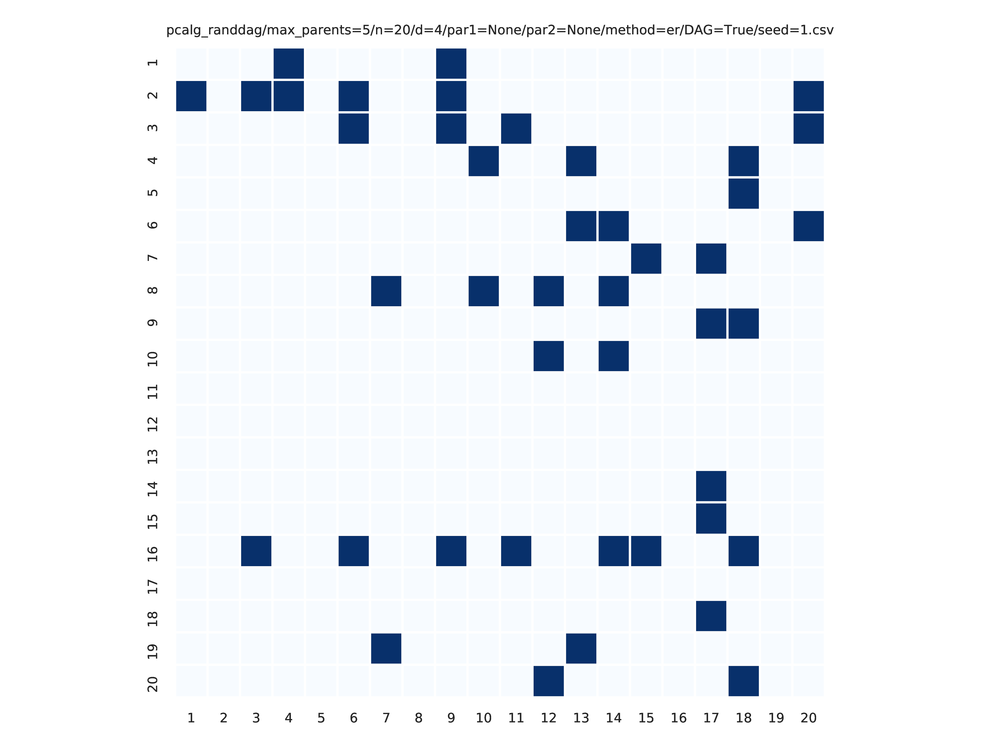
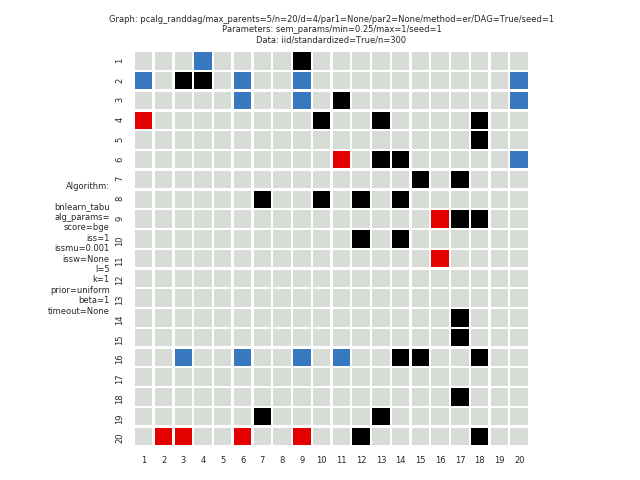
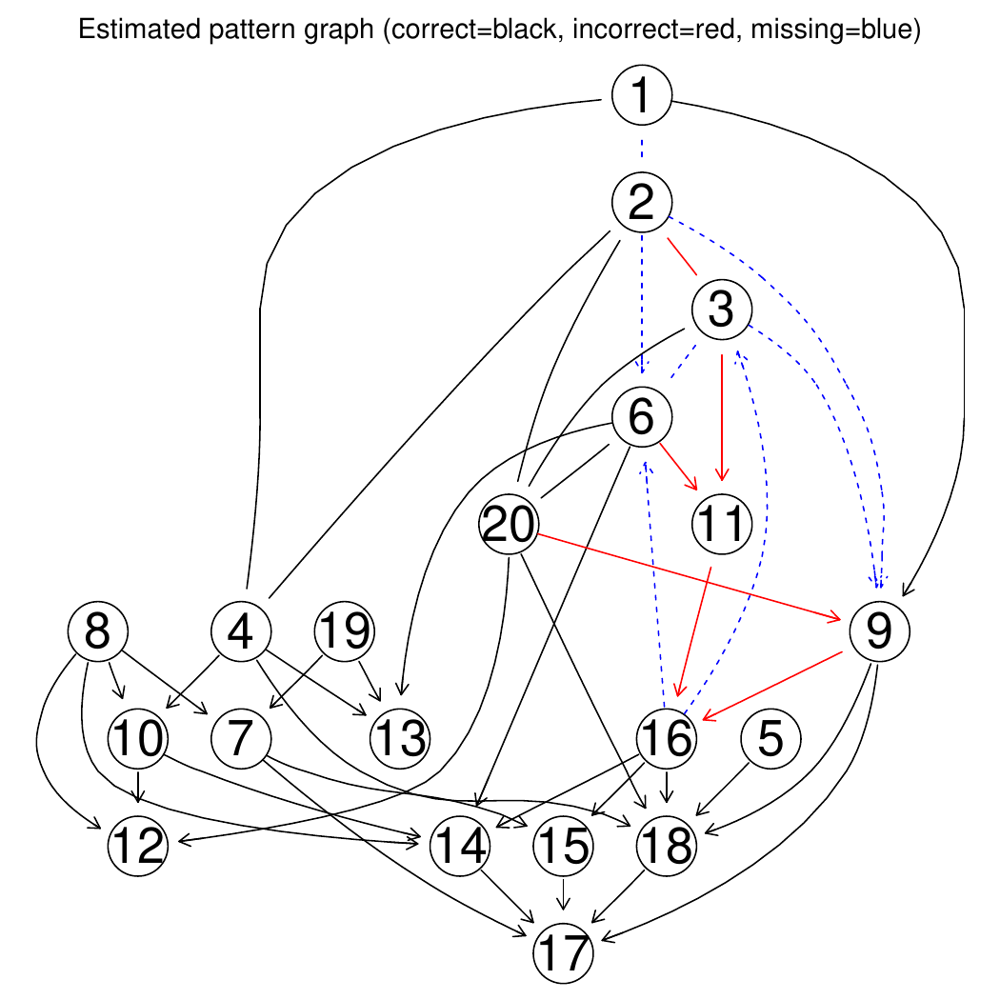

Small example
*************************
Config file: `config/config.json <https://github.com/felixleopoldo/benchpress/blob/master/config/config.json>`__.

Command:

.. prompt:: bash

    snakemake --cores all --use-singularity --configfile config/config.json

Approximate time: 10 min. on a 3.1 GHz Dual-Core Intel Core i5.

This study is an example of data scenario :ref:`V` based on three continuous datasets, sampled using the :ref:`iid` module, corresponding to three realisations of a random linear Gaussian `structural equation model (SEM) <https://en.wikipedia.org/wiki/Structural_equation_modeling>`__ with random `DAG <https://en.wikipedia.org/wiki/Directed_acyclic_graph>`_. 
The `DAGs <https://en.wikipedia.org/wiki/Directed_acyclic_graph>`__ are sampled from a restricted `Erdős–Rényi model <https://en.wikipedia.org/wiki/Erd%C5%91s%E2%80%93R%C3%A9nyi_model>`__ using the :ref:`pcalg_randdag` module and the weight parameters are sampled uniformly using the :ref:`sem_params` module. 
For simplicity, we use only a few structure learning modules here (:ref:`bidag_itsearch`, :ref:`tetrad_fges`, :ref:`bnlearn_tabu`, :ref:`pcalg_pc` ) with different parameter settings. 
The ``benchmark_setup`` section of this study is found in :numref:`smallex`.

.. code-block:: json
    :linenos:
    :name: smallex
    :caption: The `benchmark_setup` section of config/config.json.

    "benchmark_setup": {
            "data": [
                {
                    "graph_id": "avneigs4_p20",
                    "parameters_id": "SEM",
                    "data_id": "standardized",
                    "seed_range": [1, 3]
                }
            ],
            "evaluation": {
                "benchmarks": {
                    "filename_prefix": "example/",
                    "show_seed": false,
                    "errorbar": true,
                    "errorbarh": false,
                    "scatter": true,
                    "path": true,
                    "text": false,
                    "ids": [
                        "fges-sem-bic",
                        "tabu-bge",
                        "itsearch-bge",
                        "pc-gaussCItest"
                    ]
                },
                "graph_true_plots": true,
                "graph_true_stats": true,
                "ggally_ggpairs": true,
                "graph_plots": [
                    "fges-sem-bic",
                    "tabu-bge",
                    "itsearch-bge",
                    "pc-gaussCItest"
                ],
                "mcmc_traj_plots": [],
                "mcmc_heatmaps": [],
                "mcmc_autocorr_plots": []
            }
        }

The following plots are generated by the :ref:`benchmarks` module

.. figure:: _static/FPR_TPR_skel.png
    :width: 300
    :alt: Benchpress small example TPR/FPR plot.
    :align: left

.. figure:: _static/elapsed_time_joint.png
    :width: 300
    :alt: 

.. figure:: _static/SHD_cpdag_joint.png
    :width: 300
    :alt: 
    :align: left

.. figure:: _static/f1_skel_joint.png
    :width: 300
    :alt: 

    

From :ref:`graph_true_plots` and :ref:`graph_plots` we get

.. figure:: _static/adjmat_plot_2.png
    :width: 300
    :alt: 

