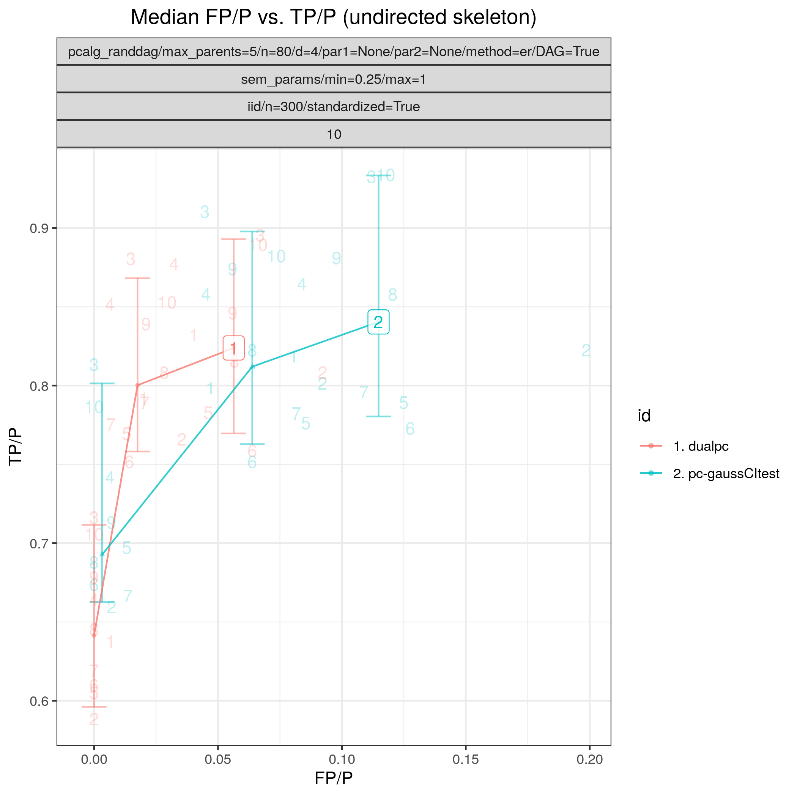
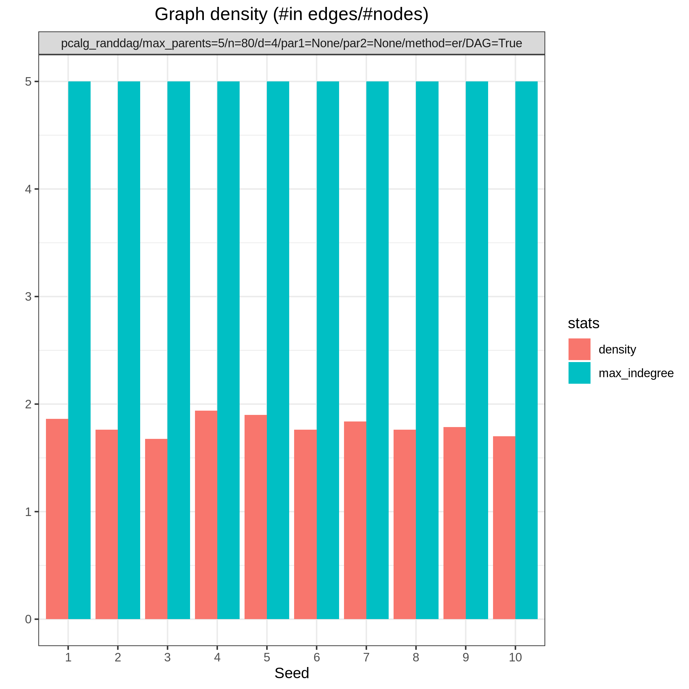
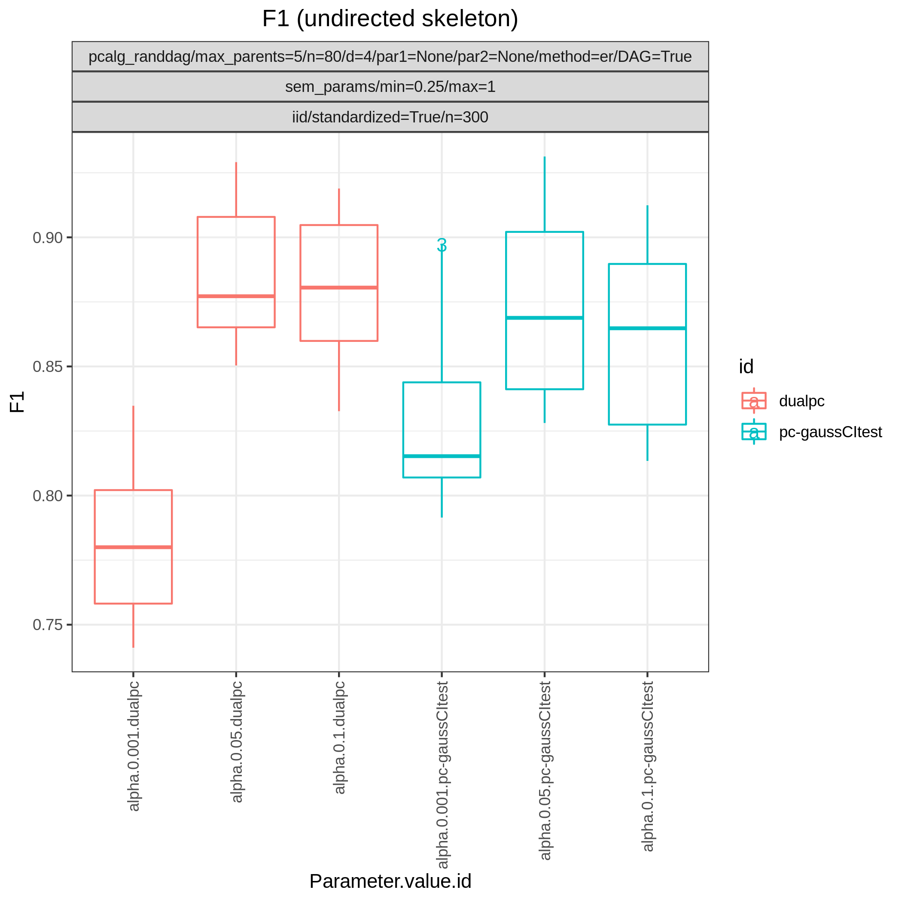
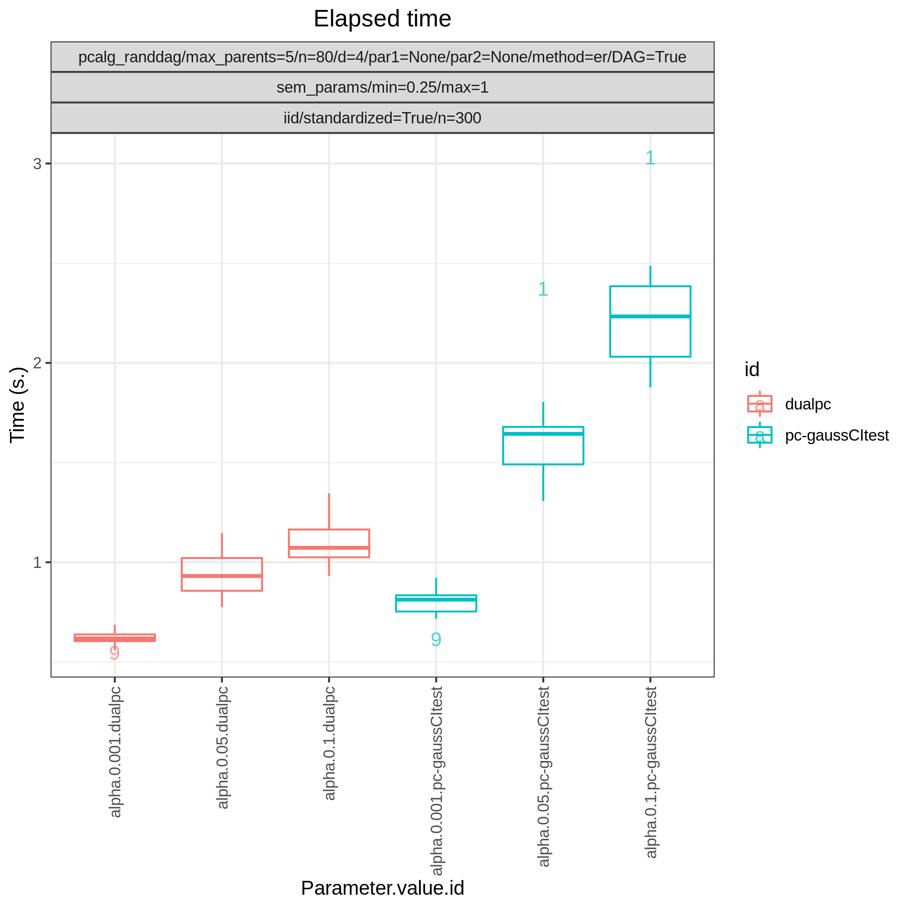

PC vs. dual PC 
******************************

Config file: `config/paper_pc_vs_dualpc.json <https://github.com/felixleopoldo/benchpress/blob/master/config/paper_pc_vs_dualpc.json>`__.

Approximate time: 20 min.

We demonstrate a small scale simulation study from data scenario :ref:`V` where the PC (:ref:`pcalg_pc`) and the dual PC (:ref:`dualpc`) algorithms  are compared side-by-side.
We consider data from 10 random `Bayesian network <https://en.wikipedia.org/wiki/Bayesian_network>`_ models :math:`\{(G_i,\Theta_i)\}_{i=1}^{10}`, where each graph :math:`G_i` has :math:`p=80`` nodes and is sampled using the :ref:`pcalg_randdag` module.
The parameters :math:`\Theta_i`` are sampled from the random linear Gaussian SEM using the :ref:`sem_params` module  with ``min`` =0.25, ``max`` =1.
We draw standardised datasets :math:`\mathbf Y_i` of size :math:`n=300` from each of the models using the :ref:`iid`, module. 

The ``benchmark_setup`` section looks like this

.. code-block:: json
    :linenos:
    :name: pcvsdualpc
    :caption: The `benchmark_setup` section of PC vs. dual PC

    "benchmark_setup": {
        "data": [
            {
                "graph_id": "avneigs4_p80",
                "parameters_id": "SEM",
                "data_id": "standardized",
                "seed_range": [1, 10]
            }
        ],
        "evaluation": {
            "benchmarks": {
                "filename_prefix": "paper_pc_vs_dualpc/",
                "show_seed": true,
                "errorbar": true,
                "errorbarh": false,
                "scatter": true,
                "path": true,
                "text": false,
                "ids": [
                    "pc-gaussCItest",
                    "dualpc"
                ]
            },
            "graph_true_plots": true,
            "graph_true_stats": true,
            "ggally_ggpairs": false,
            "graph_plots": [
                "pc-gaussCItest",
                "dualpc"
            ],
            "mcmc_traj_plots": [],
            "mcmc_heatmaps": [],
            "mcmc_autocorr_plots": []
        }
    }

Results from the :ref:`benchmarks` and the :ref:`graph_true_stats` module, where we have focused on the undirected skeleton for evaluations since this is the part where the algorithms mainly differ.
More specifically, from :numref:`study_1/FPR_TPR_skel.png`, showing the `FP/P <https://en.wikipedia.org/wiki/Receiver_operating_characteristic>`_ and `TP/P <https://en.wikipedia.org/wiki/Receiver_operating_characteristic>`_, we see that the dual PC has superior performance for significance levels *alpha=0.05,0.01*.
Apart from the curves, the numbers in the plot indicates the seed number of the underlying dataset and models for each run.
We note that model with seed number 3 seems give to good results for both algorithms and looking into :numref:`study_1/graph_density_plot.png`, we note that the graph with seed number 3 corresponds to the one with the lowest graph density :math:`|E| / |V|`.
The box plots from  :numref:`study_1/elapsed_time_joint.png` shows the computational times for the two algorithms, where the outliers are labeled by the model seed numbers.
We note e.g., that seed number 1 gave a bit longer computational time for the standard PC algorithm and from :numref:`study_1/graph_density_plot.png` we find that the graph with seed number 1 has relatively high graph density.
The conclusion of the `F1 <https://en.wikipedia.org/wiki/F-score>`_ score plot in :numref:`study_1/F1_skel_joint.png`. are in line with the `FP/P <https://en.wikipedia.org/wiki/Receiver_operating_characteristic>`_ / `TP/P <https://en.wikipedia.org/wiki/Receiver_operating_characteristic>`_ results from :numref:`study_1/FPR_TPR_skel.png`.

.. _study_1/FPR_TPR_skel.png:

    FP/P vs. TP/P.

.. _study_1/graph_density_plot.png:

    Graph density.

.. _study_1/f1_skel_joint.png:

    F1.

.. _study_1/elapsed_time_joint.png:

    Timing.

