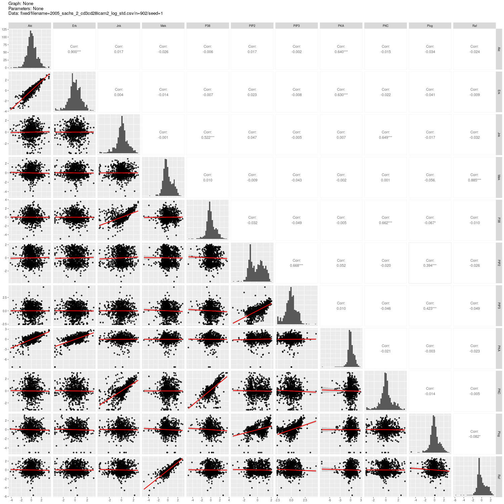

.. _sachsstudy:

Sachs et al. 2005 data
******************************

Config file: `config/realistic_study.json <https://github.com/felixleopoldo/benchpress/blob/master/config/realistic_study.json>`__.

Command:

.. prompt:: bash

    snakemake --cores all --use-singularity --configfile config/realistic_study.json

We show estimation results for the logged and standardized version (:ref:`2005_sachs_2_cd3cd28icam2_log_std.csv`) of the second dataset *anti-CD3/CD28 + ICAM-2*  from :footcite:t:`doi:10.1126/science.1105809` with 902 observations. 
The data is visualised in :numref:`sachs/pairs_1.png` with independent and pairwise scatter plots using the :ref:`ggally_ggpairs` module.

.. _sachs/pairs_1.png:

    Scatter plots.

:numref:`sachs` shows the ``benchmark_setup`` section of the config file. 
This setup falls into :ref:`II` since the *graph_id* s set to the filename of a fixed graph.

.. For Scenario I, when the underling graph is unknown, \texttt{graph\_id} would be set to \vals{null}.

.. code-block:: json
    :linenos:
    :name: sachs
    :caption: The `benchmark_setup` section of Sachs study.

    "benchmark_setup": [{
        "title": "real_data",
        "data": [
            {
                "graph_id": null,
                "parameters_id": null,
                "data_id": "2005_sachs_2_cd3cd28icam2_log_std.csv",
                "seed_range": null
            }
        ],
        "evaluation": {
            "ggally_ggpairs": true,
            "graph_estimation": {
                "ids": [
                    "fges-sem-bic",
                    "tabu-bge",
                    "itsearch-bge",
                    "pc-gaussCItest"
                ],
                "convert_to": ["cpdag"],
                "graphs": true,
                "adjmats": true,
                "diffplots": false,
                "csvs": true,
                "graphvizcompare": false
            },
            "mcmc_traj_plots": [],
            "mcmc_heatmaps": [],
            "mcmc_autocorr_plots": []
        }
    }]

:numref:`sachs/adjmat_plot_18.png` shows the adjacency matrix produced by the :ref:`graph_estimation`  module of the `DAG <https://en.wikipedia.org/wiki/Directed_acyclic_graph>`__ estimated by the  :ref:`bnlearn_tabu` module.

.. Note that, as the graph that is regarded as the true underlying graph is a perfect DAG, it can be equivalently be represented as an undirected decomposable graph.

.. _sachs/adjmat_plot_18.png:

.. figure:: _static/sachs/adjmat_plot_18.png
    :width: 450 
    :alt: Estimated adjmat
    :align: center

    Estimated adjmat.

.. _sachs/graph_29.png:

.. figure:: _static/sachs/graph_29.png
    :width: 300     
    :alt: Estimated graph
    :align: center
    
    Estimated graph.

.. rubric:: References

.. footbibliography::