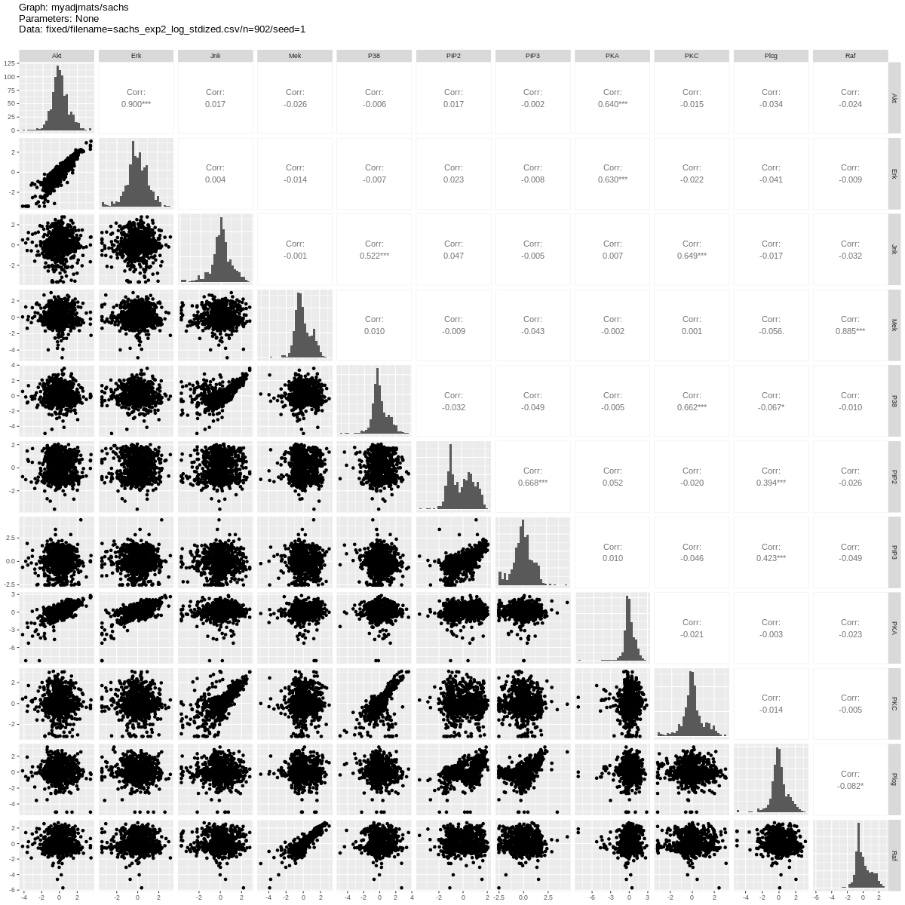
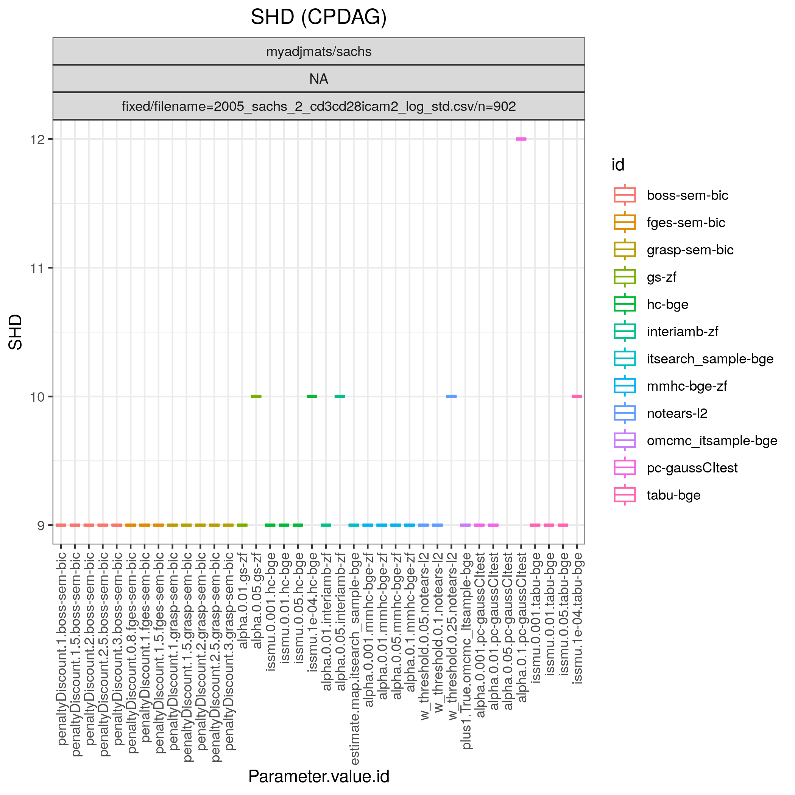
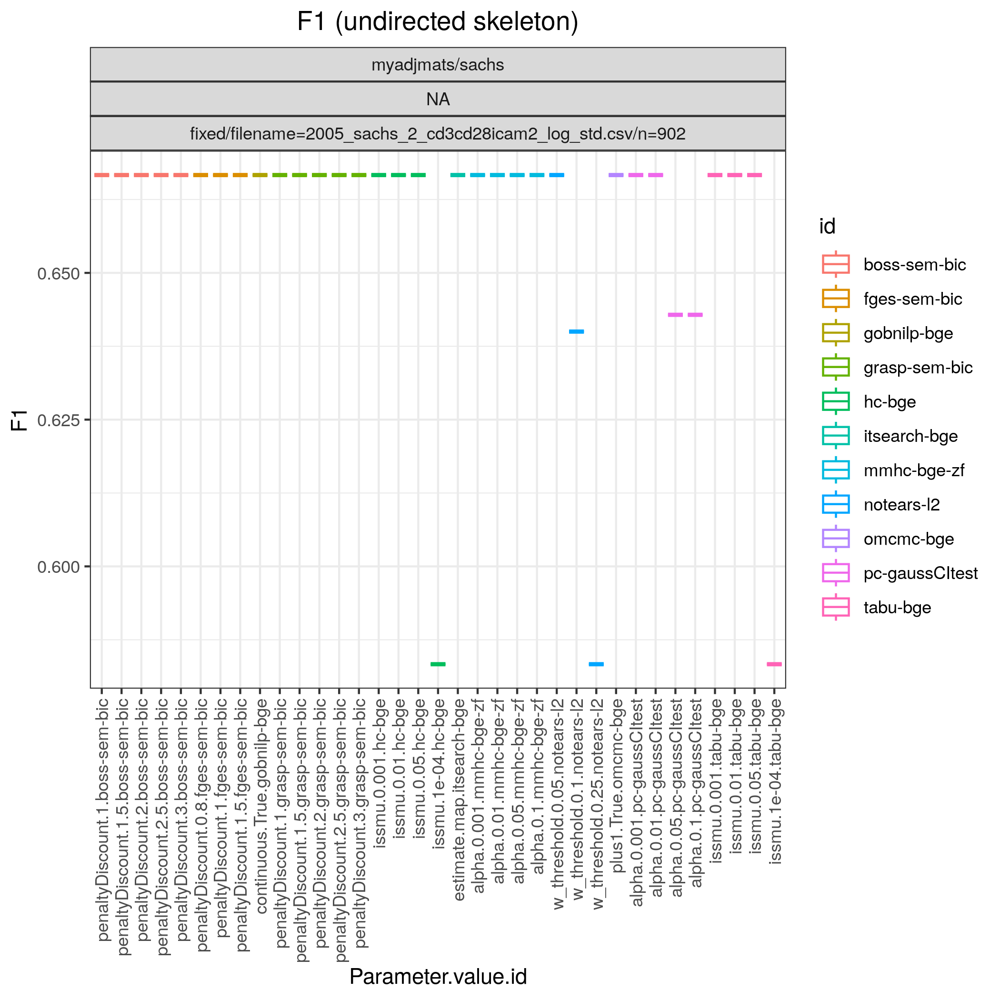
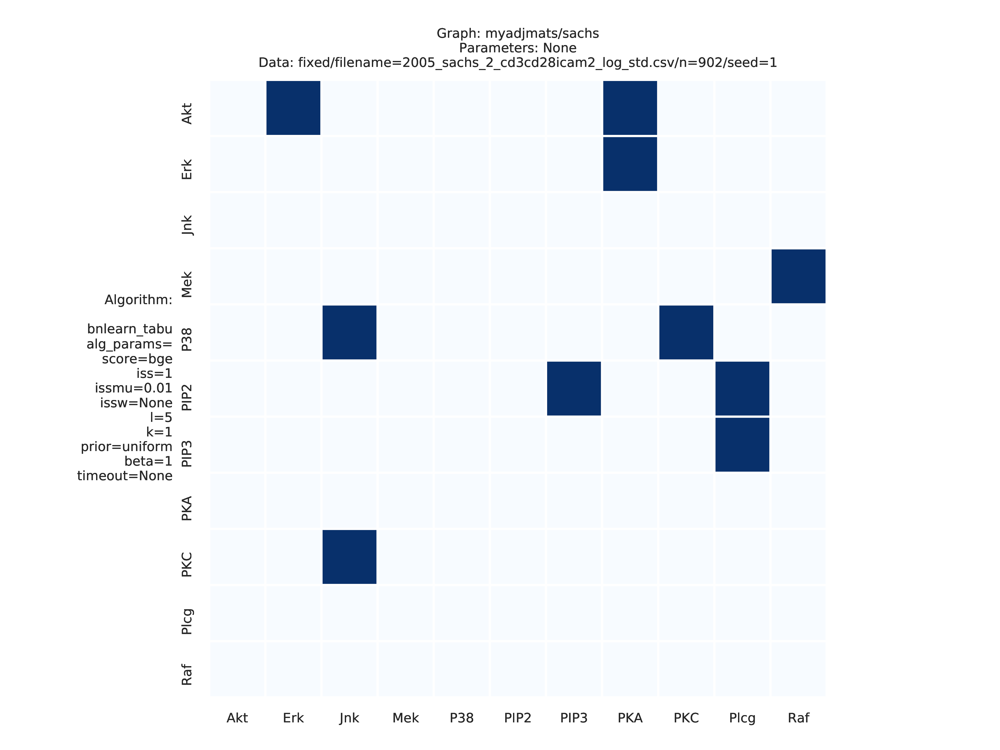
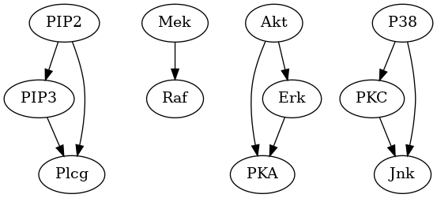
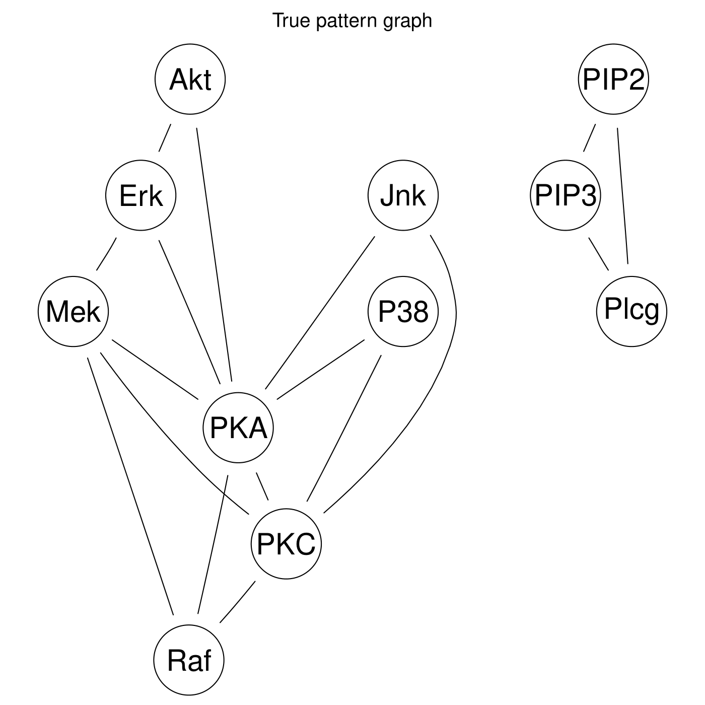
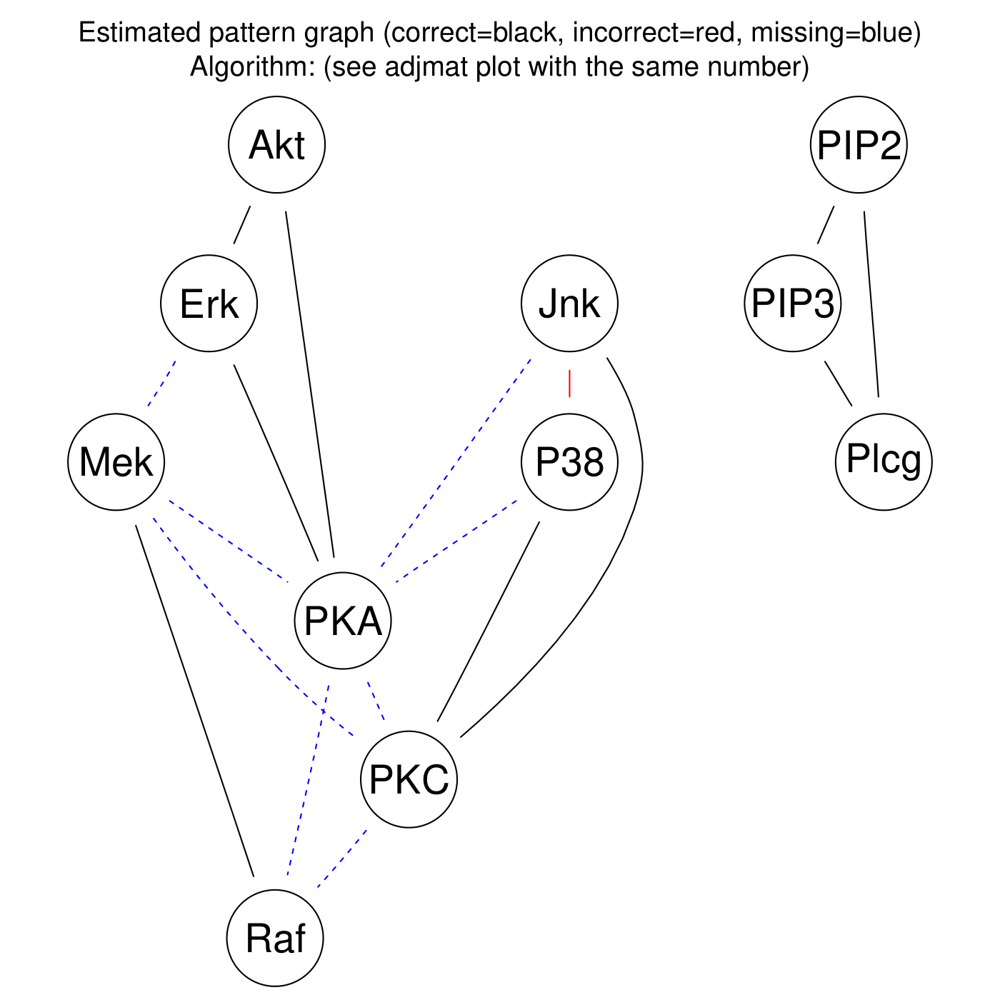

.. _sachsstudy:

Sachs et al. 2005 data
******************************

Config file: `config/paper_sachs.json <https://github.com/felixleopoldo/benchpress/blob/master/config/paper_sachs.json>`__.

Command:

.. prompt:: bash

    snakemake --cores all --use-singularity --configfile config/paper_sachs.json

.. We consider the logged and normalised second dataset :ref:`2005_sachs_2_cd3cd28icam2_log_std.csv` from :footcite:t:`doi:10.1126/science.1105809` containing cytometry measurements of 11 phosphorylated proteins and phospholipids, which has become standard in this field since the true underlying graph is regarded as known.

.. This data has several times been used carelessly to benchmark structure learning algorithms for observational data.
.. \cite{sachs2005causal} removed any data points that fell more than three standard deviations from the mean. 
.. The data were then discretized to three levels. 
.. %The purely observational data had merely 1200 data points.
.. They also use bootstrapping methodologies and handle the interventional dataset to determine causal directions of edges. 
.. However, since the purpose here is to benchmark algorithms suited for observational data, we consider only the first two interventions, referred to as \emph{(anti-CD3/CD28)} and \emph{(anti-CD3/CD28 + ICAM-2)} as only these are expected to be independent of the nodes in the network and just activate the T-cells generally. 

We show estimation results for the logged and standardized version (:ref:`2005_sachs_2_cd3cd28icam2_log_std.csv`) of the second dataset *anti-CD3/CD28 + ICAM-2*  from :footcite:t:`doi:10.1126/science.1105809` with 902 observations. 
The data is visualised in :numref:`sachs/pairs_1.png` with independent and pairwise scatter plots using the :ref:`ggally_ggpairs` module.

.. _sachs/pairs_1.png:

    Scatter plots.

:numref:`sachs` shows the ``benchmark_setup`` section of the config file. 
This setup falls into :ref:`II` since the *graph_id* s set to the filename of a fixed graph.

.. For Scenario I, when the underling graph is unknown, \texttt{graph\_id} would be set to \vals{null}.

.. code-block:: json
    :linenos:
    :name: sachs
    :caption: The `benchmark_setup` section of Sachs study.

    "benchmark_setup": {
        "data": [
            {
                "graph_id": "sachs.csv",
                "parameters_id": null,
                "data_id": "2005_sachs_2_cd3cd28icam2_log_std.csv",
                "seed_range": null
            }
        ],
        "evaluation": {
            "benchmarks": {
                "filename_prefix": "paper_sachs/",
                "show_seed": false,
                "errorbar": false,
                "errorbarh": false,
                "scatter": true,
                "path": true,
                "text": false,
                "ids": [
                    "gobnilp-bge",
                    "boss-sem-bic",
                    "grasp-sem-bic",
                    "notears-l2",
                    "fges-sem-bic",
                    "hc-bge",
                    "itsearch-bge",
                    "mmhc-bge-zf",
                    "omcmc-bge",
                    "pc-gaussCItest",
                    "tabu-bge"
                ]
            },
            "graph_true_stats": true,
            "graph_true_plots": true,
            "ggally_ggpairs": true,
            "graph_plots": [
                    "gobnilp-bge",
                    "boss-sem-bic",
                    "grasp-sem-bic",
                    "notears-l2",
                    "fges-sem-bic",
                    "hc-bge",
                    "itsearch-bge",
                    "mmhc-bge-zf",
                    "omcmc-bge",
                    "pc-gaussCItest",
                    "tabu-bge"
            ],
            "mcmc_traj_plots": [],
            "mcmc_heatmaps": [],
            "mcmc_autocorr_plots": []
        }
    }

    

:numref:`sachs/SHD_cpdag_joint.png` shows Hamming distance between the edge sets of the true and the estimated `CPDAGs <https://search.r-project.org/CRAN/refmans/pcalg/html/dag2cpdag.html>`__  (`SHD <https://en.wikipedia.org/wiki/Hamming_distance>`_) and the `F1 <https://en.wikipedia.org/wiki/F-score>`_  score based on the undirected skeleton from 10 algorithms with different parametrisations, produced by the :ref:`benchmarks` module.
From this figure we can directly conclude that all algorithms have a parametrisation that gives the minimal `SHD <https://en.wikipedia.org/wiki/Hamming_distance>`_ of 9 and maximal `F1 <https://en.wikipedia.org/wiki/F-score>`_ score of 0.67.

.. _sachs/SHD_cpdag_joint.png:

    SHD.

.. _sachs/f1_skel_joint.png:

    

    F1.

:numref:`sachs/adjmat_plot_18.png` shows the adjacency matrix produced by the :ref:`graph_plots`  module of the `DAG <https://en.wikipedia.org/wiki/Directed_acyclic_graph>`__ estimated by the  :ref:`bnlearn_tabu` module.

.. Note that, as the graph that is regarded as the true underlying graph is a perfect DAG, it can be equivalently be represented as an undirected decomposable graph.

.. _sachs/adjmat_plot_18.png:

    Estimated adjmat.

.. _sachs/graph_29.png:

    
    Estimated graph.

:numref:`sachs/compare_19-1.png` and :numref:`sachs/compare_19-2.png` shows the pattern graph of both the true and a `DAG <https://en.wikipedia.org/wiki/Directed_acyclic_graph>`__ estimated by the :ref:`bnlearn_tabu` module, where the black edges are correct in both subfigures. 
The missing and incorrect edges are colored in blue and red respectively in :numref:`sachs/compare_19-2.png`.    
    

.. _sachs/compare_19-1.png:

    True pattern graph.

.. _sachs/compare_19-2.png:

    Diff pattern graph.

.. rubric:: References

.. footbibliography::