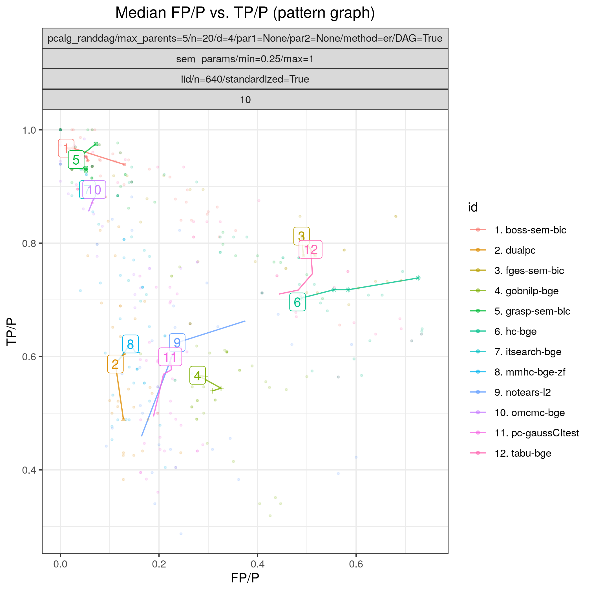

.. _smallstudy:

Random  Gaussian SEM (small study)
****************************************************************************

Config file: `config/paper_er_sem_small.json <https://github.com/felixleopoldo/benchpress/blob/master/config/paper_er_sem_small.json>`__.

Command:

.. prompt:: bash

    snakemake --cores all --use-singularity --configfile config/paper_er_sem_small.json

Approximate time: 40 min. on a 3.1 GHz Dual-Core Intel Core i5.

In the present study we consider a broader simulation over 13 algorithms in a similar Gaussian data setting as in  :ref:`pcdualpcstudy`, with the only difference that the number of nodes is reduced to 20 and the number of seeds is increased to 10.

.. _study_2/FPR_TPR_pattern.png:

    FP/P vs. TP/P.

.. _study_2/elapsed_time_joint.png:

.. figure:: _static/study_2/elapsed_time_joint.png
    :width: 315
    :alt: 
    :align: left

    Timing.

:numref:`study_2/FPR_TPR_pattern.png` shows `FP/P <https://en.wikipedia.org/wiki/Receiver_operating_characteristic>`_ / `TP/P <https://en.wikipedia.org/wiki/Receiver_operating_characteristic>`_  based on pattern graphs and :numref:`study_2/elapsed_time_joint.png`  shows the computational times.
:ref:`tetrad_boss` (*boss-sem-bic*), :ref:`tetrad_grasp` (*grasp-sem-bic*), :ref:`bidag_itsearch`, (*itsearch-bge*), and :ref:`bidag_order_mcmc` (*omcmc-bge*) have the best (near perfect) performance.

