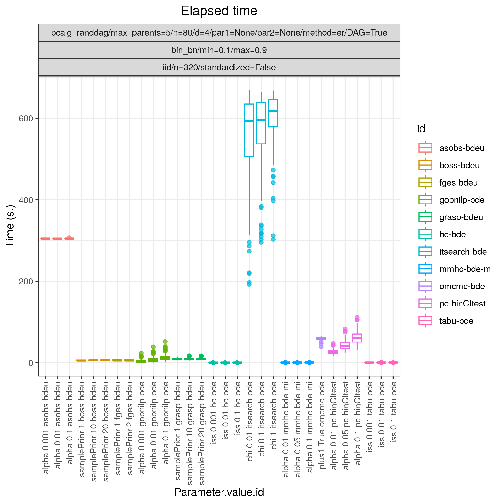

.. _study_3:

Random binary Bayesian network 
*********************************************************************

Config file: `config/paper_er_bin.json <https://github.com/felixleopoldo/benchpress/blob/master/config/paper_er_bin.json>`__.

Command:

.. prompt:: bash

    snakemake --cores all --use-singularity --configfile config/paper_er_bin.json

In this example we study a binary valued Bayesian network, where both the graph :math:`G` and the parameters :math:`\Theta`  are regarded as random variables.
More specifically, we consider 100 models :math:`\{(G_i,\Theta_i)\}_{i=1}^{100}`, where each :math:`G_i` is sampled according to the  Erdős–Rényi random DAG model using the :ref:`pcalg_randdag` module, where the number of nodes is `p=80` (*p* is called *n* in this module), the average number of neighbours (parents) per node is 4 (2) and the maximal number of parents per node is 5. 

.. code-block:: json

    "pcalg_randdag": [
        {
            "id": "avneigs4",
            "max_parents": 5,
            "n": 80,
            "d": 4,
            "par1": null,
            "par2": null,
            "method": "er",
            "DAG": true
        }
    ]

The parameters :math:`\Theta_i` are sampled using the  :ref:`bin_bn` module  and restricting the conditional probabilities within the range [0.1, 0.9].

.. code-block:: json

    "bin_bn": [
        {
            "id": "binbn",
            "min": 0.1,
            "max": 0.9
        }
    ]

From each model, we sample a dataset :math:`\mathbf Y_i` of size *n=320* and using the :ref:`iid` module.

.. code-block:: json

   "iid": [
      {
          "id": "example3",
          "standardized": false,
          "n": 320
      }
   ]

:numref:`study_3/FPR_TPR_pattern.png` shows the ROC type curves for the algorithms considered for the discrete data as described above. 
The algorithms standing out in terms of low SHD in combination with low best median `FP/P <https://en.wikipedia.org/wiki/Receiver_operating_characteristic>`_ (< 0.12) and higher best median TPR (>0.5), are :ref:`tetrad_boss` (*boss-bdeu*), :ref:`tetrad_grasp` (*grasp-bdeu*), :ref:`tetrad_fges` (*fges-bdeu*), and :ref:`bidag_order_mcmc` (*omcmc-bde*).

.. _study_3/FPR_TPR_pattern.png:

.. figure:: _static/study_3/FPR_TPR_pattern.png    
    :alt: FP/P vs. TP/P
    :width: 315
    :align: left
    

    FP/P vs. TP/P.

.. _study_3/elapsed_time_joint.png:

    Timing.