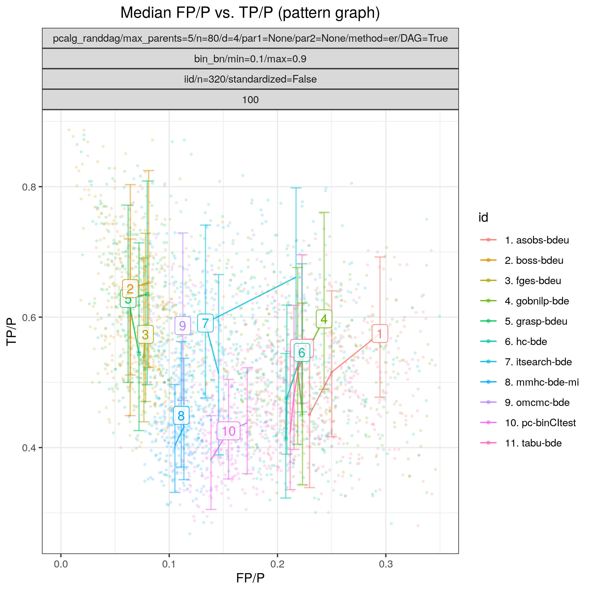

.. _study_3:

Random binary Bayesian network 
*********************************************************************

Config file: `config/paper_er_bin.json <https://github.com/felixleopoldo/benchpress/blob/master/config/paper_er_bin.json>`__.

Command:

.. prompt:: bash

    snakemake --cores all --use-singularity --configfile config/paper_er_bin.json

In this example we study a binary valued Bayesian network, where both the graph :math:`G` and the parameters :math:`\Theta`  are regarded as random variables.
More specifically, we consider 50 models :math:`\{(G_i,\Theta_i)\}_{i=1}^{50}`, where each :math:`G_i` is sampled according to the  Erdős–Rényi random DAG model using the :ref:`pcalg_randdag` module, where the number of nodes is `p=80` (*p* is called ``n`` in this module), the average number of neighbours (parents) per node is 4 (2) and the maximal number of parents per node is 5. 

.. code-block:: json

    "pcalg_randdag": [
        {
            "id": "avneigs4",
            "max_parents": 5,
            "n": 80,
            "d": 4,
            "par1": null,
            "par2": null,
            "method": "er",
            "DAG": true
        }
    ]

The parameters :math:`\Theta_i` are sampled using the  :ref:`bin_bn` module  and restricting the conditional probabilities within the range [0.1, 0.9].

.. code-block:: json

    "bin_bn": [
        {
            "id": "binbn",
            "min": 0.1,
            "max": 0.9
        }
    ]

From each model, we draw two datasets :math:`\mathbf Y_i^{320}` and :math:`\mathbf Y_i^{640}` of sizes *n=320* and *n=640* using (*n* is called ``sample_sizes`` in this module) the :ref:`iid` module.

.. code-block:: json

   "iid": [
      {
          "id": "example3",
          "standardized": false,
          "sample_sizes": [320, 640]
      }
   ]

:numref:`study_3/FPR_TPR_pattern.png` shows the ROC type curves for the algorithms considered for the discrete data as described above. 
We note that for the smaller number of observations (*n=320*), the results are more spread out in terms of FPRp than for the larger data sets (*n=640*).
For the smaller data sets (*n=320*), the algorithms standing out in terms of low SHD in combination with low best median FPRp (< 0.12) and higher best median TPR (>0.5), are :ref:`tetrad_fges` (*fges-bdeu*), :ref:`tetrad_gfci` (*gfci-bdeu-chi-square*) and :ref:`bidag_itsearch` (*omcmc_itsample-bde*).
For the case with larger sample size the same algorithms still achieve higher performance, together with :ref:`bidag_itsearch` (*itsearch_sample-bde*).

.. _study_3/FPR_TPR_pattern.png:

    FP/P vs. TP/P.