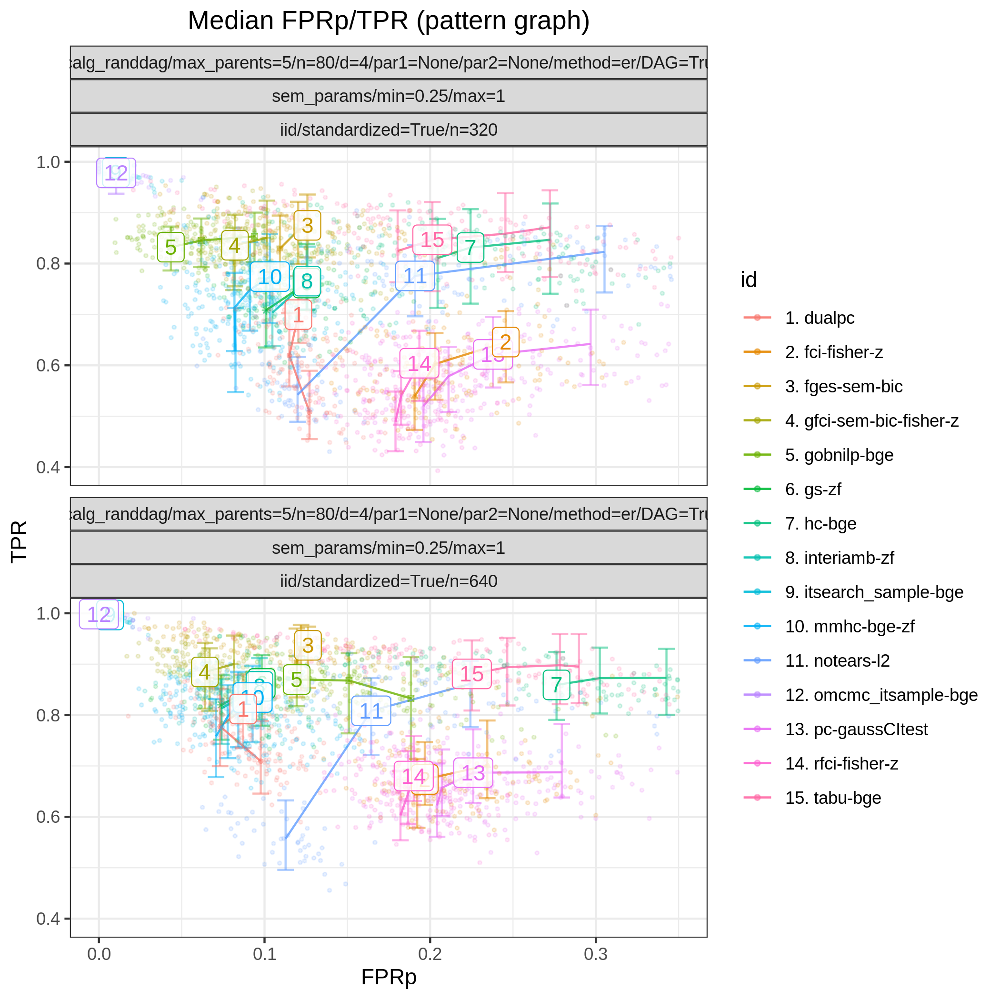
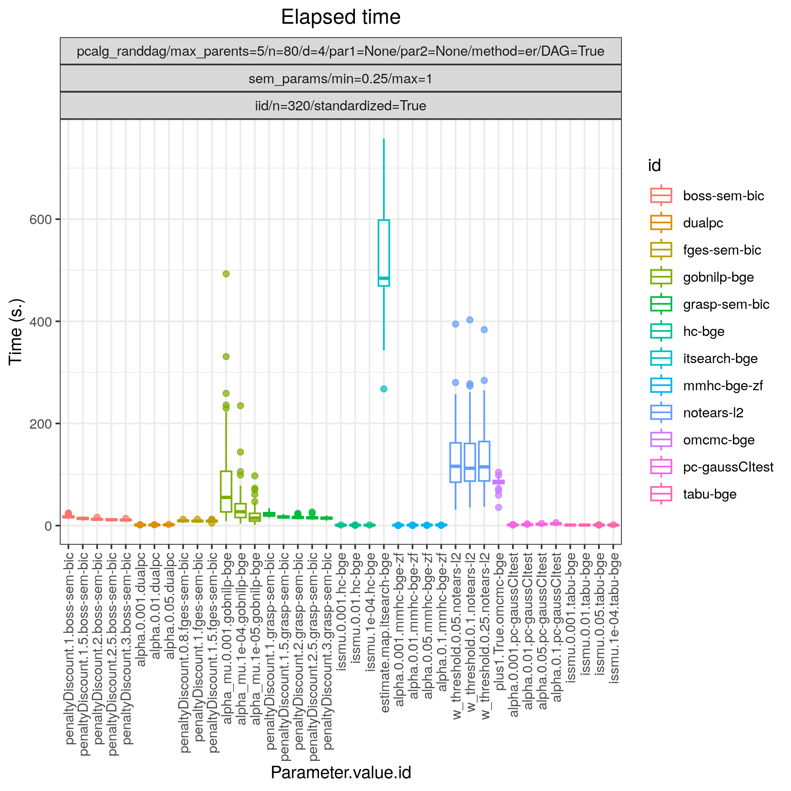

.. _study_4:

Random Gaussian SEM
*******************************************************

Config file: `config/paper_er_sem.json <https://github.com/felixleopoldo/benchpress/blob/master/config/paper_er_sem.json>`__.

Command:

.. prompt:: bash

    snakemake --cores all --use-singularity --configfile config/paper_er_sem.json

In this example we again study a linear Gaussian random Bayesian networks, of size *p=80* and with 100 repetitions :math:`\{(G_i,\Theta_i)\}_{i=1}^{100}`. 
As in :ref:`smallstudy`, we draw a standardised dataset :math:`\mathbf Y_i` of size *n=320* from each of the models using the :ref:`iid` module. 

:numref:`study_4/FPR_TPR_pattern.png` shows results for all the algorithms considered for continuous data as described above.
In terms of achieving high TP/P (>0.95) :ref:`bidag_order_mcmc` (*omcmc_itsample-bge*) and :ref:`bidag_itsearch` (*itsearch-bge*), :ref:`tetrad_boss` (*boss-sem-bic*), and :ref:`tetrad_grasp` (*grasp-sem-bic*) stand out with near perfect performance, *i.e.*, SHD :math:`\approx 0`.
Among the other algorithms :ref:`gobnilp` (*gobnilp-bge*) performs next best for both sample sizes with TP/F :math:`\approx 0.85` and `FP/P <https://en.wikipedia.org/wiki/Receiver_operating_characteristic>`_ :math:`\approx 0.05`, followed by :ref:`tetrad_fges` (*fges-sem-bic*).

.. _study_4/FPR_TPR_pattern.png:

    FP/P vs. TP/P.

.. _study_4/elapsed_time_joint.png:

    Timing.