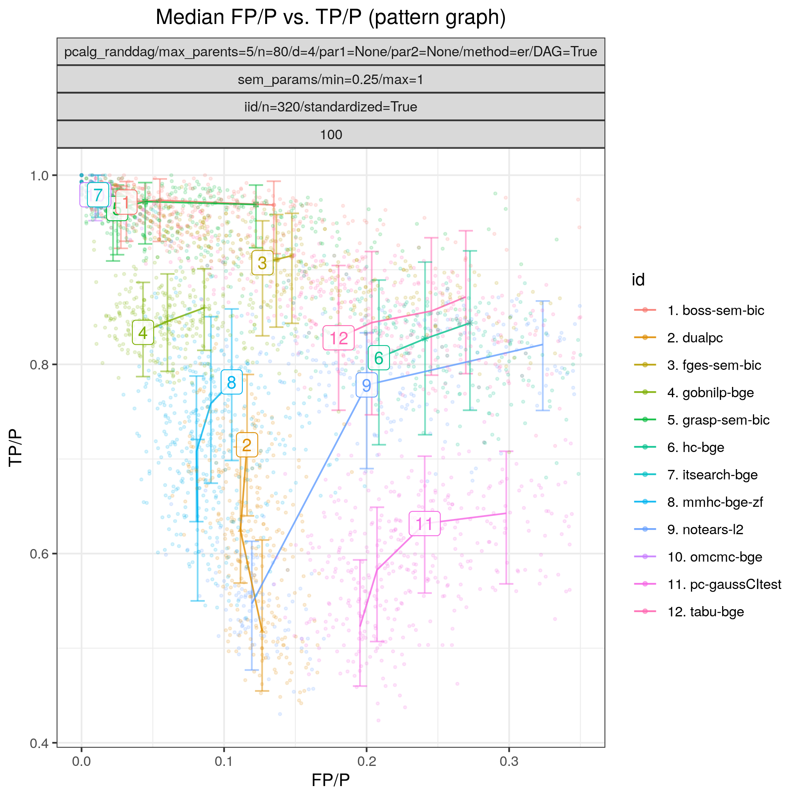

.. _study_4:

Random Gaussian SEM
*******************************************************

Config file: `config/paper_er_sem.json <https://github.com/felixleopoldo/benchpress/blob/master/config/paper_er_sem.json>`__.

Command:

.. prompt:: bash

    snakemake --cores all --use-singularity --configfile config/paper_er_sem.json

In this example we again study a linear Gaussian random Bayesian networks, of size *p=80* and with 50 repetitions :math:`\{(G_i,\Theta_i)\}_{i=1}^{50}`. 
As in :ref:`smallstudy`, we draw two standardised datasets :math:`\mathbf Y_i^{320}` and :math:`\mathbf Y_i^{640}` of sizes *n=320* and *n=640* from each of the models using the :ref:`iid` module. 

:numref:`study_4/FPR_TPR_pattern.png` shows results for all the algorithms considered for continuous data as described above.
For both sample sizes, the constraint based methods :ref:`tetrad_fci` (*fci-sem-bic-fisher-z*),  :ref:`tetrad_rfci` (*rfci-fisher-z*),  :ref:`pcalg_pc` (*pc-gaussCItest*), and  :ref:`dualpc` (*dualpc*) have comparable and lower best median TPR (<0.7) then the remaining algorithms.
In terms of achieving high TPR (>0.7) :ref:`bidag_order_mcmc` (*omcmc_itsample-bge*) and :ref:`bidag_itsearch` (*itsearch-bge*) stand out with near perfect performance, *i.e.*, SHD :math:`\approx 0`.
Among the other algorithms :ref:`tetrad_gfci` (*gfci-bedeu-chi-square*) and :ref:`gobnilp` (*gobnilp-bge*) performs next best for both sample sizes with TPR :math:`\approx 0.85`` and FPRp :math:`\approx 0.08`, followed by :ref:`bnlearn_hc` (*hc-bge*), :ref:`bnlearn_mmhc` (*mmhc-bge-zf*), :ref:`tetrad_fges` (*fges-sem-bic*), and :ref:`bnlearn_gs` (*gs-zf*).

.. _study_4/FPR_TPR_pattern.png:

    FP/P vs. TP/P.