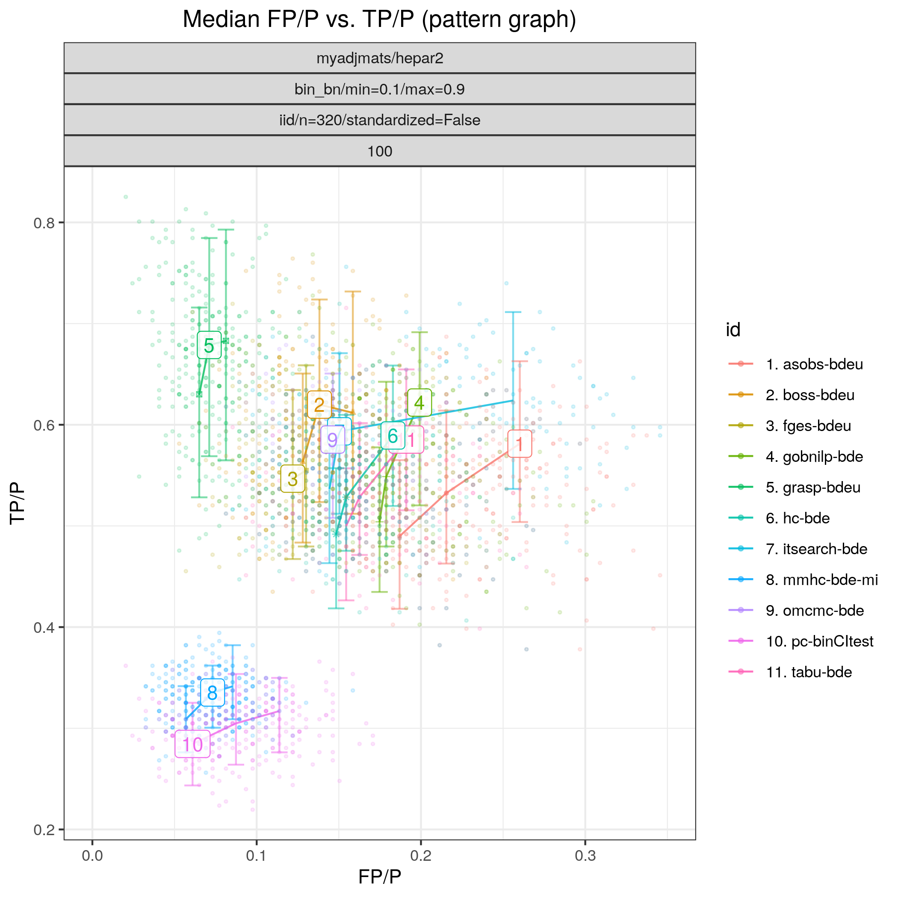

Random binary HEPAR II network
*******************************************************

Config file: `config/paper_hepar2_bin.json <https://github.com/felixleopoldo/benchpress/blob/master/config/paper_hepar2_bin.json>`__.

Command:

.. prompt:: bash

    snakemake --cores all --use-singularity --configfile config/paper_hepar2_bin.json

In this example we study a random binary Bayesian network where the graph :math:`G` is fixed and the associated parameters  :math:`\Theta` are regarded as random.
More specifically, we consider 50 models :math:`\{(G_i,\Theta_i)\}_{i=1}^{50}`, where
the graph structure :math:`G` is that of the well known Bayesian network *HEPAR II* (`hepar2.csv <https://github.com/felixleopoldo/benchpress/blob/master/resources/adjmat/myadjmats/hepar2.csv>`_).
This graph has 70 nodes and 123 edges and has become one of the standard benchmarks for evaluating the performance of structure learning algorithms.
The maximum number of parents per node is 6 and we sample the parameters :math:`\Theta_i` using the :ref:`bin_bn` module, in the same manner as described :ref:`study_3`.
From each model we draw, as before, two datasets :math:`\mathbf Y_i^{320}` and :math:`\mathbf Y_i^{640}` of sizes *n=320* and *n=640*, respectively, using the :ref:`iid` module.

:numref:`study_5/FPR_TPR_pattern.png` shows the ROC curves for this scenario. 
The algorithms appear to be divided in two groups with respect to their performance in terms of TPR. 
Constraint based methods including :ref:`pcalg_pc` (*pc-binCItest*), :ref:`tetrad_fci` (*fci-chi-square*), :ref:`tetrad_rfci` (*rfci-chi-square*), inter-IAMB (*interiamb-mi*), :ref:`bnlearn_mmhc` (*mmhc-bde-mi*), and :ref:`bnlearn_gs` (*gs-mi*) appear to cluster in the lower scoring region (TPR *<0.5*), with :ref:`bnlearn_gs` achieving the lowest `FP/P <https://en.wikipedia.org/wiki/Receiver_operating_characteristic>`_.
Score based methods on the other seem to concentrate in the higher scoring region (TPR *>0.5*). 
For the smaller dataset (*n=320*), the group of better performing algorithms includes :ref:`tetrad_fges` (*fges-bdeu*), :ref:`bidag_order_mcmc` (*omcmc_itsample-bde*), :ref:`bidag_itsearch` (*itsearch_sample-bde*), :ref:`tetrad_gfci` (*gfci-bdeu-chi-square*), all with FPRp :math:`\approx 0.15`. 
For the larger data set (*n=640*) the higher performing group in terms of `FP/P <https://en.wikipedia.org/wiki/Receiver_operating_characteristic>`_ :math:`\approx 0.11`` includes again :ref:`bidag_itsearch` (*omcmc_itsample-bde*) and :ref:`bidag_itsearch` (*itsearch_sample-bde*), this time joined by :ref:`gobnilp` (*gobnilp-bde*).

.. _study_5/FPR_TPR_pattern.png:

    FP/P vs. TP/P.