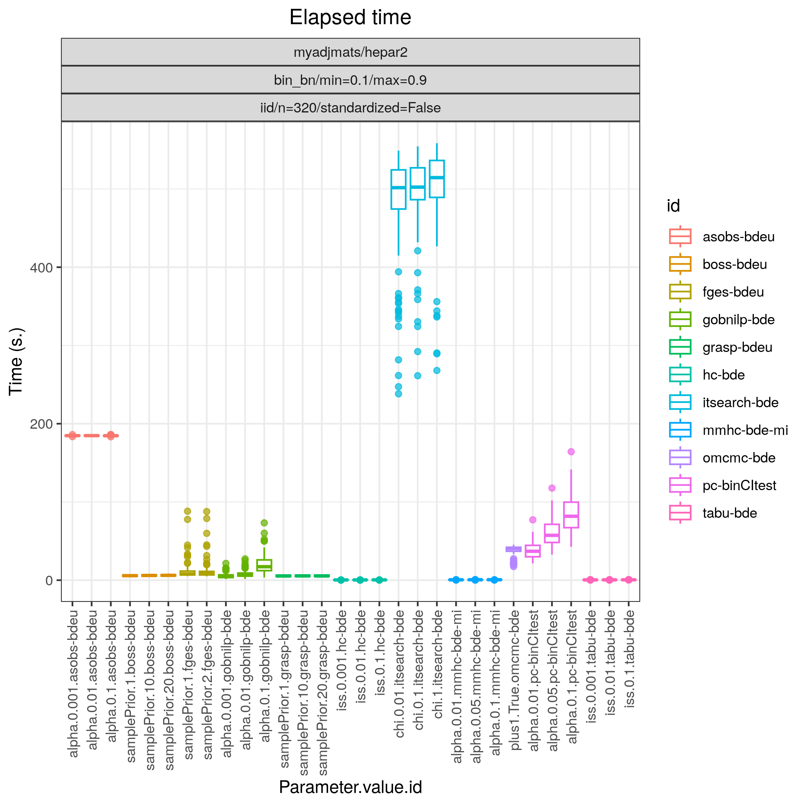

Random binary HEPAR II network
*******************************************************

Config file: `config/paper_hepar2_bin.json <https://github.com/felixleopoldo/benchpress/blob/master/config/paper_hepar2_bin.json>`__.

Command:

.. prompt:: bash

    snakemake --cores all --use-singularity --configfile config/paper_hepar2_bin.json

In this example we study a random binary Bayesian network where the graph :math:`G` is fixed and the associated parameters  :math:`\Theta` are regarded as random.
More specifically, we consider 100 models :math:`\{(G_i,\Theta_i)\}_{i=1}^{100}`, where
the graph structure :math:`G` is that of the well known Bayesian network *HEPAR II* (`hepar2.csv <https://github.com/felixleopoldo/benchpress/blob/master/resources/adjmat/myadjmats/hepar2.csv>`_).
This graph has 70 nodes and 123 edges and has become one of the standard benchmarks for evaluating the performance of structure learning algorithms.
The maximum number of parents per node is 6 and we sample the parameters :math:`\Theta_i` using the :ref:`bin_bn` module, in the same manner as described :ref:`study_3`.
From each model :math:`(G_i,\Theta_i)` we draw a dataset :math:`\mathbf Y_i` of size *n=320*, using the :ref:`iid` module.

:numref:`study_5/FPR_TPR_pattern.png` shows the ROC curves for this scenario. 
The best performing algorithm is clearly :ref:`tetrad_grasp` (*grasp-sem-bic*), followed by :ref:`tetrad_boss` (*boss-sem-bic*), :ref:`tetrad_fges` (*fges-bdeu*), :ref:`bidag_order_mcmc` (*omcmc_itsample-bde*), :ref:`bidag_itsearch` (*itsearch_sample-bde*),  all with FP/P :math:`\approx 0.15.` 
The constraint based algorithm :ref:`pcalg_pc` (*pc-binCItest*) and  :ref:`bnlearn_mmhc` (*mmhc-bde-mi*) appear to cluster in the lower scoring region (TP/P *<0.4*).

.. _study_5/FPR_TPR_pattern.png:

.. figure:: _static/study_5/FPR_TPR_pattern.png    
    :alt: FP/P vs. TP/P
    :align: left
    :width: 315

    FP/P vs. TP/P.

.. _study_5/elapsed_time_joint.png:

    Timing.