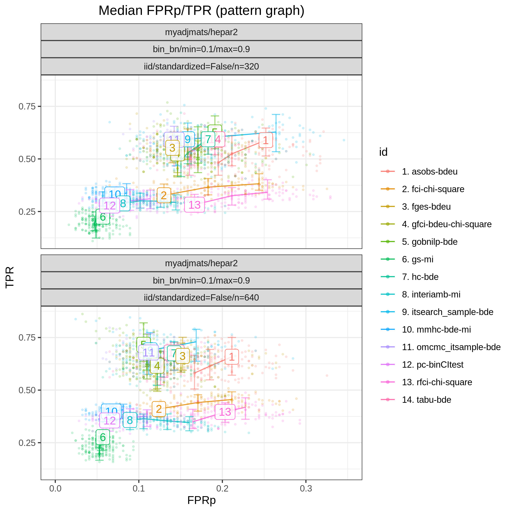

Random Gaussian HEPAR II network
********************************************************

Config file: `config/paper_hepar2_sem.json <https://github.com/felixleopoldo/benchpress/blob/master/config/paper_hepar2_sem.json>`__.

Command:

.. prompt:: bash

    snakemake --cores all --use-singularity --configfile config/paper_hepar2_sem.json

In this example we draw again 50  models :math:`\{(G_i,\Theta_i)\}_{i=1}^{50}`, 
where :math:`G` corresponds to the *HEPAR II* network (`hepar2.csv <https://github.com/felixleopoldo/benchpress/blob/master/resources/adjmat/myadjmats/hepar2.csv>`_), and :math:`\Theta_i` are the parameters of a linear Gaussian SEM sampled using the :ref:`sem\_params`, module with the same settings as in :ref:`study_3`.
From each of the models :math:`(G,\Theta_i)`, we draw once more independent standardised data sets :math:`\mathbf Y_i^{320}` and :math:`\mathbf Y_i^{640}` of sizes *n=320* and *n=640*, respectively, using the :ref:`iid` module.

The  results of :numref:`study_6/FPR_TPR_pattern.png` highlight that :ref:`bidag_order_mcmc` (*omcmc_itsample-bge*), :ref:`bidag_itsearch` (*itsearch_sample-bge*) visibly separate themselves from the rest in terms of SHD (combining both low `FP/P <https://en.wikipedia.org/wiki/Receiver_operating_characteristic>`_ and high `TP/P <https://en.wikipedia.org/wiki/Receiver_operating_characteristic>`_) for both sample sizes. 
In terms of best median `TP/P <https://en.wikipedia.org/wiki/Receiver_operating_characteristic>`_ (>0.8) only :ref:`bnlearn_hc` (*hc-bge*) and :ref:`bnlearn_tabu` (*tabu-bge*) display similar performaces, while performing considerably worse with respect to median `FP/P <https://en.wikipedia.org/wiki/Receiver_operating_characteristic>`_ (:math:`\approx 0.1`) vs :math:`\approx 0.17`).
Apart from :ref:`gobnilp` (*gobnilp-bge*) which shows comparable best results in this region (`TP/P <https://en.wikipedia.org/wiki/Receiver_operating_characteristic>`_ :math:`\approx 0.75``) and `FP/P <https://en.wikipedia.org/wiki/Receiver_operating_characteristic>`_ :math:`\approx 0.15`, there is in general not a big difference in performance of the algorithms between the two sample sizes.

.. _study_6/FPR_TPR_pattern.png:

    FP/P vs. TP/P.