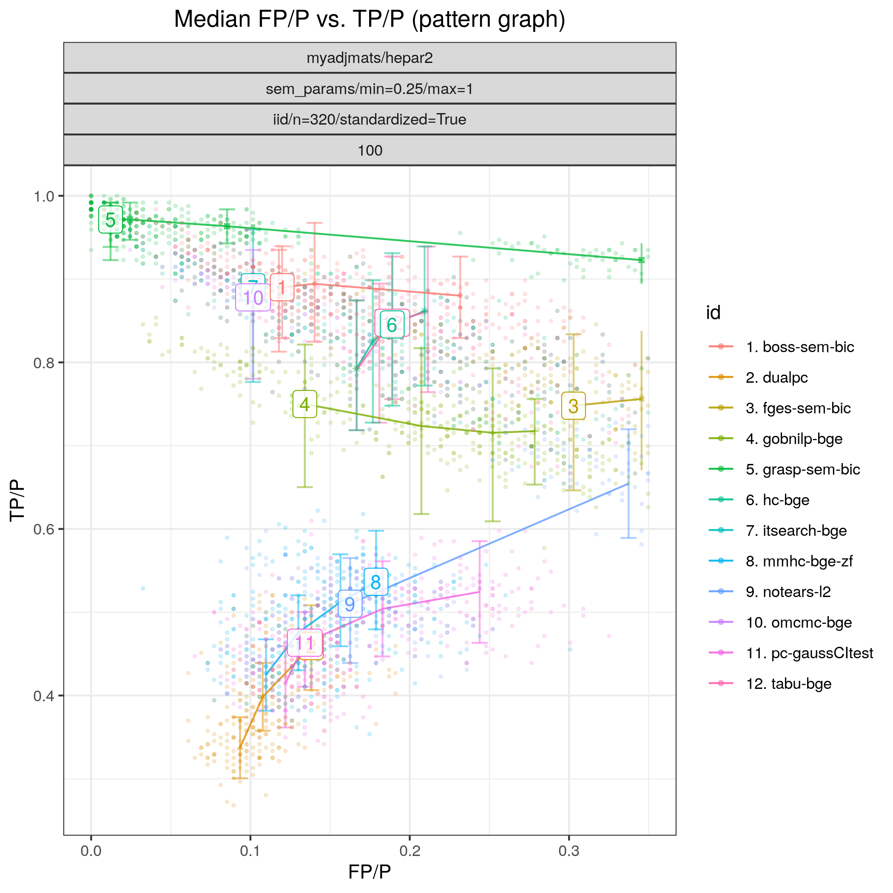

Random Gaussian HEPAR II network
********************************************************

Config file: `config/paper_hepar2_sem.json <https://github.com/felixleopoldo/benchpress/blob/master/config/paper_hepar2_sem.json>`__.

Command:

.. prompt:: bash

    snakemake --cores all --use-singularity --configfile config/paper_hepar2_sem.json

In this example we draw again 100  models :math:`\{(G_i,\Theta_i)\}_{i=1}^{100}`, 
where :math:`G` corresponds to the *HEPAR II* network (`hepar2.csv <https://github.com/felixleopoldo/benchpress/blob/master/resources/adjmat/myadjmats/hepar2.csv>`_), and :math:`\Theta_i` are the parameters of a linear Gaussian SEM sampled using the :ref:`sem\_params`, module with the same settings as in :ref:`study_3`.
From each model :math:`(G,\Theta_i)`, we draw a standardised data set :math:`\mathbf Y_i` of size *n=320*, using the :ref:`iid` module.

The  results of :numref:`study_6/FPR_TPR_pattern.png` highlight that :ref:`tetrad_grasp` (*grasp-bdeu*) has nearly perfect performande.:abbr:
Also :ref:`tetrad_boss` (*boss-bdeu*), :ref:`bidag_order_mcmc` (*omcmc_itsample-bdeu*), :ref:`bidag_itsearch` (*itsearch_sample-bge*)    separate themselves from the rest in terms of SHD (combining both low `FP/P <https://en.wikipedia.org/wiki/Receiver_operating_characteristic>`_ and high `TP/P <https://en.wikipedia.org/wiki/Receiver_operating_characteristic>`_) for both sample sizes. 

.. _study_6/FPR_TPR_pattern.png:

    FP/P vs. TP/P.

.. _study_6/elapsed_time_joint.png:

    Timing.