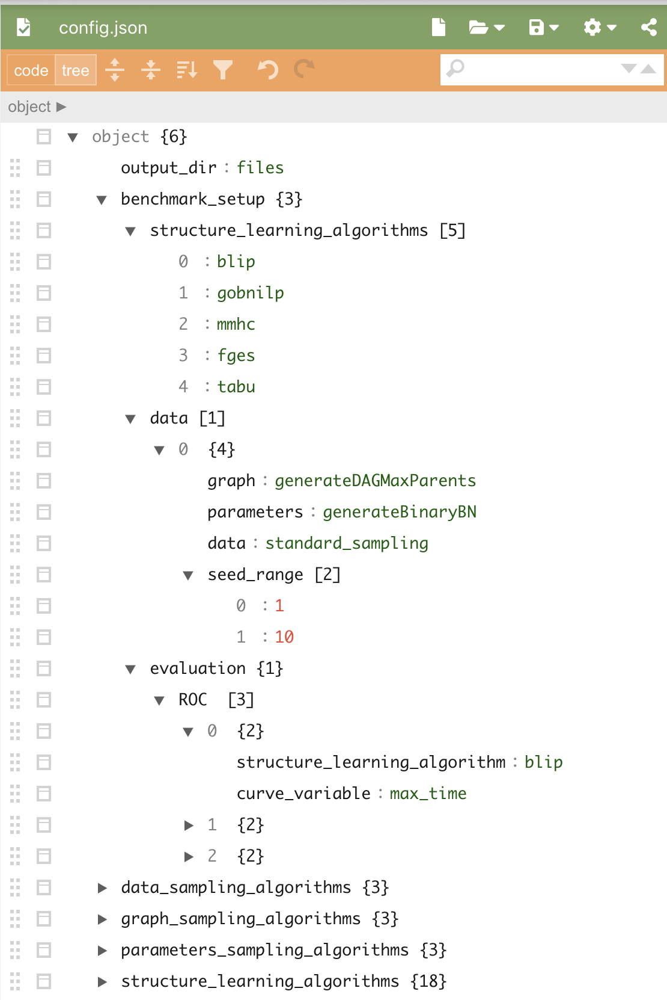

.. Benchpress documentation master file, created by
   sphinx-quickstart on Mon Oct 26 10:03:54 2020.
   You can adapt this file completely to your liking, but it should at least
   contain the root `toctree` directive.

.. toctree::
    :maxdepth: 2
    :caption: Contents:

##################################
Benchpress's documentation
###########################################

.. image:: ../../figures/benchpress.jpg
   :width: 600
   fasa

Systematic benchmarks of structure learning algorithms for graphical models.
A `Snakemake <https://snakemake.readthedocs.io/en/stable/>`_  based command-line tool for making re-producible benchmarks on graphical model learning algorithms.

Benchpress implements several of the state of the arts structure learning algorithm as well as data and parameter sampling algorithms and benchmarking metrics.
Benchpress is interfaced via the file config.json.
Example figures are generated using `JSON Editor Online <https://jsoneditoronline.org>`_.

Getting started
###############

Requirements
^^^^^^^^^^^^

* `Snakemake <https://snakemake.readthedocs.io/en/stable/>`_ (`installation instructions <https://docs.docker.com/engine/install/>`_)
* `Docker <https://www.docker.com/>`_ (`installation instructions <https://docs.docker.com/engine/install/>`_)
* `Singularity <https://docs.docker.com/engine/install/>`_  (`installation instructions <https://sylabs.io/guides/3.6/admin-guide/installation.html>`_)
* Linux/Unix (Singularity currently only has a Beta release for OSX which is not enough)

.. note:: 

    On some systems, you might also have to explicitly install squash-tools in order to run Docer with singularity. 
    squash-tools can be done using conda as
    
        $ conda install -c conda-forge squash-tools

Cloning the repository
^^^^^^^^^^^^^^^^^^^^^^
.. code-block:: bash

    $ git clone git@github.com:felixleopoldo/benchpress.git && cd benchpress

Example: ROC curve estimation
^^^^^^^^^^^^^^^^^^^^^^^^^^^^^^
This example plots roc curves for some of the available structure learning algorithms is pre-configured in config.sample.json.
The algorithms a ran on fours different types of datasets.
To run the configuration copy :download:`config.sample.json <../../config.sample.json>` to config.json by

.. code-block:: bash

    $ cp config.sample.json config.json

and run the snakemake taget roc with 2 cores and singularity enabled as

.. code-block:: bash

    $ snakemake roc --cores 2 --use-singularity

This will produce the plot below

.. image:: _static/ROC.png
   :width: 600

    some text

Understanding config.json
#############################

config.json is required to consist of two main categories, 

.. image:: _static/maincats.png
   :width: 400

*   one contains tha available algorithms for 
    models, data, and structure learning (``graph_sampling_algorithms``, ``parameters_sampling_algorithms``, ``data_sampling_algorithms``, and ``structure_learning_algorithms``).   
    Each algorithm has a unique id in its own category.

*   The second category (``benchmark_setup``) defines the benchmark setup in three main categories: 
    
    *   ``structure_learning_algorithms``: id´s of structure_learning_algorithms to be considered
    *   ``data``: A list of the data simulation setups.
    *   ``evaluation``: A list of 

Available graph sources
###########################################

generateDAGMaxParents
^^^^^^^^^^^^^^^^^^^^^^^^^^^^^^^^^^^^^^^^^

See `JSON schema <https://github.com/felixleopoldo/benchpress/blob/master/schema/docs/config-definitions-generatedagmaxparents.md>`_ 

Example
"""""""

.. code-block:: json

    {
        "id": "myrandomdag",
        "av_parents": 2,
        "dims": 80
    }

fixed_adjmats
^^^^^^^^^^^^^

See `JSON schema <https://github.com/felixleopoldo/benchpress/blob/master/schema/docs/config-definitions-fixed-adjacenty-matrix-of-a-graph.md>`_

Example
"""""""""""

.. code-block:: json

    {
        "id": "hepar2.csv",
        "filename": "hepar2.csv",
        "source": "http://bnlearn.com/bnrepository/discrete-large.html#hepar2"
    }
    

notears
"""""""

See `JSON schema <https://github.com/felixleopoldo/benchpress/blob/master/schema/docs/config-definitions-notears-dag-sampling.md>`_

Example
"""""""""""
.. code-block:: json

    {
        "id": "notears_dag_sampling",
        "num_nodes":40,
        "num_edges": 80
    }

parameters_sampling_algorithms
################################################

generateBinaryBN
^^^^^^^^^^^^^^^^

See `JSON schema <https://github.com/felixleopoldo/benchpress/blob/master/schema/docs/config-definitions-generatebinarybn.md>`_

Example
"""""""""""
.. code-block:: json

    {
        "id":"generateBinaryBN",
        "min":0.1,
        "max":0.9
    }

bn.fit_networks
^^^^^^^^^^^^^^^

See `JSON schema <https://github.com/felixleopoldo/benchpress/blob/master/schema/docs/config-definitions-bnfit-network-file.md>`_

Example
"""""""""""
.. code-block:: json

    {
        "id":"hepar2.rds",
        "filename": "hepar2.rds",
        "source": "http://bnlearn.com/bnrepository/discrete-large.html#hepar2"          
    }

notears_parameters_sampling
^^^^^^^^^^^^^^^^^^^^^^^^^^^^

See  `JSON schema <https://github.com/felixleopoldo/benchpress/blob/master/schema/docs/config-definitions-notears-parameter-sampling-for-gaissian-bayesian-networks.md>`_

Example
"""""""

.. code-block:: json

    {
        "id":"notears",
        "edge_coefficient_range_from":0.5,
        "edge_coefficient_range_to":2
    }

data_sampling_algorithms
################################################

standard_sampling
^^^^^^^^^^^^^^^^^

See  `JSON schema <>`_

Example
"""""""

.. code-block:: json

    {
        "id":"standard_sampling",
        "sample_sizes": [100]
    }

output_dir
==========

This is the directory where all the output will be stored (should be files/ at the moment).

benchmark_setup
===============

This is where the benchmark_setup is made. 

data_sampling_algorithms
=========================

Contains the aviliable data sampling algorithms.

parameters_sampling_algorithms
==============================

graph_sampling_algorithms
=========================

structure_learning_algorithms
=============================

