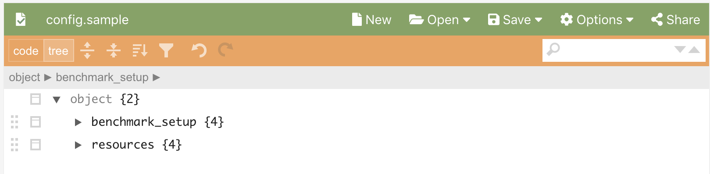

.. Benchpress documentation master file, created by
   sphinx-quickstart on Mon Oct 26 10:03:54 2020.
   You can adapt this file completely to your liking, but it should at least
   contain the root `toctree` directive.

Welcome to Benchpress's documentation!
======================================

Systematic benchmarks of structure learning algorithms for graphical models.
A command-line tool for making re-producible benchmarks based on `Snakemake <https://snakemake.readthedocs.io/en/stable/>`_.

.. toctree::
   :maxdepth: 2
   :caption: Contents:

Getting started
===============

Installation
------------

Requirements
^^^^^^^^^^^^

* `Snakemake <https://snakemake.readthedocs.io/en/stable/>`_ (`installation instructions <https://docs.docker.com/engine/install/>`_)
* `Docker <https://www.docker.com/>`_ (`installation instructions <https://docs.docker.com/engine/install/>`_)
* `Singularity <https://docs.docker.com/engine/install/>`_  (`installation instructions <https://sylabs.io/guides/3.6/admin-guide/installation.html>`_)
* Linux/Unix (Singularity currently only has a Beta release for OSX which is not enough)

Cloning the repository
^^^^^^^^^^^^^^^^^^^^^^
.. code-block:: bash

    $ git clone git@github.com:felixleopoldo/benchpress.git && cd benchpress

Example ROC curve benchmark
---------------------------

Understanding the config file
=============================

.. code-block:: bash

    $ snakemake roc --cores 2 --use-singularity

Benchpress is a command-line tool for creating reproducible benchmarks in graphical models.
It implements several of the state of the arts structure learning algorithm as well as data and parameter sampling algorithms and benchmarking metrics.
Benchpress is based on Snakemake and is interfaced via the file config.json.

Next follows a description of the structure of config.json, where :download:`config.json.sample <../../config.json.sample>` file is used thoughout the example.
It will produce a ROC curve etimation plot.

.. image:: _static/ROC.png
   :width: 600

The config.json.sample consists of six main keys, seen below (where the conten has been removed in order to )

output_dir
----------

This is the directory where all the output will be stored (should be files/ at the moment).

benchmark_setup
---------------

This is where the benchmark_setup is made. 

data_sampling_algorithms
------------------------

Contains the aviliable data sampling algorithms.

parameters_sampling_algorithms
------------------------------

graph_sampling_algorithms
-------------------------

structure_learning_algorithms
-----------------------------

This json produces :download:`ROC_data.csv <../../files/ROC_data.csv>` from which following roc curve is plotted.

.. code-block:: json

   {
    "output_dir": "files",
    "benchmark_setup": {
        "structure_learning_algorithms": [
            "itsearch_map", "order_mcmc_itmap", "blip"
        ],
        "data":[               {
            "graph": "generateDAGMaxParents",
            "parameters": "generateBinaryBN" ,
            "data": "standard_sampling",
            "seed_range": [1, 1]
        }],
        "evaluation": {
            "ROC": [{
                        "structure_learning_algorithm":"blip", 
                        "curve_variable":"time"
                    },
                    {
                        "structure_learning_algorithm":"order_mcmc", 
                        "curve_variable":"threshold"
                    },
                    {"structure_learning_algorithm":"itsearch", "curve_variable":"plus1it"},
                    {"structure_learning_algorithm":"notears", "curve_variable":"min_rate_of_progress"}
                    ]
        }
    },
    "data_sampling_algorithms": {
        "standard_sampling":[
            {"id":"standard_sampling",
             "sample_sizes": [100]
             },
             {"id":"standard_sampling2000",
                "sample_sizes": [2000]
                }
        ],
        "notears_linear_gaussian_sampling":[
            {
                "id":"standard_linear_gaussian",
                "sample_sizes":[100],
                "mean":0,
                "variance":1
            }
        ],
        "fixed_data":[
           {"id":"myasiandata.csv",
            "datatype":"binary",
            "samples":100,
            "filename":"myasiandata.csv",
            "graph":"asia.csv",
            "source":"scutari"
            }
            ,
           {"id":"myhepar2data.csv",
            "datatype":"categorical",
            "samples":1000,
            "filename":"myhepar2data.csv",
            "graph":"hepar2.csv",
            "source":"scutari"
            }
        ]
    },
    "graph_sampling_algorithms": {
        "notears":[{
            "id":"notears",
            "num_nodes":40,
            "num_edges": 80
        }],
        "generateDAGMaxParents": [{
            "id": "generateDAGMaxParents",
            "av_parents": [2],
            "dims": [80]
        }],
        "fixed_adjmats": [
            {"id":"asia.csv",
             "filename":"asia.csv",
             "source":"http://bnlearn.com/bnrepository/discrete-large.html#asia"}
            ,  
            {"id": "hepar2.csv",
             "filename": "hepar2.csv",
             "source":"http://bnlearn.com/bnrepository/discrete-large.html#hepar2"}]
    },
    "parameters_sampling_algorithms": {
        "generateBinaryBN":[{
            "id":"generateBinaryBN",
            "min":0.1,
            "max":0.9
        }],
        "bn.fit_networks": [
            {"id":"hepar2.rds",
             "filename": "hepar2.rds",
             "source":"Scutari"          
            }
        ],
        "notears_parameters_sampling":[{
            "id":"notears",
            "edge_coefficient_range_from":0.5,
            "edge_coefficient_range_to":2
        }]
    },
    "structure_learning_algorithms": {
        "blip": [{
            "id": "blip",
            "plot_legend": "Blip",
            "scorer.method": "is",
            "solver.method": "winasobs",
            "indeg": 80,   
            "time": [
                20, 60
            ],
            "allocated": 80,
            "scorefunction": "bdeu",
            "alpha": 1,
            "cores": 1,
            "verbose": 0
            }
        ],
        "notears": [{
            "id": "notears",
            "plot_legend": "Notears",
            "min_rate_of_progress": 0.25,
            "penalty_growth_rate": 10,
            "optimation_accuracy": 0.00000001,
            "loss": "least_squares_loss",
            "loss_grad": "least_squares_loss_grad"
            }
        ],
        "gobnilp": 
            [{"id":"gobnilp",
                "plot_legend": "GOBNILP",
                "plot": false,
                "palim": 2,
                "alpha": 1,
                "prune": true            
            }
            ]
         }
      }
   