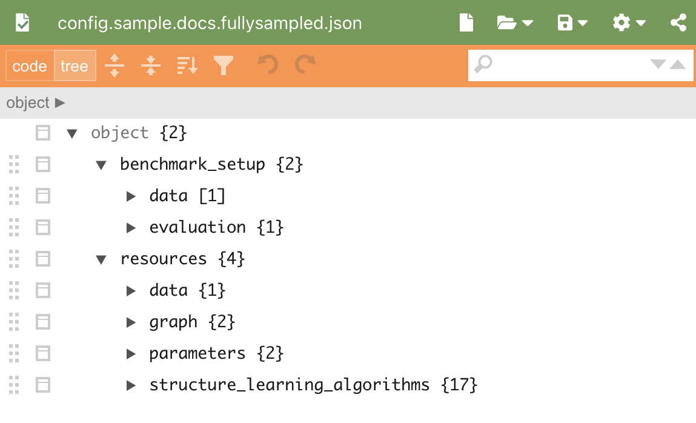
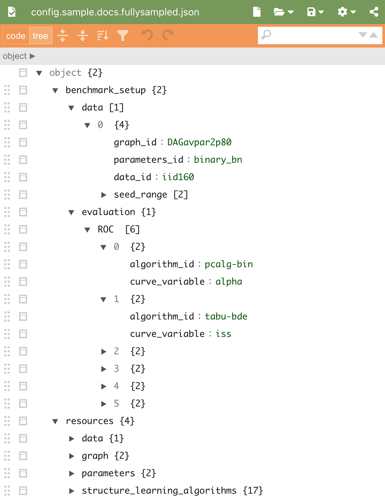
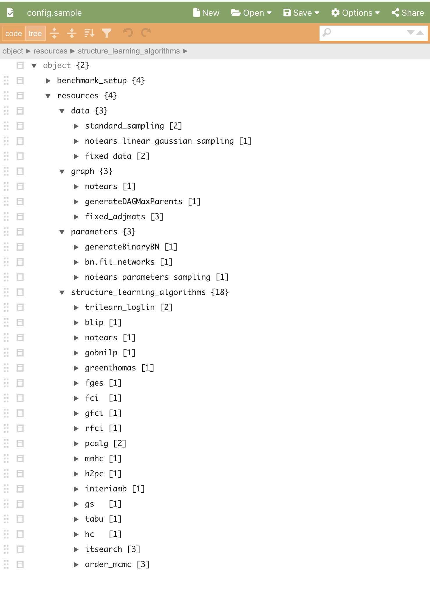
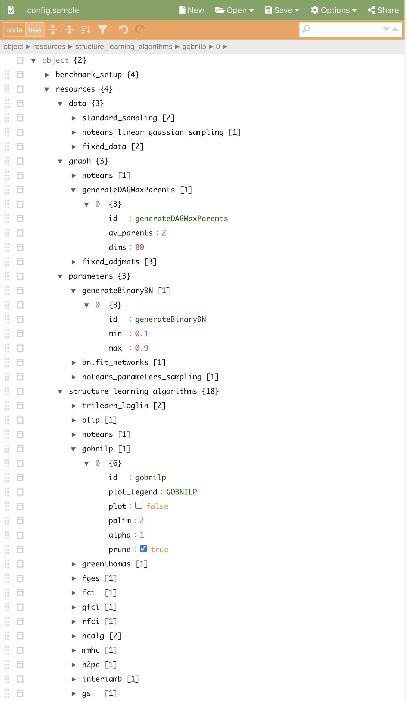

JSON file overview
#############################

In this overview, the file :download:`config.sample.json <../../config.sample.json>` is used. The figures are generated using `JSON Editor Online <https://jsoneditoronline.org>`_.

Overview
********
The configuration file consists of two main categories ``benchmark_setup`` and ``resources``, see :numref:`maincats`.

.. _maincats:

    Main categories in :download:`config.sample.json <../../config.sample.json>`.

``resources`` contains the available resources by means of graphs, parameters, data and structure learning algorithms.
``benchmark_setup`` defines the actual benchmarking setup, where the resourses are references by there id´s.

    
benchmark_setup
***************

This defines the benchmark setup in four main categories, see :numref:`benchmark_setup`  

``output_dir`` is the directory where the output will be stored (can only be files at the moment).
``structure_learning_algorithms`` is a list of id´s of structure learning algorithms to be analysed.
``data`` is a list of the data simulation setups.
``evaluation`` is a list of evaluation metrics (currently only ROC available).

.. _benchmark_setup:

    Expanded ``benchmark_setup`` in :download:`config.sample.json <../../config.sample.json>`. 

resources
*********

The first catergories ``graph``, ``parameters``, ``data``, and ``structure_learning_algorithms``.
contains the available algorithms for models, data, and structure learning 

.. _resources:

    Expanded ``resources`` in :download:`config.sample.json <../../config.sample.json>`. 

    Each algorithm has a unique id in its own category.

.. _setup:

    Expanded ``data`` in :download:`config.sample.json <../../config.sample.json>`. 

    Each algorithm has a unique id in its own category.
