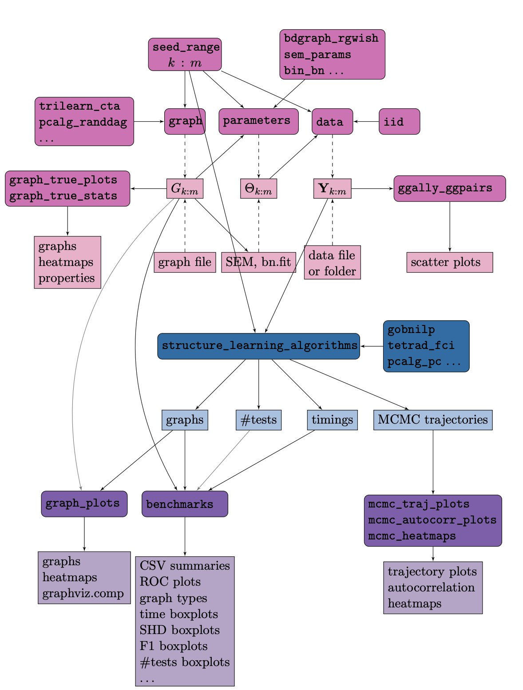

JSON config file
##################

In this section we describe the modules of Benchpress and the structure of the `JSON <https://www.json.org/json-en.html>`__ configuration file, which serves as interface for the user.
For reference, we show the content of  `config/paper_pc_vs_dualpc.json <https://github.com/felixleopoldo/benchpress/blob/master/config/paper_pc_vs_dualpc.json>`__, which is  comparison between :ref:`pcalg_pc` and :ref:`dualpc`.

At the highest level there are two main sections, :ref:`benchmark_setup` (Line 2) and :ref:`resources` (Line 37). 
The :ref:`resources` section contains separate subsections of the available modules for generating or defining graphs (:ref:`graph`), parameters (:ref:`parameters`), data (:ref:`data`, and algorithms for structure learning (:ref:`structure_learning_algorithms`). 
Each module in turn has a list, where each element is an object defining a parameter setting, identified by a unique ``id`` (Lines 41, 50, 64, 73, and 87). 
The :ref:`benchmark_setup` section specifies the data models (data_) (Line 3) and evaluation methods (:ref:`evaluation`) (Line 11) a user wishes to consider for analysis. 
The module objects used in :ref:`benchmark_setup` are defined in :ref:`resources` and referenced by their corresponding ``id``’s. 
The output files of each module are saved systematically under the *results/* directory based on the corresponding objects’ values.

.. code-block:: json
    :linenos:
    :name: pcdualpc
    :caption: Comparison between PC vs. dual PC.

    {
        "benchmark_setup": {
            "data": [ // the data setups
                {
                    "graph_id": "avneigs4_p80", // see line 50
                    "parameters_id": "SEM", // see line 64
                    "data_id": "standardized", // see line 41
                    "seed_range": [1, 10]
                }
            ],
            "evaluation": { // the evaluation modules
                "benchmarks": {  
                    "filename_prefix": "paper_pc_vs_dualpc/",
                    "show_seed": true,
                    "errorbar": true,
                    "errorbarh": false,
                    "scatter": true,
                    "path": true,
                    "text": false,
                    "ids": [
                        "pc-gaussCItest", // see line 87
                        "dualpc" // see line 73
                    ]
                },
                "graph_true_plots": true,
                "graph_true_stats": true,
                "ggally_ggpairs": false,
                "graph_plots": [
                    "pc-gaussCItest",
                    "dualpc"
                ],
                "mcmc_traj_plots": [],
                "mcmc_heatmaps": [],
                "mcmc_autocorr_plots": []
            }
        },
        "resources": {
            "data": { // the data modules
                "iid": [
                    {
                        "id": "standardized",
                        "standardized": true,
                        "sample_sizes": 300
                    }
                ]
            },
            "graph": { // the graph modules 
                "pcalg_randdag": [
                    {
                        "id": "avneigs4_p80",
                        "max_parents": 5,
                        "n": 80,
                        "d": 4,
                        "par1": null,
                        "par2": null,
                        "method": "er",
                        "DAG": true
                    }
                ]
            },
            "parameters": { // the parameters modules
                "sem_params": [
                    {
                        "id": "SEM",
                        "min": 0.25,
                        "max": 1
                    }
                ]
            },
            "structure_learning_algorithms": { // the structure learning modules
                "dualpc": [
                    {
                        "id": "dualpc",
                        "alpha": [
                            0.001,
                            0.05,
                            0.1
                        ],
                        "skeleton": false,
                        "pattern_graph": false,
                        "max_ord": null,
                        "timeout": null
                    }
                ],
                "pcalg_pc": [
                    {
                        "id": "pc-gaussCItest",
                        "alpha": [
                            0.001,
                            0.05,
                            0.1
                        ],
                        "NAdelete": true,
                        "mmax": "Inf",
                        "u2pd": "relaxed",
                        "skelmethod": "stable",
                        "conservative": false,
                        "majrule": false,
                        "solveconfl": false,
                        "numCores": 1,
                        "verbose": false,
                        "indepTest": "gaussCItest",
                        "timeout": null
                    }
                ]
            }
        }
    }

Figure 1 shows a flowchart describing how the files (light colored rectangles) and sections relate to the modules (dark colored rounded rectangles). 
Graphs, parameters, and data are denoted by :math:`G, \Theta`, and :math:`\mathbf Y`, respectively.
The different colors pink, blue, and purple indicate modules, files and sections related to data, structure learning, and evaluating results, respectively. 
An arrow from a node A to another node B should be read as *“B requires input from A”*. 
Thus, for any node, following the arrows in their opposite directions builds a path of the used modules or files. 
Dashed arrows indicates that one of the parents is required and grey arrows indicate partial requirement.

    Flowchart for the Benchpress sections/modules/files architecture.

.. _benchmark_setup:

``benchmark_setup``
********************

some text

.. _datasetup:

``data``
========

This section should contain a list where each item defines a certain data setup.
For each seed number :math:`i` in the range specified by ``seed_range`` (Line 8), a graph :math:`G_i` is obtained as specified by ``graph_id`` (Line 5). 
Given :math:`G_i`, the parameters in the model :math:`\Theta_i` are obtained from ``parameters_id`` (Line 6). 
A data matrix, :math:`\mathbf Y_i^T = (Y_{1:p}^j)_{j=1}^n`, is then sampled from :math:`(G_i,\Theta_i)` as specified by the data model in ``data_id`` (Line 7). 

Data scenarios
---------------

Benchpress supports different strategies for defining models and data. 
One possibility is to generate data, graphs and parameters using the existing modules in the resources_ section, referenced by their objects id, as described above. 
An alternative is to provide user-specified graphs, parameters and data sets, referenced by their corresponding filenames. 
Further we can combine the two approaches as needed.

The different sources of data can be summarised in five scenarios
shown in the table below. Scenario I is the typical scenario for data analysts, where the user provides
one or more datasets by hand. Scenario II is similar to Scenario I, with the difference that
the user also provides the true graph underlying the data. This situation arises e.g. when
replicating a simulation study from the literature, where both the true graph and the dataset
are given. Scenario III-V are pure benchmarking scenarios, where either all of the graphs,
parameters and data are generated (V) or the graphs and possibly parameters are specified by
the user (III, IV).

+-----+-----------+------------+-----------+
|     | Graph     | Parameters | Data      |
+-----+-----------+------------+-----------+
| I   | -         | -          | Fixed     |
+-----+-----------+------------+-----------+
| II  | Fixed     | -          | Fixed     |
+-----+-----------+------------+-----------+
| III | Fixed     | Fixed      | Generated |
+-----+-----------+------------+-----------+
| IV  | Fixed     | Generated  | Generated |
+-----+-----------+------------+-----------+
| V   | Generated | Generated  | Generated |
+-----+-----------+------------+-----------+

The following subsections shows some data examples in the benchmark_setup_ section that correspond to the scenarios I-IV.
To try this out, you may change the current data section in `config/config.json <../../config/config.json>`__.
Note that, in general the ``id``'s used must be defined in the resources section (as it is in `config/config.json <https://github.com/felixleopoldo/benchpress/blob/master/config/config.json>`__ ). 
For example, *avneigs4_p20* is the ``id`` of an object in the :ref:`pcalg_randdag` module in the :ref:`graph` section.
Also, datasets, parameters, and graphs must be placed in the proper subfolder of the `resources/ <https://github.com/felixleopoldo/benchpress/blob/master/resources/>`_ folder.

Note that some evaluation modules are not compatible with this scenario as there is no true graph specified.
For example, you may not use the :ref:`graph_true_plots` or :ref:`benchmarks` modules as both require the true graph to be provided.

Examples
^^^^^^^^^

.. _I:

I) Data analysis (fixed data)
---------------------------------

Here we use `2005_sachs_2_cd3cd28icam2_log_std.csv <https://github.com/felixleopoldo/benchpress/blob/master/resources/data/mydatasets/2005_sachs_2_cd3cd28icam2_log_std.csv>`_, which is the logged and standardized version of the 2nd dataset from :footcite:t:`doi:10.1126/science.1105809`

.. code-block:: json

    { 
        "graph_id": null,
        "parameters_id": null,
        "data_id": "2005_sachs_2_cd3cd28icam2_log_std.csv",
        "seed_range": null
    }

`2005_sachs <https://github.com/felixleopoldo/benchpress/tree/master/resources/data/mydatasets/2005_sachs>`_ is a subfolder of  `resources/data/mydatasets <https://github.com/felixleopoldo/benchpress/blob/master/resources/data/mydatasets/>`_ containing all the datasets from :footcite:t:`doi:10.1126/science.1105809`.

.. code-block:: json

    { 
        "graph_id": null,
        "parameters_id": null,
        "data_id": "2005_sachs",
        "seed_range": null
    }

.. _II:

II) Data analysis with validation
----------------------------------

.. code-block:: json

    { 
        "graph_id": "sachs.csv",
        "parameters_id": null,
        "data_id": "2005_sachs_2_cd3cd28icam2_log_std.csv",
        "seed_range": null
    }

III) Fixed graph
------------------

.. code-block:: json

    
        {
            "graph_id": "alarm.csv",
            "parameters_id": "SEM",
            "data_id": "standardized",
            "seed_range": [
                1,
                3
            ]
        }

IV) Fixed graph and parameters
--------------------------------

Beware that the parameters in the following example is for binary data so make sure that the algorithms used must be compatible.
You may e.g. use the id *itsearch_sample-bde* in the :ref:`graph_plots` module.

.. code-block:: json

    { 
        "graph_id": "sachs.csv",
        "parameters_id": "sachs.rds",
        "data_id": "nonstandardized",
        "seed_range": [1, 10]
    }

.. _V:

V) Fully generated
-------------------

.. code-block:: json

    { 
        "graph_id": "avneigs4_p20",
        "parameters_id": "SEM",
        "data_id": "standardized",
        "seed_range": [1, 10]
    }

.. _resources:

``resources``
*************

The names of the fields of the modules in this section are directly transferred or translated from the original libraries or code. Thus, for further details of each field we refer to the documentation of the original sources.

To start an interactive `Docker <https://www.docker.com/>`_ shell for a module run

.. prompt:: bash

    docker run -it username/image:version

or using `Apptainer <https://apptainer.org/>`_

.. prompt:: bash

    apptainer run docker://username/image:version

.. rubric:: References

.. footbibliography::