JSON config file
##################

An overview of how the config file is structured can be read about in the paper [3]_.
For specific information about each element in the JSON file, see the documentation generated from the `JSON schema <https://github.com/felixleopoldo/benchpress/tree/master/docs/source/json_schema/config.md>`_.

.. _benchmark_setup:

``benchmark_setup``
********************

.. .. figure:: _static/benchmark_setup.png
..     :width: 400

..     Expanded ``benchmark_setup`` in :download:`config/sec6.1.json <../../config/sec6.1.json>`. 

.. _datasetup:

``data``
========

This section should contain a list where each item defines a certain data setup with the following fields.

* ``graph_id`` an id from a graph_ module.
* ``parameters_id`` an id from a parameters_ module.
* ``data_id`` an id from the data_ module.
* ``seed_range`` a range of seeds used for random number generation.  

The different sources of data provided by Benchpress can be summarised in five scenarios
shown in the tabel below. Scenario I is the typical scenario for data analysts, where the user provides
one or more datasets by hand. Scenario II is similar to Scenario I, with the difference that
the user also provides the true graph underlying the data. This situation arises e.g. when
replicating a simulation study from the literature, where both the true graph and the dataset
are given. Scenario III-V are pure benchmarking scenarios, where either all of the graphs,
parameters and data are generated (V) or the graphs and possibly parameters are specified by
the user (III, IV).

+-----+-----------+------------+-----------+
|     | Graph     | Parameters | Data      |
+-----+-----------+------------+-----------+
| I   | -         | -          | Fixed     |
+-----+-----------+------------+-----------+
| II  | Fixed     | -          | Fixed     |
+-----+-----------+------------+-----------+
| III | Fixed     | Fixed      | Generated |
+-----+-----------+------------+-----------+
| IV  | Fixed     | Generated  | Generated |
+-----+-----------+------------+-----------+
| V   | Generated | Generated  | Generated |
+-----+-----------+------------+-----------+

The following subsections shows some data examples in the benchmark_setup_ section that correspond to the scenarios I-IV.
To try this out, you may change the current data section in :download:`config/config.json <../../config/config.json>`.
Note that, in general the id's used must be defined in the resources section (as it is in `config/config.json <https://github.com/felixleopoldo/benchpress/blob/master/config/config.json>`_ ). 
For example, *avneigs4_p20* is the id of an object in the pcalg_randdag_ module in the graph section.
Also, datasets, parameters, and graphs must be placed in the proper place under the *resources* folder.

I
---

Note that some evaluation modules are not compatible with this scenario as there is no true graph specified.
For example, you may not use the graph_true_plots_ or benchmarks_ modules as both require the true graph to be provided.

.. rubric:: Example 1

Here we use `2005_sachs_2_cd3cd28icam2_log_std.csv <https://github.com/felixleopoldo/benchpress/blob/master/resources/data/mydatasets/2005_sachs_2_cd3cd28icam2_log_std.csv>`_, which is the logged and standardized version of the 2nd dataset from Sachs et. al 2005, and is contain

.. code-block:: json

    { 
        "graph_id": null,
        "parameters_id": null,
        "data_id": "2005_sachs_2_cd3cd28icam2_log_std.csv",
        "seed_range": null
    }

.. rubric:: Example 2

`2005_sachs <https://github.com/felixleopoldo/benchpress/tree/master/resources/data/mydatasets/2005_sachs>`_ is a subfolder of mydatasets containing all the datasets from Sachs et. al 2005.

.. code-block:: json

    { 
        "graph_id": null,
        "parameters_id": null,
        "data_id": "2005_sachs",
        "seed_range": null
    }

II
---

.. rubric:: Example

.. code-block:: json

    { 
        "graph_id": "sachs.csv",
        "parameters_id": null,
        "data_id": "2005_sachs_2_cd3cd28icam2_log_std.csv",
        "seed_range": null
    }

III
---

.. rubric:: Example

Beware that the parameters in the following example is for binary data so make sure that the algorithms used must be compatible.
You may e.g. use the id *itsearch_sample-bde* in the graph_plots_ module.

.. code-block:: json

    { 
        "graph_id": "sachs.csv",
        "parameters_id": "sachs.rds",
        "data_id": "nonstandardized",
        "seed_range": [1, 10]
    }

IV
---

.. rubric:: Example

.. code-block:: json

    { 
        "graph_id": "sachs.csv",
        "parameters_id": "SEM",
        "data_id": "standardized",
        "seed_range": [1, 10]
    }

.. code-block:: json

    
        {
            "graph_id": "alarm.csv",
            "parameters_id": "SEM",
            "data_id": "standardized",
            "seed_range": [
                1,
                3
            ]
        }
    
V
---

.. rubric:: Example

.. code-block:: json

    { 
        "graph_id": "avneigs4_p20",
        "parameters_id": "SEM",
        "data_id": "standardized",
        "seed_range": [1, 10]
    }

.. _evaluation:

``evaluation``
===============

The available evaluation methods. The output of the evaluation modules are found in *results/output*.

.. _benchmarks:

``benchmarks``
-----------------

This modules produce several results in one

* *elapsed_time_joint.png*: Box-plots for the total times over all seeds.
* *f1_skel_joint.png*: F1 score box-plots.
* *FNR_FPR_skel.png*: Median false negative rate (FNR) / false positive rate (FPRp) for the skeleton graph (undirected version).
* *FPR_TPR_skel.png*: Median FPRp / TPR for the skeleton graph (undirected version).
* *FPR_TPR_pattern.png*: Median FPRp / TPR for the pattern graph (same as skeleton for undirected graphs).
* *FPRp_FNR_skel.png*: Median FPRp / FNR for the skeleton graph.
* *graph_type.png*: Plots the type of graph for each graph estimate.
* *joint_benchmarks.csv*: Benchmarks joined in a CSV file (this ay be analyzed using any preferred software).
* *ntests_joint.png*: Box-plots for number of statistical tests (this is only applicable for some algorithms).
* *ROC_data.csv*: Summarized benchmarks joined in a CSV file.
* *SHD_cpdag_joint.png*: Structural Hamming distance (SHD) box-plots.

.. ``algorithm_id`` is the current algorithm and ``curve_variable`` is the varying parameter in the plot.
.. In order to get the curve like form in the plot, you need to make sure that ``curve_variable`` is given as a list in the corresponding algorithm's section.

.. See `JSON schema <https://github.com/felixleopoldo/benchpress/blob/master/schema/docs/config-definitions-roc-item.md>`_

Fields (mostly for the ROC type curves).

* ``filename_prefix``: is the prefix for the produced files. By ending with a "/" as in "example/", the produced files will be stored in the folder "example/". 
* ``show_seed``: shows the seed numbers in the ROC type plots and for the outliers in the box-plots.
* ``errorbar``: shows vertical estimated 5% and 95% quantiles in the ROC type plots.
* ``errorbarh``: shows horisontal estimated 5% and 95% quantiles in the ROC type plots.
* ``scatter``: shows scatterplots in the ROC type plots.
* ``path``: joins the median values of each parameter setting for a specific with a line. So for this to become a path, you need to specify rande of values for some of the fields in the corresponding algorithm module object.
* ``text``: shows the parameter value in the ROC type plots. If this is set to false, a dot will be plotted instead.

.. rubric:: Example

.. code-block:: json

    {
        "filename_prefix": "example/",
        "show_seed": false,
        "errorbar": true,
        "errorbarh": false,
        "scatter": true,
        "path": true,
        "text": false,
        "ids": [
            "fges-sem-bic",
            "mmhc-bge-zf",
            "gfci-sem-bic-fisher-z",
            "pc-gaussCItest"
        ]
    }

    
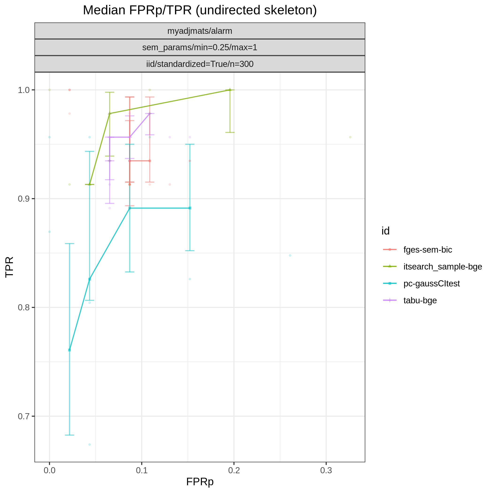

    ROC plot

The following plots are also produced

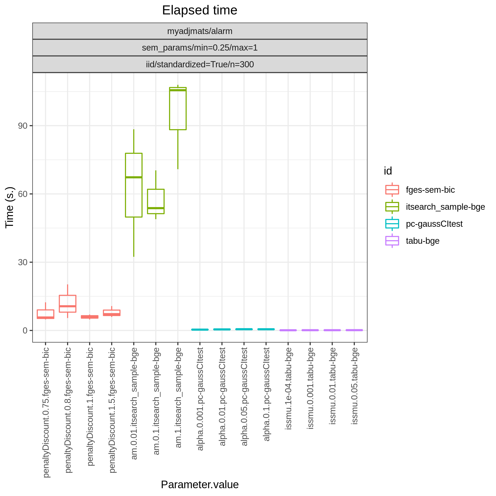

    Timing

..  figure:: _static/alarm/f1_skel_joint.png
    :alt: F1 
    :width: 500

    F1

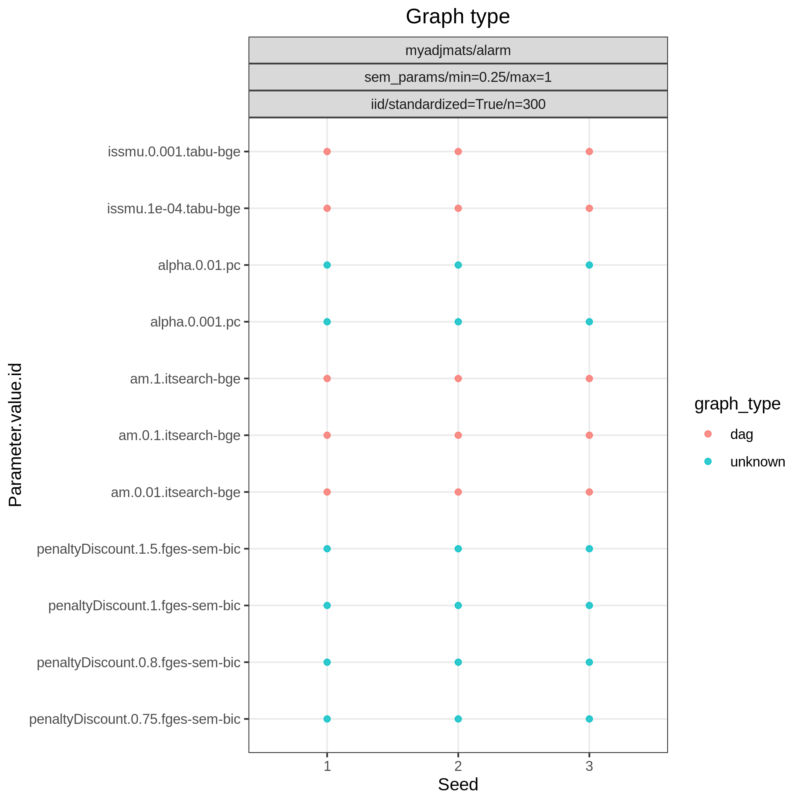

    Graph type

.. _ggally_ggpairs:

``ggally_ggpairs``
-------------------------

This module writes ggpairs plots using the `GGally <https://cran.r-project.org/web/packages/GGally/index.html#:~:text=GGally%3A%20Extension%20to%20'ggplot2',geometric%20objects%20with%20transformed%20data.>`_ package. 
Be careful that this can be slow and the variable names may not fit into the figure if the dimension is too large.
However, you can always alter the script as you like it.

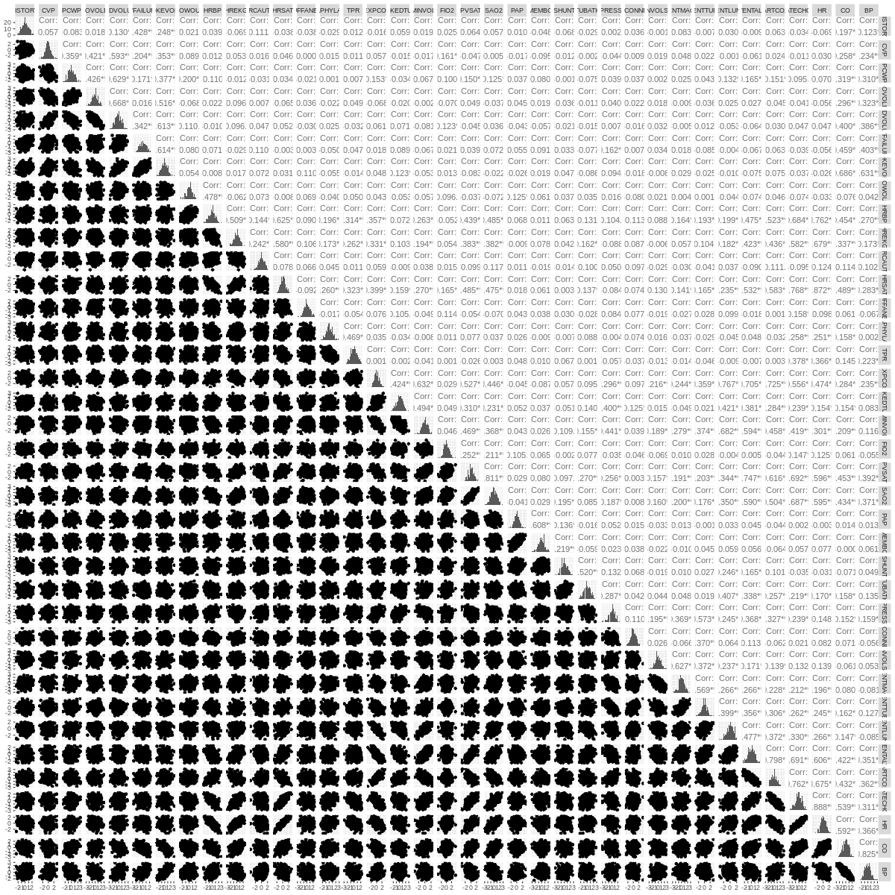

    GGpairs plot

.. _graph_true_stats:

``graph_true_stats``
-------------------------

This module plots properties of the true graphs such as graph density.

.. _graph_true_plots:

``graph_true_plots``
-------------------------

This module plots the true underlying graphs. 

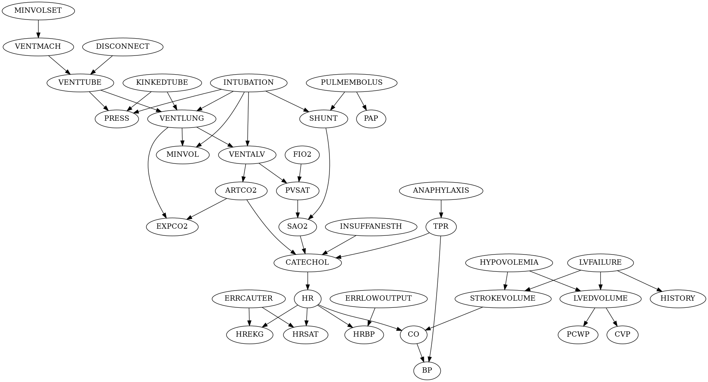

    The Alarm network

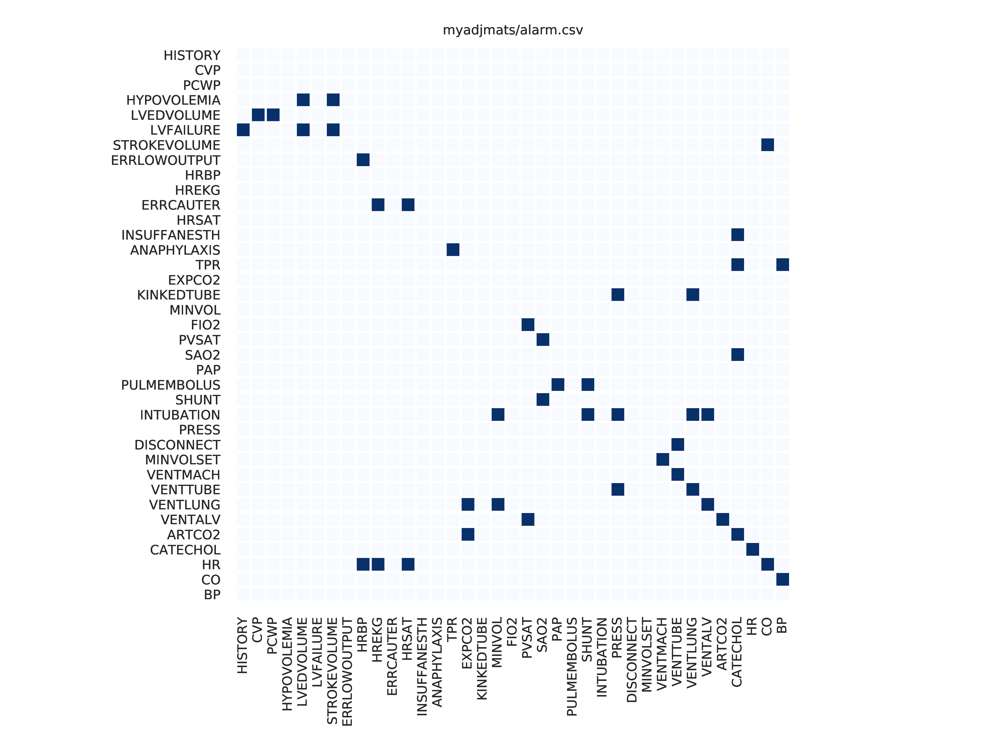

    The Alarm network as adjacency matrix

.. _graph_plots:

``graph_plots``
-------------------------

This module plots and saves the estimated graphs in dot-format and adjacency matrix.
It also plots graph comparison using *graphviz.compare* from `bnlearn <https://www.bnlearn.com/>`.

.. code-block:: json
    
    [
        "fges-sem-bic",
        "mmhc-bge-zf",
        "omcmc_itsample-bge",
        "pc-gaussCItest"
    ]

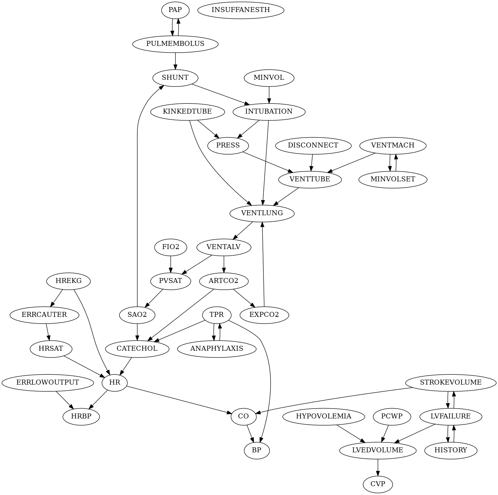

    Estimate of the Alarm network using PC algorithm

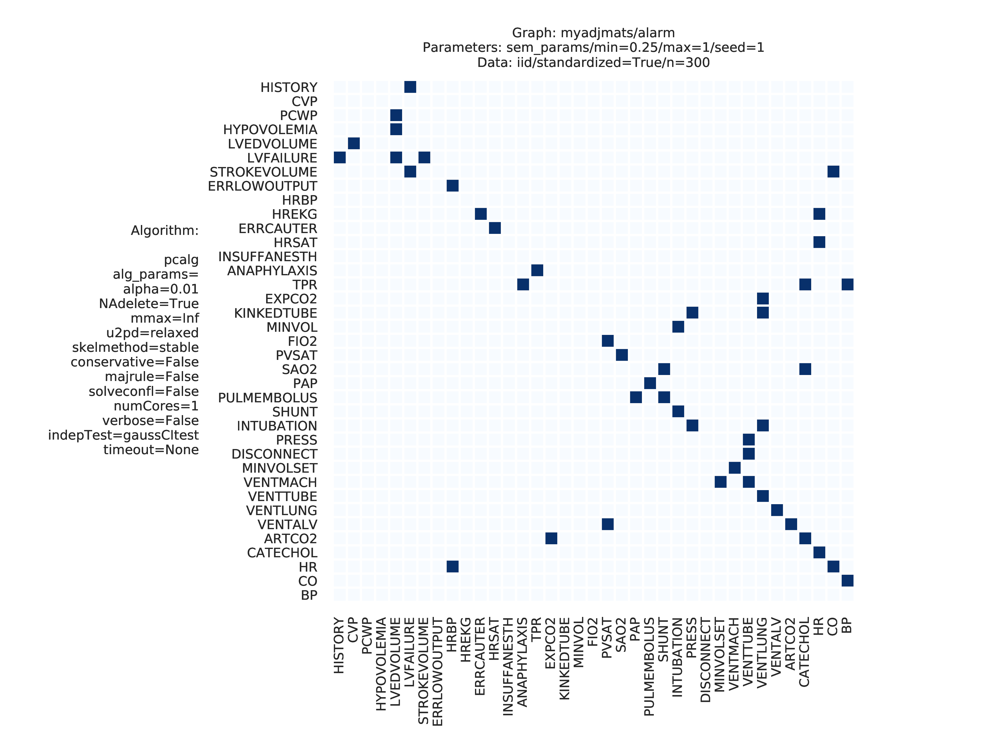

    Estimate of the Alarm network using PC algorithm

.. _mcmc_heatmaps:

``mcmc_heatmaps``
-------------------------

For Bayesian inference it is custom to use MCMC methods to simulate a Markov chain of graphs :math:`\{G^l\}_{l=0}^\infty` having the graph posterior as stationary distribution.
Suppose we have a realisation of length :math:`M + 1` of such chain, then the posterior edge probability of an edge e is estimated by :math:`\frac{1}{M+1-b} \sum_{l=b}^{M} \mathbf{1}_{e}(e^l)`, where the first :math:`b` samples are disregarded as a burn-in period.

This module has a list of objects, where each object has 
* an id field for the algorithm object id 
* and a field (``burn_in``) for specifying the burn-in period. 

The estimated probabilities are plotted in heatmaps using seaborn which are saved in *results/mcmc_heatmaps/* and copied to *results/output/mcmc_heatmaps/* for easy reference.

.. rubric:: Example

.. code-block:: json

    [
        {
            "id": "omcmc_itsample-bge",
            "burn_in": 0,
            "active": true
        }
    ]

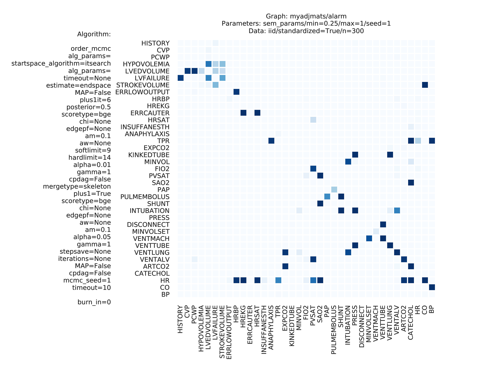

    Mean graph estimate of the Alarm network using order MCMC with startspace from iterative MCMC 

.. _mcmc_autocorr_plots:

``mcmc_autocorr_plots``
-------------------------

The ``mcmc_autocorr_plots`` module plots the auto-correlation of a functional of the graphs in a MCMC trajectory. 
Similar to the ``mcmc_traj_plots`` module, the ``mcmc_autocorr_plots`` module has a list of objects, where each object has

* ``id``: algorithm module object id. 
* ``burn_in``: use samples starting from this value. Use 0 if no burn-in.
* ``thinning``: use only each ``thinning`` sample of the chain. (It is usually recommended to use this if the number of samples if large).
* ``functional``: a field specifying the functional to be considered. The currently supported functionals are the number of edges for the graphs *size* and the graph *score*. 
* ``lags``: The maximum number of lags after thinning.

.. rubric:: Example

.. code-block:: json
    
    [
        {
            "id": "omcmc_itsample-bge",
            "burn_in": 0,
            "thinning": 1,
            "lags": 50,
            "functional": [
                "score",
                "size"
            ],
            "active": true
        }
    ]

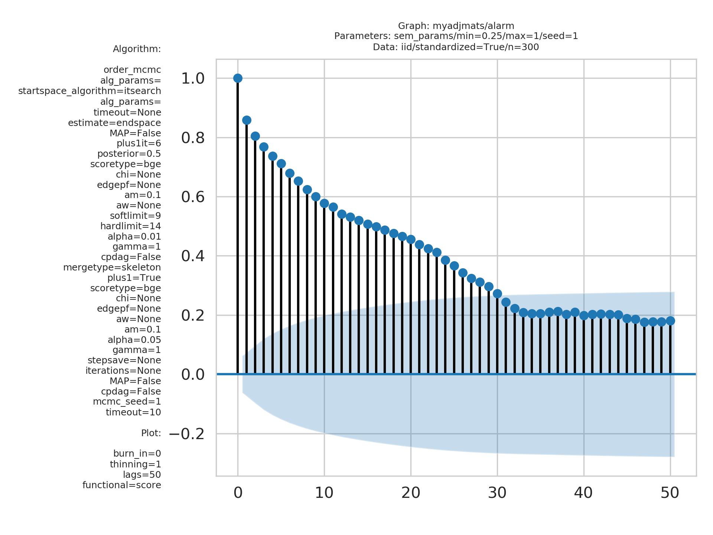

    Auto-correlation of the scores in trajectory of order MCMC

.. _mcmc_traj_plots:

``mcmc_traj_plots``
-------------------------

This module plots the  values in the trajectory of a given functional. 

The ``mcmc_traj_plots`` module has a list of objects, where each object has

* ``id``: algorithm module object id. 
* ``burn_in``: use samples starting from this value. Use 0 if no burn-in.a burn-in field 
* ``functional``:  a field specifying the functional to be considered. The currently supported functionals are the number of edges for the graphs *size* and the graph *score*. 
  
Since the trajectories tend to be very long, the user may choose to thin out the trajectory by only considering every graph at a given interval length specified by the thinning field. 

.. rubric:: Example

.. code-block:: json
        
    [
        {
            "id": "omcmc_itsample-bge",
            "burn_in": 0,
            "thinning": 1,
            "functional": [
                "score",
                "size"
            ],
            "active": true
        }
    ]

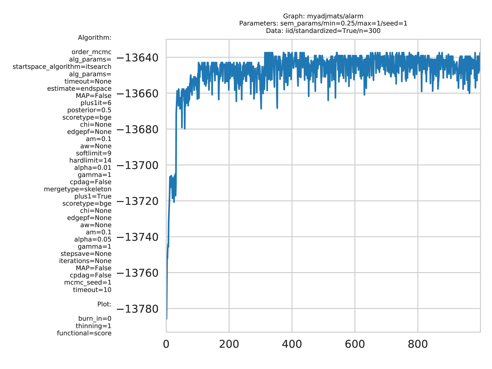

    Score trajectory of order MCMC

.. _resources:

``resources``
*************

The  sections ``graph``, ``parameters``, ``data``, and ``structure_learning_algorithms``
contain the available modules in benchpress.
Each object in a module algorithm has a unique `id` which can be referenced in the benchmark_setup_ section.

.. _resources:
.. .. figure:: _static/resources.png
..     :width: 400

..     Expanded ``resources`` in :download:`config/sec6.1.json <../../config/sec6.1.json>`. 

.. .. _setup:
.. .. figure:: _static/setup.png
..     :width: 400

..     Expanded ``resources`` and ``benchmark_setup`` in :download:`config/sec6.1.json <../../config/sec6.1.json>`. 

.. include:: available_graphs.rst
.. include:: available_parameters.rst
.. include:: available_data.rst
.. include:: available_structure_learning_algorithms.rst

.. [3] Felix L. Rios and Giusi Moffa and Jack Kuipers Benchpress: a scalable and platform-independent workflow for benchmarking structure learning algorithms for graphical models. ArXiv eprints., 2107.03863, 2021.

