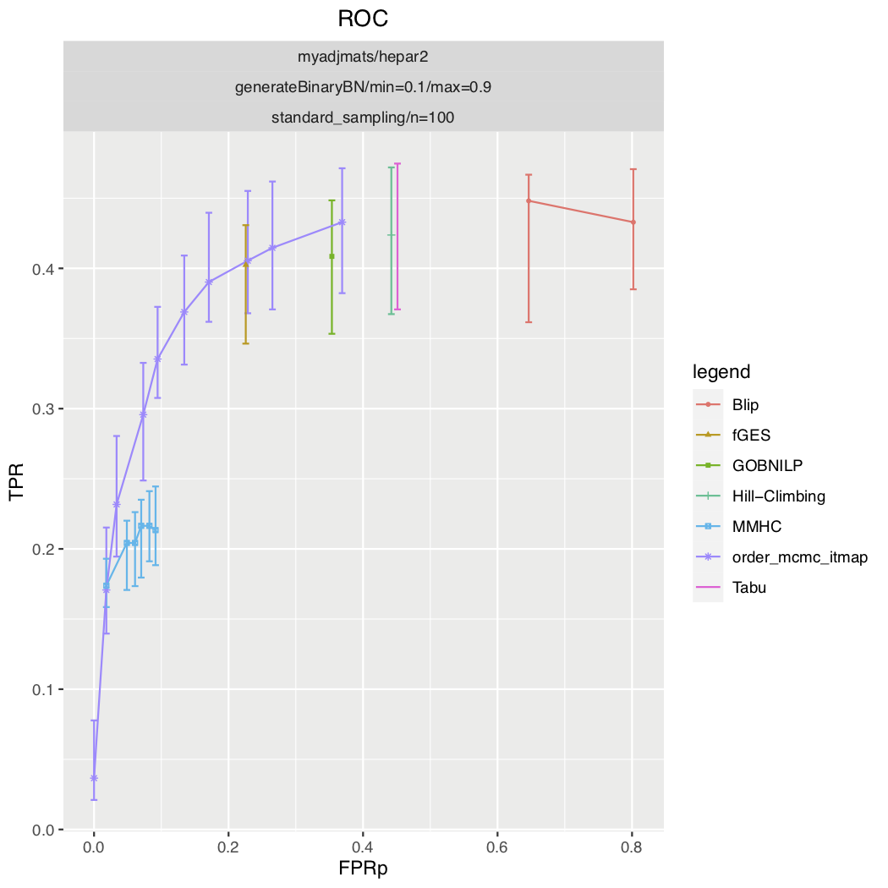
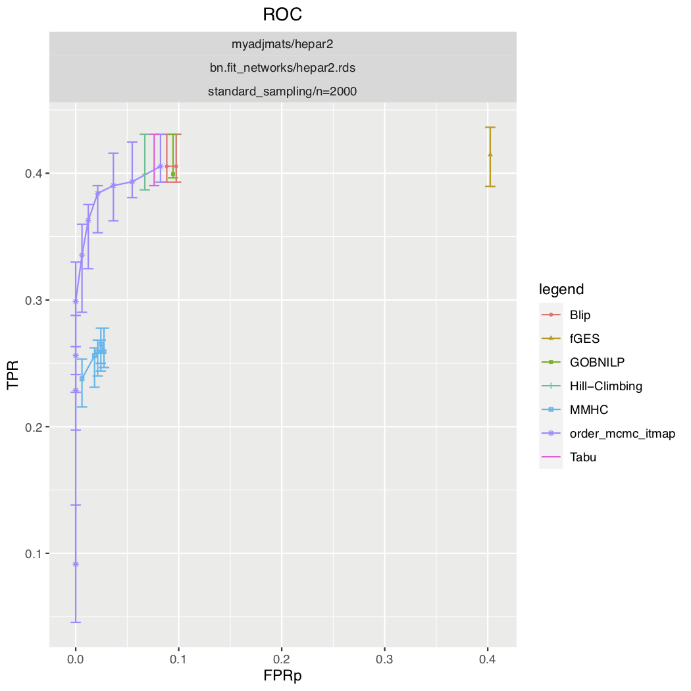
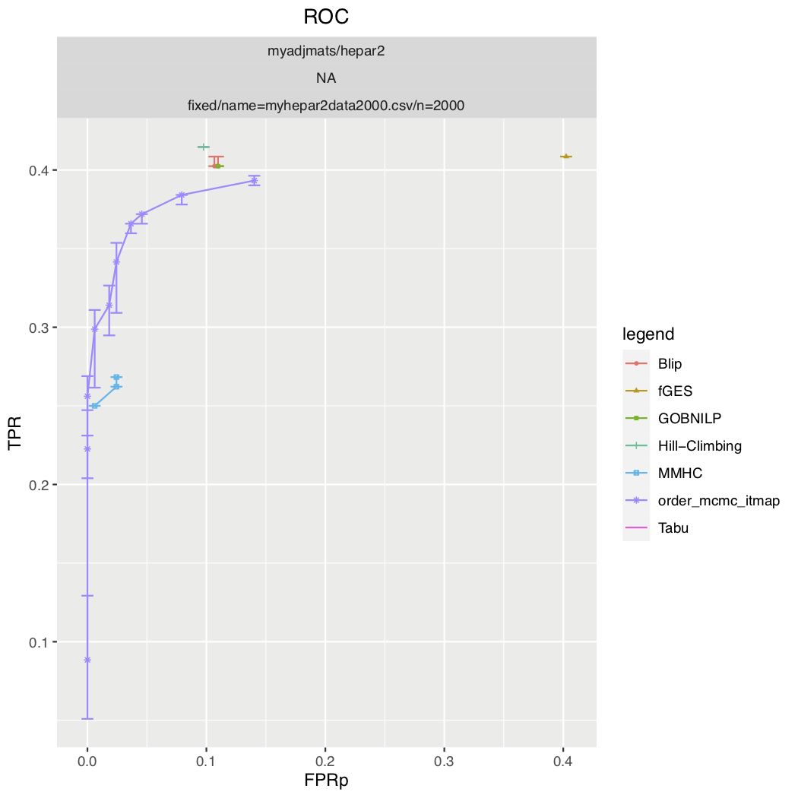

Examples
###############

This example plots ROC curves (see :ref:`rocdef`) for some of the available structure learning algorithms.

Fully sampled model
*************************************
This example is based on the config file is found in :download:`config.sample.json <../../config.sample.json>`.

Run the snakemake rule roc with 2 cores by:

.. code-block:: bash

    $ snakemake roc --cores 2 --use-singularity --configfile config.sample.json

This will produce the plot below 

.. code-block:: json

    {
        "graph_id": "generateDAGMaxParents",
        "parameters_id": "generateBinaryBN",
        "data_id": "standard_sampling",
        "seed_range": [1, 10]
    }

.. image:: _static/ROC.png
   :width: 400

Fixed graph
****************************************

.. code-block:: json
    
    {
        "graph_id": "hepar2.csv",
        "parameters_id": "generateBinaryBN" ,
        "data_id": "standard_sampling",
        "seed_range": [1, 10]
    }

Fixed graph and parameters
***************************************

.. code-block:: json

    {
        "graph_id": "hepar2.csv",
        "parameters_id": "hepar2.rds",
        "data_id": "standard_sampling2000",
        "seed_range": [1, 10]
    }
    

Fixed graph and data
************************************

.. code-block:: json

    {
        "graph_id": "asia.csv",
        "parameters_id": null,
        "data_id": "myasiandata.csv",
        "seed_range": null
    }

