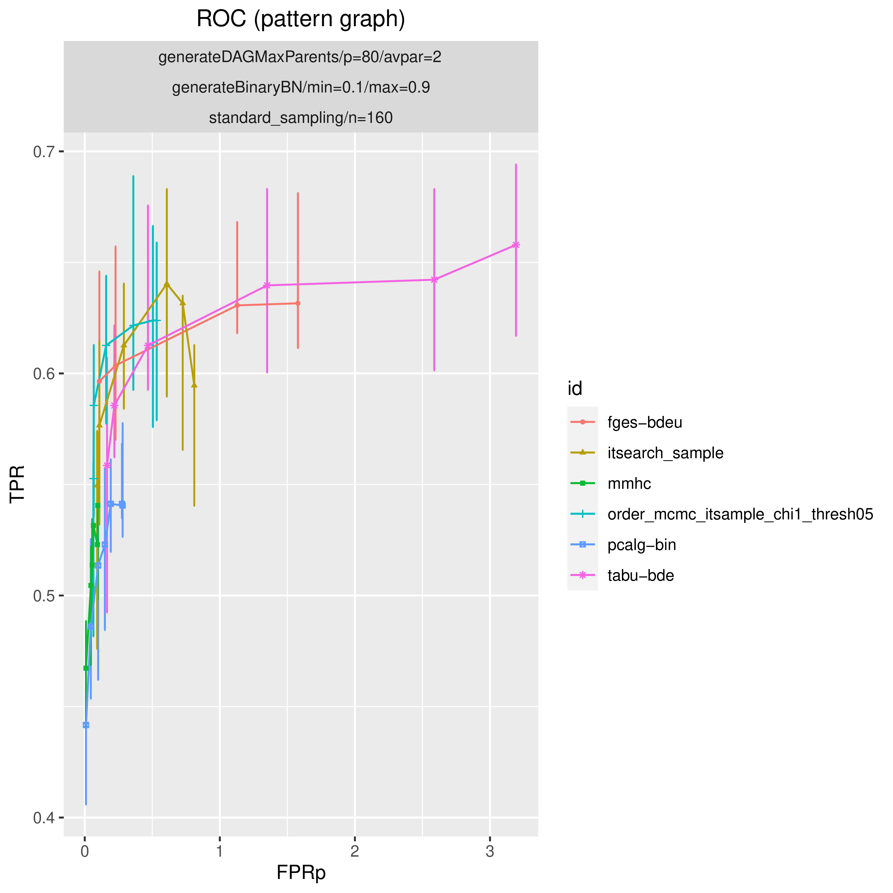
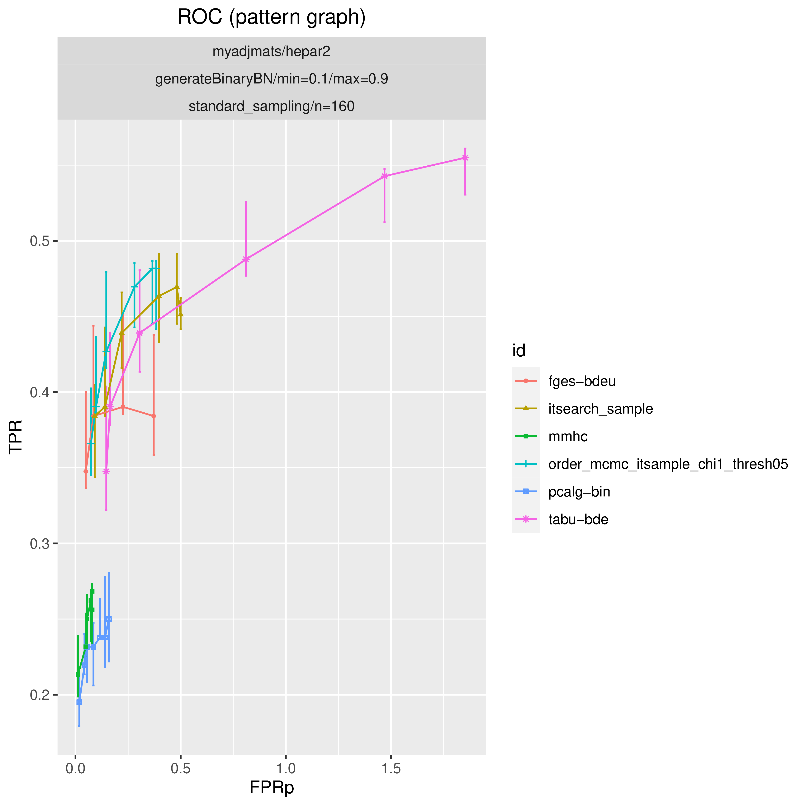
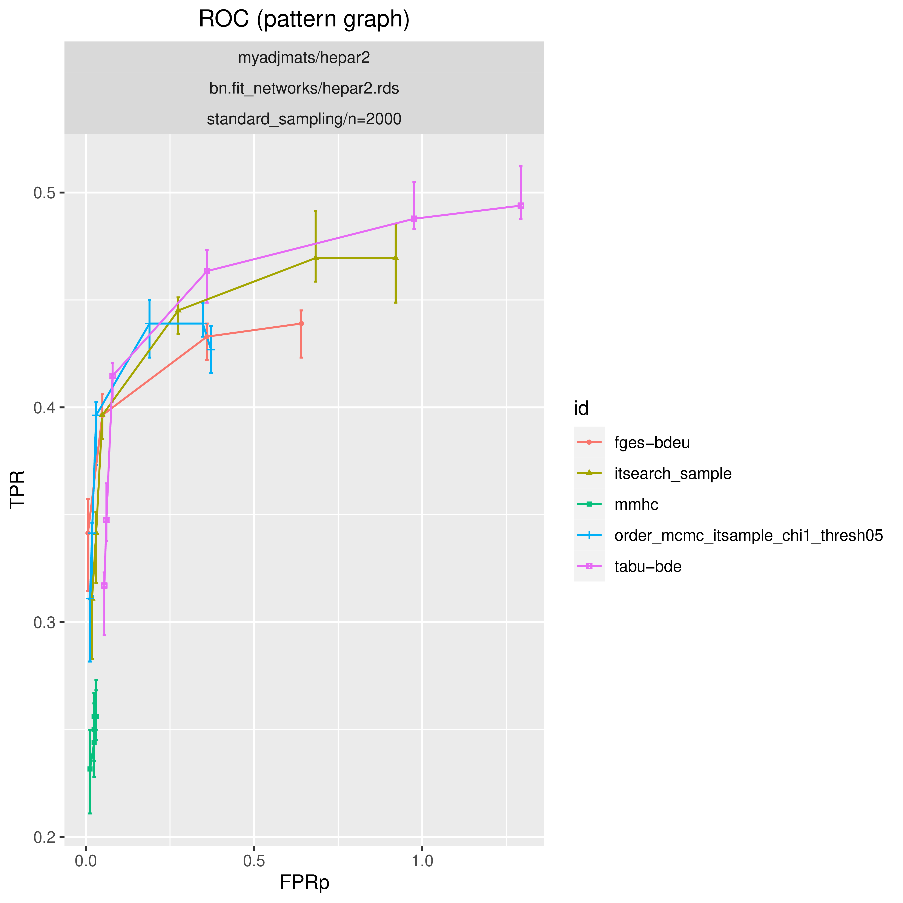
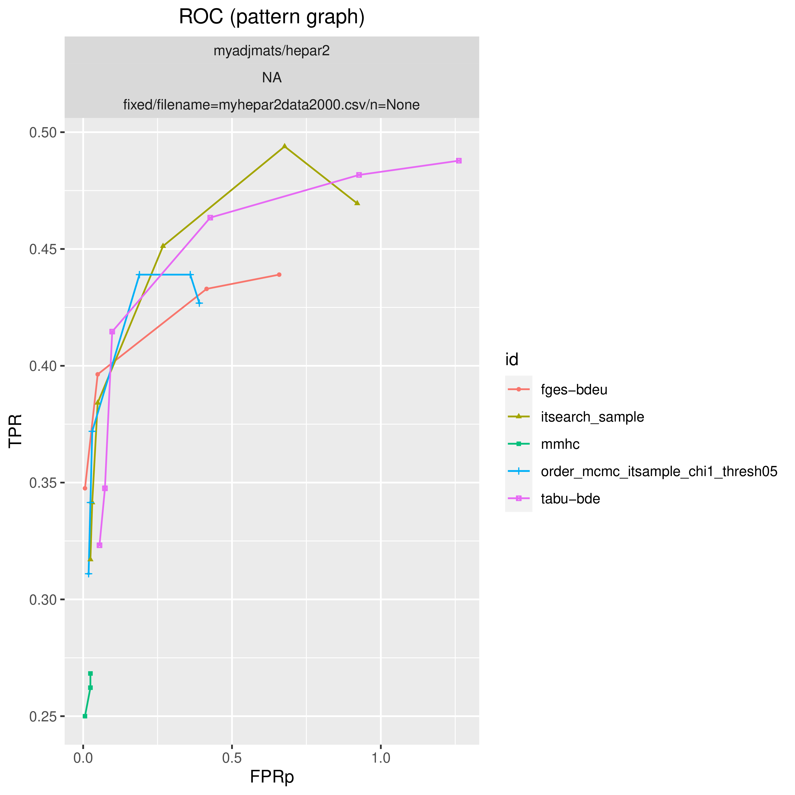

Examples
###############

This example plots ROC curves (see :ref:`rocdef`) for some of the available structure learning algorithms.
The plot is stored in ``results/ROC.eps``. 
The data for the plot is stored in ``results/ROC_data.csv``. 

Fully sampled model
*************************************
This example is based on the config file :download:`config.sample.docs.fullysampled.json <../../config/config.sample.docs.fullysampled.json>`.
The model is fully random Bayesian network model in the sense that both the DAG and the parameters are random.

From the config file´s ``benchmark_setup->data`` section:

.. code-block:: json
    
    {
        "graph_id": "DAGavpar2p80",
        "parameters_id": "binary_bn",
        "data_id": "iid160",
        "seed_range": [
            1,
            5
        ]
    }

Run the following command to produce the plot below.

.. code-block:: bash

    $ make cleanres && snakemake roc --cores 2 --use-singularity --configfile config.sample.docs.fullysampled.json

Fixed graph
****************************************

This example is based on the config file :download:`config.sample.docs.fixedgraph.json <../../config/config.sample.docs.fixedgraph.json>`.
I this model, the DAG is specified as a ``.csv`` and parameters for a binary Bayesian network is random.

From the config file´s ``benchmark_setup->data`` section:

.. code-block:: json

    {
        "graph_id": "hepar2.csv",
        "parameters_id": "binary_bn",
        "data_id": "iid160",
        "seed_range": [
            1,
            5
        ]
    }

Run the following command to produce the plot below.

.. code-block:: bash

    $ make cleanres && snakemake roc --cores 2 --use-singularity --configfile config.sample.docs.fixedgraph.json

Fixed graph and parameters
***************************************

This example is based on the config file :download:`config.sample.docs.fixedgraphparams.json <../../config/config.sample.docs.fixedgraphparams.json>`.
This is a fixed *bnlearn* Bayesian network specified as a ``.rds`` file.

From the config file´s ``benchmark_setup->data`` section:

.. code-block:: json

    {
        "graph_id": "hepar2.csv",
        "parameters_id": "hepar2.rds",
        "data_id": "iid2000",
        "seed_range": [
            1,
            5
        ]
    }

Run the following command to produce the plot below.

.. code-block:: bash

    $ make cleanres && snakemake roc --cores 2 --use-singularity --configfile config.sample.docs.fixedgraphparams.json

    

Fixed graph and data
************************************

This example is based on the config file :download:`config.sample.docs.fixeddata.json <../../config/config.sample.docs.fixeddata.json>`.
In this example, the data is fixed and specified as a ``.csv`` file and the underlying graph (DAG) is specified as a ``.csv`` file.

From the config file´s ``benchmark_setup->data`` section:

.. code-block:: json

    {
        "graph_id": "hepar2.csv",
        "parameters_id": null,
        "data_id": "myhepar2data2000.csv",
        "seed_range": null
    }

Run the following command to produce the plot below.

.. code-block:: bash

    $ make cleanres && snakemake roc --cores 2 --use-singularity --configfile config.sample.docs.fixeddata.json

