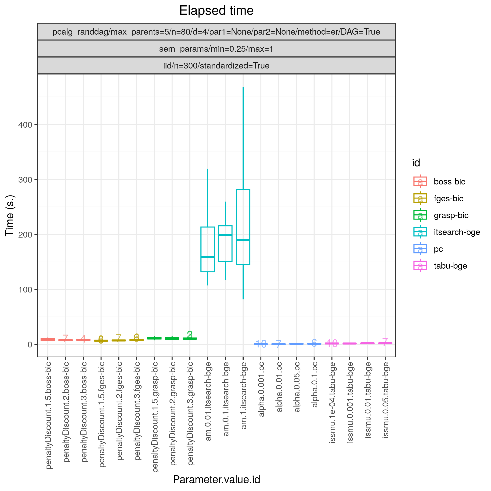

.. _bidag_itsearch: 

bidag_itsearch 
------------------

.. rubric:: Iterative MCMC

.. list-table:: 

   * - Package
     - `BiDAG <https://cran.r-project.org/web/packages/BiDAG/index.html>`__
   * - Version
     - 2.1.4
   * - Language
     - `R <https://www.r-project.org/>`__
   * - Docs
     - `here <https://cran.r-project.org/web/packages/BiDAG/BiDAG.pdf>`__
   * - Paper
     - :footcite:t:`doi:10.1080/10618600.2021.2020127`
   * - Graph type
     - `DAG <https://en.wikipedia.org/wiki/Directed_acyclic_graph>`__, `CPDAG <https://search.r-project.org/CRAN/refmans/pcalg/html/dag2cpdag.html>`__
   * - Docker 
     - `bpimages/bidag:2.1.4 <https://hub.docker.com/r/bpimages/bidag/tags>`__

   * - Module folder
     - `bidag_itsearch <https://github.com/felixleopoldo/benchpress/tree/master/workflow/rules/structure_learning_algorithms/bidag_itsearch>`__

.. rubric:: Description

This is a hybrid score-based optimisation technique based on Markov chain Monte Carlo
schemes :footcite:t:`doi:10.1080/10618600.2021.2020127`. The algorithm starts from a skeleton obtained
through a fast method (e.g. a constraint based method, or GES). Then it performs score and
search on the DAGs belonging to the space defined by the starting skeleton. To correct for
edges which may be missed, the search space is iteratively expanded to include one additional
parent for each variable from outside the current search space. The score and search phase relies
on an MCMC scheme producing a chain of DAGs from their posterior probability given the data.

.. rubric:: Example 

Config file: `itsearch_sem.json <https://github.com/felixleopoldo/benchpress/blob/master/workflow/rules/structure_learning_algorithms/bidag_itsearch/config/itsearch_sem.json>`_

Command:

.. code:: bash

    snakemake --cores all --use-singularity --configfile workflow/rules/structure_learning_algorithms/bidag_itsearch/config/itsearch_sem.json

:numref:`itsearchroc` and :numref:`itsearchtimings2`  show FP/P vs. TP/P and timings based on 10 datsets corresponding to 10 realisations of a 80-variables random Gaussian SEM, with an average indegree of 2 and maximum indegree of 5.
Each dataset contains 300 samples.
:numref:`itsearchtype2` and :numref:`itsearchprops2` shows the type of graphs estimated and the properties of the true graphs, respectively.

.. _itsearchroc:

.. figure:: ../../../workflow/rules/structure_learning_algorithms/bidag_itsearch/images/bidag_roc.png
    :width: 320 
    :alt: FP/P vs. TP/P itsearch example
    :align: left

    FP/P vs. TP/P.

.. _itsearchtimings2:

    Timings.

.. _itsearchtype2:

.. figure:: ../../../workflow/rules/structure_learning_algorithms/bidag_itsearch/images/bidag_graphtype.png
    :width: 320 
    :alt: Graph types example
    :align: left

    Type of graphs estimated.

.. _itsearchprops2:

.. figure:: ../../../workflow/rules/structure_learning_algorithms/bidag_itsearch/images/bidag_graph_properties_plot.png
    :width: 320 
    :alt: Properties of the true graphs
    :align: right

    Graph properties.

.. rubric:: Some fields described 
* ``edgeConstraints`` Name of the JSON file containing background knowledge 

.. rubric:: Example JSON

.. code-block:: json

    [
      {
        "id": "itsearch_map-bge",
        "estimate": "map",
        "MAP": true,
        "plus1it": null,
        "posterior": null,
        "scoretype": "bge",
        "chi": null,
        "edgepf": null,
        "am": [
          0.000248,
          0.0223,
          0.1,
          0.448,
          0.739
        ],
        "aw": null,
        "softlimit": 9,
        "hardlimit": 15,
        "alpha": 0.05,
        "gamma": 1,
        "cpdag": false,
        "mergetype": "skeleton",
        "timeout": null,
        "edgeConstraints": "edgeConstraints.json"
      },
      {
        "id": "itsearch_map-bde",
        "estimate": "map",
        "MAP": true,
        "plus1it": null,
        "posterior": null,
        "scoretype": "bde",
        "chi": [
          0.01,
          0.1,
          1
        ],
        "edgepf": 2,
        "am": null,
        "aw": null,
        "softlimit": 9,
        "hardlimit": 12,
        "alpha": 0.05,
        "gamma": 1,
        "cpdag": false,
        "mergetype": "skeleton",
        "timeout": null,
        "edgeConstraints": "edgeConstraints.json"
      }
    ]

.. footbibliography::

