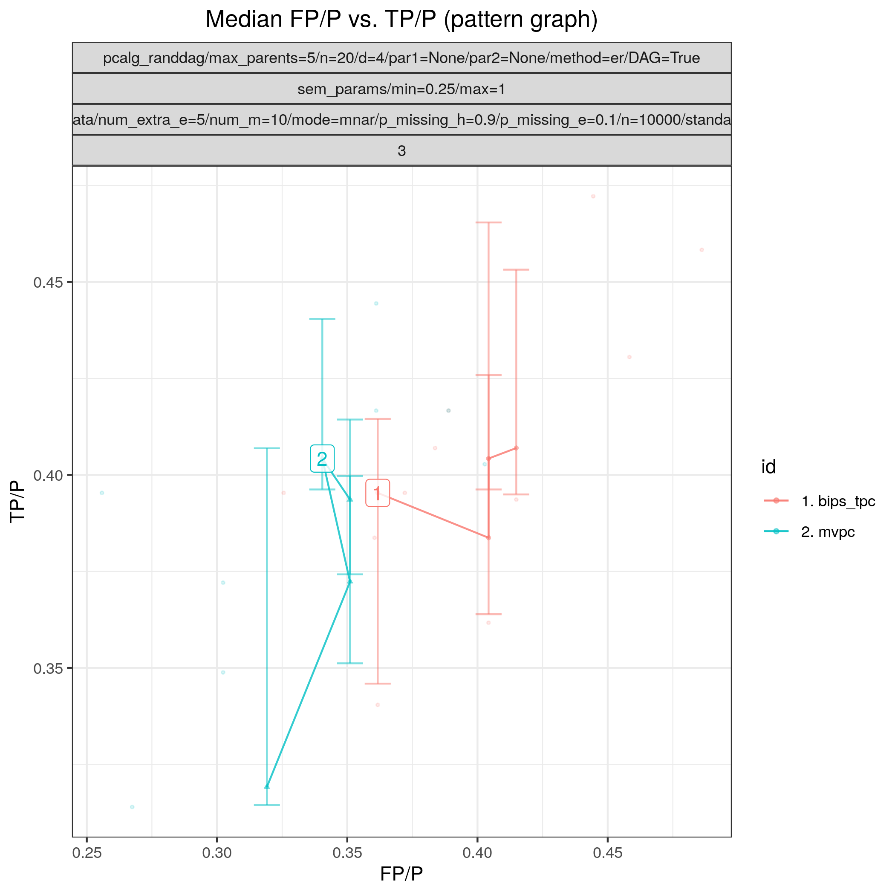
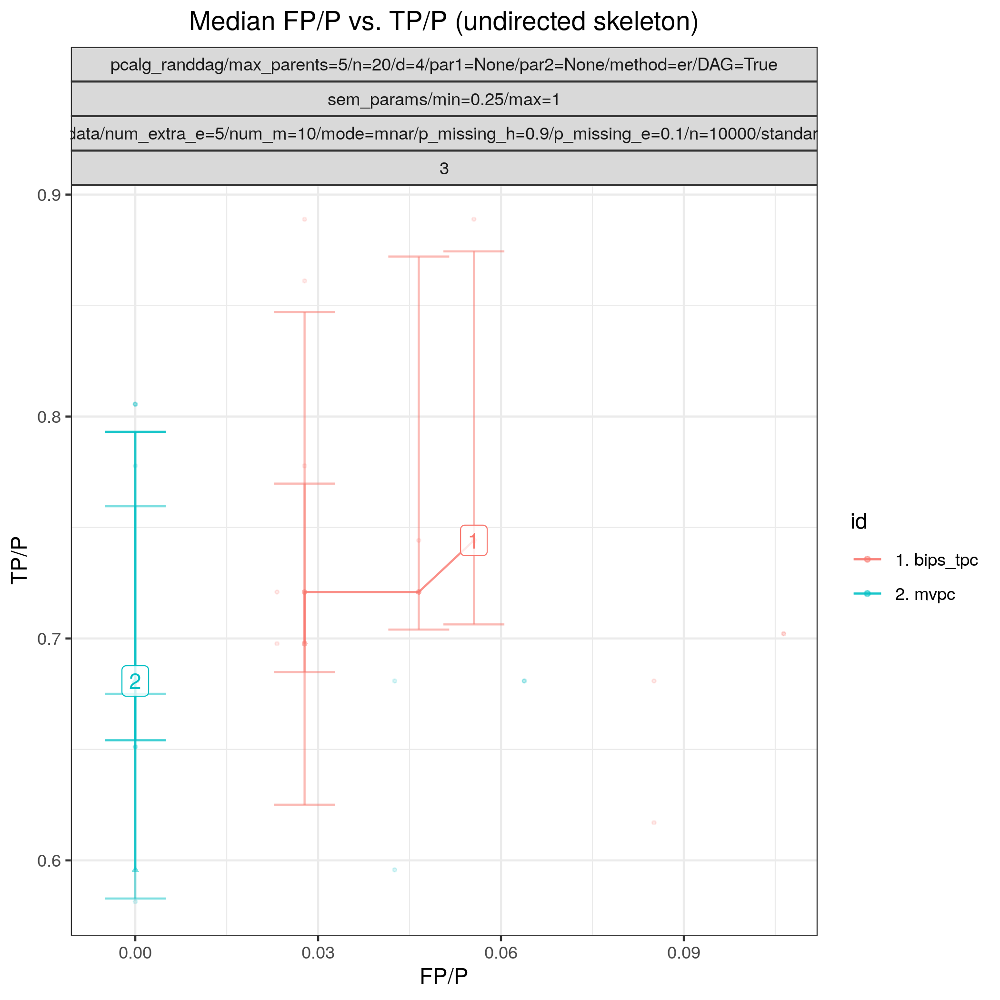

:og:description: This package implements the tPC algorithm for causal discovery. The 't' stands for 'temporal' or 'tiers' and indicates that background knowledge in the form of a partial node/variable ordering is available.
:og:image:alt: Benchpress logo
:og:sitename: Benchpress causal discovery platform
:og:title: TPC (tpc)
 
.. meta::
    :title: TPC (tpc)
    :description: This package implements the tPC algorithm for causal discovery. The 't' stands for 'temporal' or 'tiers' and indicates that background knowledge in the form of a partial node/variable ordering is available.

.. _bips_tpc: 

TPC (tpc) 
**********

.. list-table:: 

   * - Module name
     - `bips_tpc <https://github.com/felixleopoldo/benchpress/tree/master/workflow/rules/structure_learning_algorithms/bips_tpc>`__
   * - Package
     - `tpc <https://github.com/bips-hb/tpc>`__
   * - Version
     - 137e18b
   * - Language
     - `R <https://www.r-project.org/>`__
   * - Docs
     - `here <https://github.com/bips-hb/tpc>`__
   * - Paper
     - :footcite:t:`andrews2023practicalguidecausaldiscovery`
   * - Graph type
     - `CPDAG <https://search.r-project.org/CRAN/refmans/pcalg/html/dag2cpdag.html>`__
   * - MCMC
     - No
   * - Edge constraints
     - :ref:`Yes <edge_constraints>`
   * - Data type
     - C, D, M
   * - Data missingness
     - `MAR <https://en.wikipedia.org/wiki/Missing_data#Missing_completely_at_random>`__, `MNAR <https://en.wikipedia.org/wiki/Missing_data#Missing_completely_at_random>`__, `MCAR <https://en.wikipedia.org/wiki/Missing_data#Missing_completely_at_random>`__
   * - Intervention type
     - 
   * - Docker 
     - `bpimages/bips_tpc:137e18be <https://hub.docker.com/r/bpimages/bips_tpc/tags>`__

Temporal PC 
---------------

This package implements the tPC algorithm for causal discovery. The 't' stands for 'temporal' or 'tiers' and indicates that background knowledge in the form of a partial node/variable ordering is available. Our implementation is a modified version of pc from the pcalg package (Kalisch et al. 2012) with more :ref:`edge_constraints` supported.

It also supports the Multiple Imputation for Causal Graph Discovery (micd) package.
Which is and add-on to the R package pcalg for handling missing data in contrataint-based causal graph discovery. Supports continuous, discrete and mixed data. Two options are available: 1) gaussCItwd, disCItwd and mixCItwd perform test-wise deletion, where missing observations are deleted as necessary on a test-by-test basis; 2) gaussMItest, disMItest and mixMItest perform conditional independence tests on multiply imputed data. 

.. rubric:: Example 

Config file: `bips_tpc.json <https://github.com/felixleopoldo/benchpress/blob/master/workflow/rules/structure_learning_algorithms/bips_tpc/bips_tpc.json>`_

Command:

.. code:: bash

    snakemake --cores all --use-singularity --configfile workflow/rules/structure_learning_algorithms/bips_tpc/bips_tpc.json

:numref:`bips_tpcplot` and :numref:`bips_tpcplot2`  show FP/P vs. TP/P for pattern graphs and skeletons based on 3 datsets corresponding to 3 realisations of a 20-variables random Gaussian SEM, with an average indegree of 4.
Each dataset contains 10000 samples and has values that are missing not at random (MNAR), sampled using :ref:`mvpc_gen_data`.

.. _bips_tpcplot:

    FP/P vs. TP/P. for pattern graphs

.. _bips_tpcplot2:

    FP/P vs. TP/P. for  skeletons

.. rubric:: Some fields described 
* ``edgeConstraints`` Name of the JSON file containing :ref:`edge_constraints` 
* ``indepTest`` gaussCItest, binCItest, disCItest, gaussCItwd, disCItwd, mixCItwd, gaussMItest, mixMItest, disMItest 
* ``input_algorithm_id`` When using multiple imputation (MI) i.e. when indepTest is set to gaussMItest, mixMItest, or disMItest, this should be and id of the :ref:`mice <mice>` module. It is a workaround to get imputed data. 

.. rubric:: Example JSON

.. code-block:: json

    [
      {
        "id": "tpc",
        "alpha": [
          0.001,
          0.01,
          0.05,
          0.1
        ],
        "mmax": "Inf",
        "conservative": false,
        "majrule": true,
        "numCores": 1,
        "cl_type": "PSOCK",
        "verbose": false,
        "indepTest": "gaussCItwd",
        "input_algorithm_id": null,
        "timeout": null,
        "edgeConstraints": null
      }
    ]

.. footbibliography::

