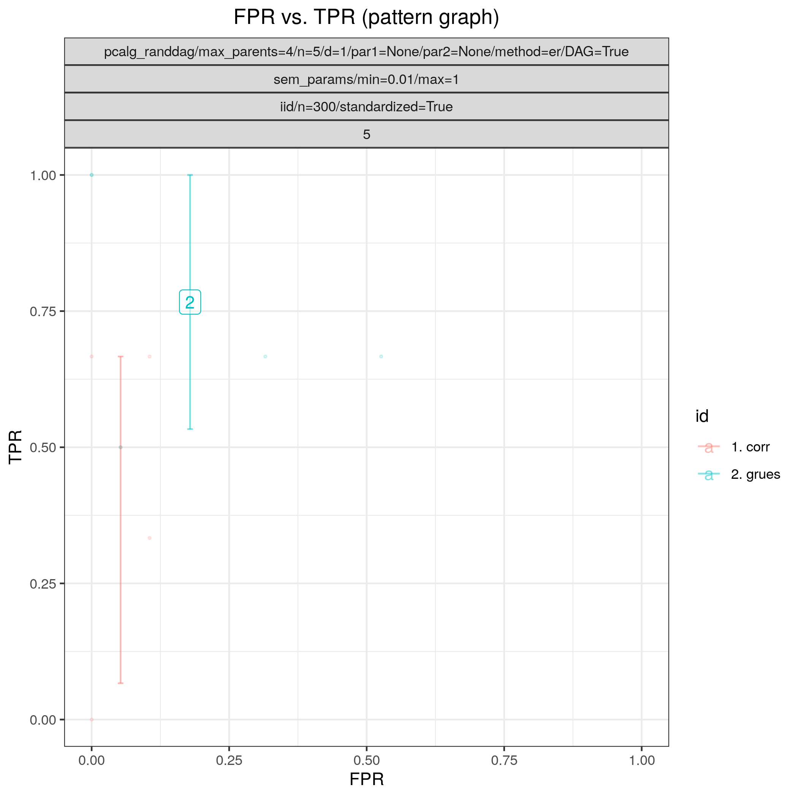

:og:description: Estimates sparse graphs by a lasso penalty applied to the inverse covariance matrix.
:og:image:alt: Benchpress logo
:og:sitename: Benchpress causal discovery platform
:og:title: Graphical lasso (huge_glasso)
 
.. meta::
    :title: Graphical lasso 
    :description: Estimates sparse graphs by a lasso penalty applied to the inverse covariance matrix.

.. _huge_glasso: 

GLasso (huge) 
**************

.. list-table:: 

   * - Module name
     - `huge_glasso <https://github.com/felixleopoldo/benchpress/tree/master/workflow/rules/structure_learning_algorithms/huge_glasso>`__
   * - Package
     - `huge <https://cran.r-project.org/web/packages/huge/index.html>`__
   * - Version
     - 1.3.5
   * - Language
     - `R <https://www.r-project.org/>`__
   * - Docs
     - `here <https://cran.r-project.org/web/packages/huge/huge.pdf>`__
   * - Paper
     - :footcite:t:`zhao2012huge`, :footcite:t:`friedman2008sparse`
   * - Graph type
     - `UG <https://en.wikipedia.org/wiki/Graph_(discrete_mathematics)#Graph>`__
   * - Docker 
     - `bpimages/huge:1.3.5 <https://hub.docker.com/r/bpimages/huge/tags>`__

Graphical lasso 
-------------------

Abstract:
We consider the problem of estimating the marginal independence structure of a Bayesian network from observational data in the form of an undirected graph called the unconditional dependence graph. We show that unconditional dependence graphs of Bayesian networks correspond to the graphs having equal independence and intersection numbers. Using this observation, a Gröbner basis for a toric ideal associated to unconditional dependence graphs of Bayesian networks is given and then extended by additional binomial relations to connect the space of all such graphs. An MCMC method, called GrUES (Gröbner-based Unconditional Equivalence Search), is implemented based on the resulting moves and applied to synthetic Gaussian data. GrUES recovers the true marginal independence structure via a penalized maximum likelihood or MAP estimate at a higher rate than simple independence tests while also yielding an estimate of the posterior, for which the 20% HPD credible sets include the true structure at a high rate for data-generating graphs with density at least 0.5.

.. rubric:: Example

Config file: `grues_vs_corr-thresh.json <https://github.com/felixleopoldo/benchpress/blob/master/workflow/rules/structure_learning_algorithms/grues/grues_vs_corr-thresh.json>`_

Command:

.. code:: bash

    snakemake --cores all --use-singularity --configfile workflow/rules/structure_learning_algorithms/grues/grues_vs_corr-thresh.json

:numref:`roc_grues_vs_thresh` shows the ROC and :numref:`shd_grues_vs_thresh` shows the SHD comparing GrUES to correlation thresholding for datsets from five different graphs corresponding to a 5-variable random Gaussian SEM whose nodes have average degree of 1 and whose edge weights were allowed to be close to 0. Each dataset contains 300 observations and each Markov chain has 10000 observations. Note that SHD between a learned UDG and true CPDAG is not the most reasonable comparison because an inflated FPR will be reported---see :footcite:t:`grues2023` for discussion and a more reasonable benchmark.

:numref:`adj_grues` shows that GrUES estimates the correct `UDG <https://arxiv.org/pdf/2210.00822.pdf#subsection.2.2>`__ while correlation thresholding (:numref:`adj_thresh`) misses the edge `1---2`.

.. _roc_grues_vs_thresh:

    ROC of GrUES vs corr_thresh.

.. _shd_grues_vs_thresh:

    SHD of GrUES vs corr_thresh.

.. _adj_grues:

    Adj mat learned by GrUES.

.. _adj_thresh:

.. figure:: ../../../workflow/rules/structure_learning_algorithms/grues/images/diffplot_15.png
    :width: 320
    :alt: adjacency matrix corr_thresh example
    :align: right

    Adj mat learned by corr_thresh.

.. rubric:: Some fields described 
* ``lambda`` A positive number to control the regularization. Typical usage is to leave the input lambda: null and have the program compute its own. 
* ``nlambda`` The number of regularization/thresholding parameters. The default value is 10 
* ``select_criterion`` Model selection criterion. ric, stars, and ebic are available. The default value is ric. 

.. rubric:: Example JSON

.. code-block:: json

    [
      [
        {
          "id": "huge_glasso",
          "lambda": [
            2,
            1,
            0.8,
            0.6,
            0.4,
            0.2,
            0.1,
            0.05,
            0.01
          ],
          "nlambda": null,
          "select_criterion": "ebic",
          "timeout": null
        }
      ]
    ]

.. footbibliography::

