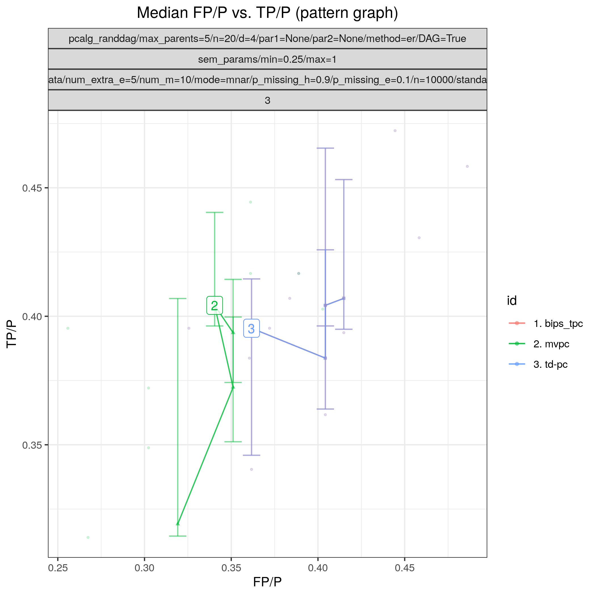
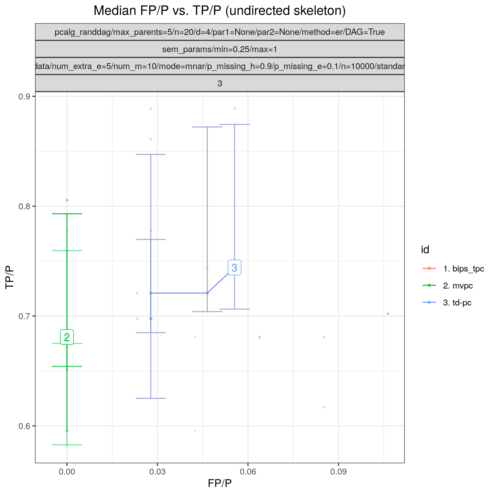

:og:description: MVPC extends the PC algorithm to incorporate additional corrections for missing values of type missing at random (MAR) and missing not at random (MNAR).
:og:image:alt: Benchpress logo
:og:sitename: Benchpress causal discovery platform
 
.. meta::
    :title: Missing Value PC 
    :description: MVPC extends the PC algorithm to incorporate additional corrections for missing values of type missing at random (MAR) and missing not at random (MNAR).

.. _mvpc: 

mvpc 
********

.. list-table:: 

   * - Package
     - `MVPC <https://github.com/felixleopoldo/MVPC>`__
   * - Version
     - d901361
   * - Language
     - `R <https://www.r-project.org/>`__
   * - Docs
     - `here <https://github.com/felixleopoldo/MVPC>`__
   * - Paper
     - :footcite:t:`tu2019causal`, :footcite:t:`tu2020causald`
   * - Graph type
     - `CPDAG <https://search.r-project.org/CRAN/refmans/pcalg/html/dag2cpdag.html>`__
   * - Docker 
     - `bpimages/mvpc:d901361 <https://hub.docker.com/r/bpimages/mvpc/tags>`__

   * - Module folder
     - `mvpc <https://github.com/felixleopoldo/benchpress/tree/master/workflow/rules/structure_learning_algorithms/mvpc>`__

Missing Value PC 
--------------------

*Abstract*: Missing data are ubiquitous in many domains such as healthcare. When these data entries are not missing completely at random, the (conditional) independence relations in the observed data may be different from those in the complete data generated by the underlying causal process. Consequently, simply applying existing causal discovery methods to the observed data may lead to wrong conclusions. In this paper, we aim at developing a causal discovery method to recover the underlying causal structure from observed data that are missing under different mechanisms, including missing completely at random (MCAR), missing at random (MAR), and missing not at random (MNAR). With missingness mechanisms represented by missingness graphs (m-graphs), we analyze conditions under which additional correction is needed to derive conditional independence/dependence relations in the complete data. Based on our analysis, we propose Missing Value PC (MVPC), which extends the PC algorithm to incorporate additional corrections. Our proposed MVPC is shown in theory to give asymptotically correct results even on data that are MAR or MNAR. Experimental results on both synthetic data and real healthcare applications illustrate that the proposed algorithm is able to find correct causal relations even in the general case of MNAR. 

*GitHub*: In this repository, we provide the implementation of Missing Value PC (MVPC) for both linear Gaussian and binary cases. 
MVPC is a framework of causal discovery in the presence of different missingness mechanisms, including missing completely at random (MCAR), missing at random (MAR), and missing not at random (MNAR). 
MVPC is based on the PC algorithm and contains two methods for correcting wrong results produced by missing value issues, Permutation-based Correction (PermC) and Density Ratio Weighted (DRW) correction method. 
More details can be found in the paper :footcite:t:`tu2019causal` and the long paper version :footcite:t:`tu2020causald`. 
The implementation is based on the R package pcalg.

.. rubric:: Example 

Config file: `mvpc.json <https://github.com/felixleopoldo/benchpress/blob/master/workflow/rules/structure_learning_algorithms/mvpc/config/mvpc.json>`_

Command:

.. code:: bash

    snakemake --cores all --use-singularity --configfile workflow/rules/structure_learning_algorithms/mvpc/mvpc.json

:numref:`mvpcplot` and :numref:`mvpcplot2`  show FP/P vs. TP/P for pattern graphs and skeletons based on 3 datsets corresponding to 3 realisations of a 20-variables random Gaussian SEM, with an average indegree of 4.
Each dataset contains 10000 samples and contains data that is missing not at random (MNAR) and was sampled using :ref:`mvpc_gen_data`.

.. _mvpcplot:

    FP/P vs. TP/P. for pattern graphs

.. _mvpcplot2:

    FP/P vs. TP/P. for  skeletons

.. rubric:: Some fields described 
* ``corrMethod`` gaussCItest.drw, gaussCItest.permc, binCItest.drw, binCItest.permc 
* ``edgeConstraints`` Name of the JSON file containing :ref:`edge_constraints` 
* ``indepTest`` gaussCItest, binCItest, gaussCItest.td, binCItest.td 

.. rubric:: Example JSON

.. code-block:: json

    [
      {
        "id": "mvpc",
        "alpha": [
          0.001,
          0.01,
          0.05,
          0.1
        ],
        "indepTest": "gaussCItest.td",
        "corrMethod": "gaussCItest.permc",
        "NAdelete": true,
        "mmax": "Inf",
        "u2pd": "relaxed",
        "skelmethod": "stable",
        "conservative": false,
        "majrule": true,
        "solveconfl": true,
        "numCores": 1,
        "verbose": false,
        "timeout": null,
        "edgeConstraints": null
      }
    ]

.. footbibliography::

