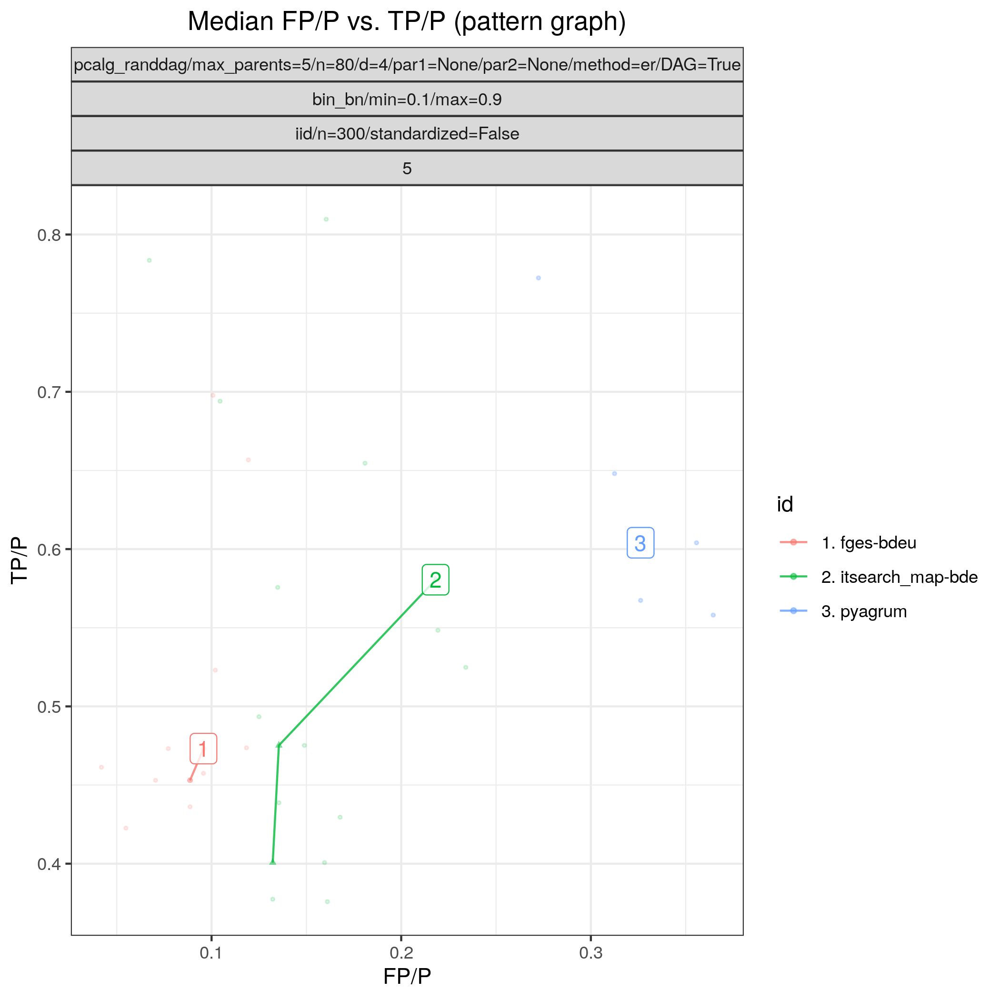

:og:description: Based on the C++ aGrUM library, it provides a high-level interface to the C++ part of aGrUM allowing to create, manage and perform efficient computations with Bayesian networks and others probabilistic graphical models : Markov random fields (MRF), influence diagrams (ID) and LIMIDs, credal networks (CN), dynamic BN (dBN), probabilistic relational models (PRM).
:og:image:alt: Benchpress logo
:og:sitename: Benchpress causal discovery platform
:og:title: PyAgrum (pyagrum)
 
.. meta::
    :title: PyAgrum (pyagrum)
    :description: Based on the C++ aGrUM library, it provides a high-level interface to the C++ part of aGrUM allowing to create, manage and perform efficient computations with Bayesian networks and others probabilistic graphical models : Markov random fields (MRF), influence diagrams (ID) and LIMIDs, credal networks (CN), dynamic BN (dBN), probabilistic relational models (PRM).

.. _pyagrum: 

PyAgrum (pyagrum) 
******************

.. list-table:: 

   * - Module name
     - `pyagrum <https://github.com/felixleopoldo/benchpress/tree/master/workflow/rules/structure_learning_algorithms/pyagrum>`__
   * - Package
     - `pyagrum <https://pyagrum.readthedocs.io/en/latest/>`__
   * - Version
     - 1.14.0
   * - Language
     - `Python <https://www.python.org/>`__
   * - Docs
     - `here <https://pyagrum.readthedocs.io/en/latest/notebooks/31-Learning_structuralLearning.html>`__
   * - Paper
     - :footcite:t:`10.1371/journal.pcbi.1005662`
   * - Graph type
     - `DAG <https://en.wikipedia.org/wiki/Directed_acyclic_graph>`__
   * - MCMC
     - No
   * - Edge constraints
     - No
   * - Data type
     - B
   * - Data missingness
     - 
   * - Intervention type
     - 
   * - Docker 
     - `bpimages/pyagrum:1.14.0 <https://hub.docker.com/r/bpimages/pyagrum/tags>`__

PyAgrum 
-----------

pyAgrum is a scientific C++ and Python library dedicated to Bayesian networks (BN) and other Probabilistic Graphical Models. Based on the C++ aGrUM library, it provides a high-level interface to the C++ part of aGrUM allowing to create, manage and perform efficient computations with Bayesian networks and others probabilistic graphical models : Markov random fields (MRF), influence diagrams (ID) and LIMIDs, credal networks (CN), dynamic BN (dBN), probabilistic relational models (PRM).

.. rubric:: Example 

Config file: `config.json <https://github.com/felixleopoldo/benchpress/blob/master/workflow/rules/structure_learning_algorithms/pyagrum/config.json>`_

Command:

.. code:: bash

    snakemake --cores all --use-singularity --configfile workflow/rules/structure_learning_algorithms/pyagrum/config.json

The following figure shows FP/P vs. TP/P for pattern graphs based on 5 datsets corresponding to 5 realisations of a 80-variables random binary Bayesian network, with an average indegree of 4.

.. _pyagrumplot:

    FP/P vs. TP/P. for pattern graphs

.. rubric:: Example JSON

.. code-block:: json

    [
      {
        "id": "pyagrum",
        "useMDLCorrection": true,
        "useSmoothingPrior": [
          true,
          false
        ],
        "timeout": null
      }
    ]

.. footbibliography::

