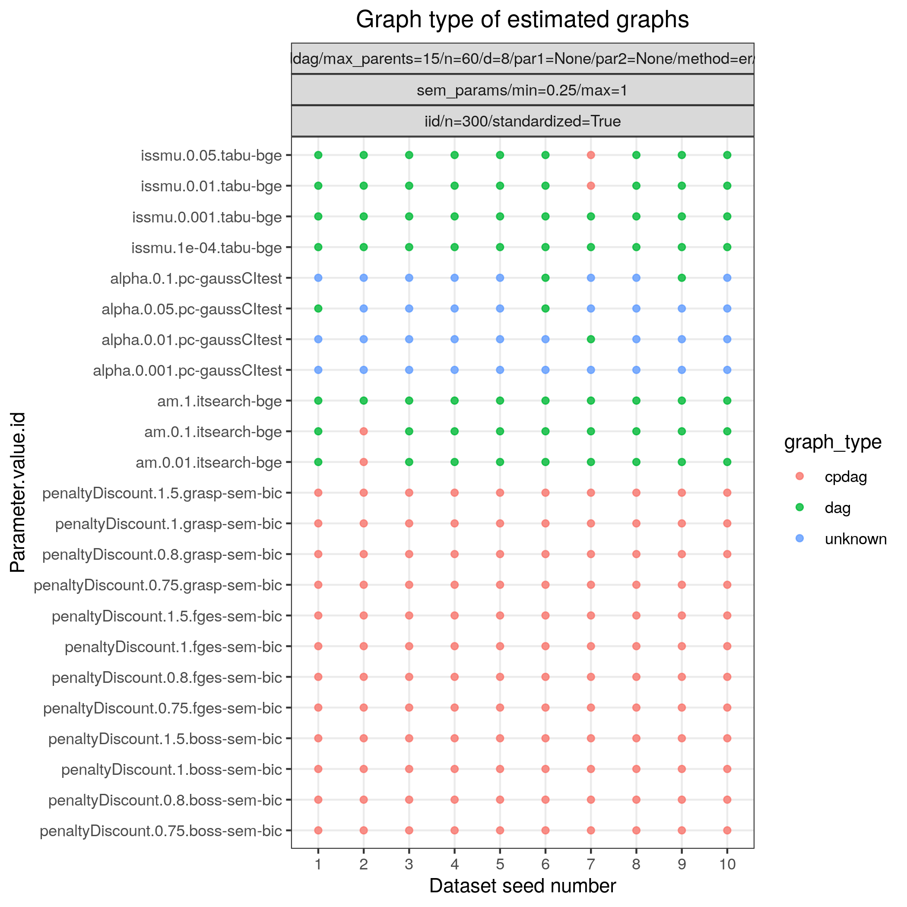

:og:description: Best Order Score Search
:og:image:alt: Benchpress logo
:og:sitename: Benchpress causal discovery platform
:og:title: Best Order Score Search (BOSS)
 
.. meta::
    :title: Best Order Score Search 
    :description: Best Order Score Search

.. _tetrad_boss: 

BOSS (TETRAD) 
**************

.. list-table:: 

   * - Module name
     - `tetrad_boss <https://github.com/felixleopoldo/benchpress/tree/master/workflow/rules/structure_learning_algorithms/tetrad_boss>`__
   * - Package
     - `TETRAD <https://github.com/bd2kccd/causal-cmd>`__
   * - Version
     - 1.10.0
   * - Language
     - `Java <https://www.java.com/en/>`__
   * - Docs
     - `here <https://cmu-phil.github.io/tetrad/manual/#search_box>`__
   * - Paper
     - :footcite:t:`ramsey2021improving`, :footcite:t:`andrews2023fast`
   * - Graph type
     - `CPDAG <https://search.r-project.org/CRAN/refmans/pcalg/html/dag2cpdag.html>`__
   * - MCMC
     - No
   * - Edge constraints
     - :ref:`Yes <edge_constraints>`
   * - Data type
     - C, D
   * - Data missingness
     - 
   * - Intervention type
     - 
   * - Docker 
     - `bpimages/causal-cmd:1.10.0 <https://hub.docker.com/r/bpimages/causal-cmd/tags>`__

Best Order Score Search 
---------------------------

BOSS (Best Order Score Search) is an algorithm that, like GRaSP, generalizes and extends the GSP (Greedy Sparsest Permutation) algorithm. It has been tested to 1000 variables with an average degree of 20 and gives near perfect precisions and recalls for N = 10,000 (with recall that drop to 0.9 for N = 1000). The algorithms works by building DAGs given permutations in ways similar to those described in Raskutti and Uhler and Solus et al.

.. rubric:: Example 

Config file: `boss_SEM.json <https://github.com/felixleopoldo/benchpress/blob/master/workflow/rules/structure_learning_algorithms/tetrad_boss/config/boss_SEM.json>`_

Command:

.. code:: bash

    snakemake --cores all --use-singularity --configfile workflow/rules/structure_learning_algorithms/tetrad_boss/config/boss_SEM.json

:numref:`bossplot` and :numref:`bosstimings`  show FP/P vs. TP/P and timings based on 10 datsets corresponding to 10 realisations of a 60-variables random Gaussian SEM, with an average indegree of 4.
Each dataset contains 300 samples.
:numref:`bosstype` and :numref:`bossprops` show the type of graphs estimated and the properties of the true graphs, respectively.

.. _bossplot:

.. figure:: ../../../workflow/rules/structure_learning_algorithms/tetrad_boss/images/tprfpr_pattern.png
    :width: 320 
    :alt: FP/P vs. TP/P BOSS example
    :align: left

    FP/P vs. TP/P.

.. _bosstimings:

    Timings.

.. _bosstype:

    Type of graphs estimated.

.. _bossprops:

    Graph properties.

.. rubric:: Some fields described 
* ``allowInternalRandomess``  If true, the algorithm allow the algorithm to use certain heuristic random steps. This can improve performance, but may make the algorithm non-deterministic. 
* ``edgeConstraints`` Name of the JSON file containing background knowledge 
* ``useBes`` True if the final BES (Backward Equivalence Search) step is used from the GES (Greedy Equivalence Search) algorithm. This step is needed for correctness but for large models, since usually nearly all edges are oriented in the CPDAG, it is heurically not needed. 

.. rubric:: Example JSON

.. code-block:: json

    [
      {
        "id": "boss-bic",
        "score": "sem-bic-score",
        "datatype": "continuous",
        "samplePrior": null,
        "useBes": true,
        "allowInternalRandomess": false,
        "semBicStructurePrior": 1,
        "penaltyDiscount": [
          0.8,
          1,
          1.5
        ],
        "timeout": null,
        "edgeConstraints": "edgeConstraints.json"
      },
      {
        "id": "boss-bdeu",
        "score": "bdeu-score",
        "datatype": "discrete",
        "samplePrior": [
          1,
          10,
          20
        ],
        "useBes": true,
        "allowInternalRandomess": false,
        "semBicStructurePrior": null,
        "penaltyDiscount": null,
        "timeout": null,
        "edgeConstraints": "edgeConstraints.json"
      }
    ]

.. footbibliography::

